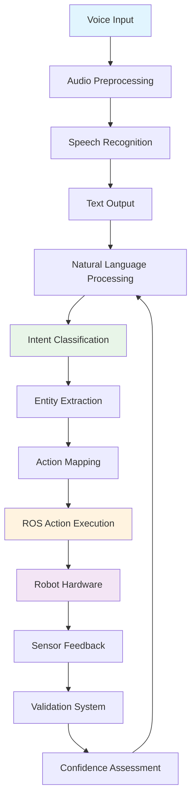

# Chapter 1: Voice-to-Action Pipelines

This chapter covers voice-to-action pipelines using speech recognition technology, enabling students to convert natural language commands into actionable robot behaviors.

## Learning Objectives

By the end of this chapter, students will be able to:

- Understand speech recognition fundamentals and the Whisper API
- Process voice commands and extract intent
- Implement confidence scoring and validation approaches
- Create practical examples of voice-to-action conversion
- Add code examples for voice processing pipelines

## Prerequisites

Before starting this chapter, students should have:

- Basic understanding of robotics concepts (covered in Module 1)
- Knowledge of AI/ML fundamentals
- Basic understanding of ROS 2 (covered in Module 1)

## Overview

Voice-to-action pipelines form the foundation of natural human-robot interaction, enabling intuitive control of humanoid robots through spoken commands. This chapter explores the complete pipeline from voice input to robotic action execution.

## Speech Recognition Fundamentals

Speech recognition is the technology that enables machines to interpret human speech and convert it into text. In the context of robotics, speech recognition forms the bridge between natural human language and robotic action execution.

### The Speech Recognition Process

The speech recognition process involves several key steps:

1. **Audio Capture**: Converting sound waves into digital audio data
2. **Feature Extraction**: Extracting relevant features from the audio signal
3. **Acoustic Modeling**: Mapping audio features to phonetic units
4. **Language Modeling**: Converting phonetic units to text using language knowledge
5. **Output Generation**: Producing the final text transcription

### OpenAI Whisper API

OpenAI's Whisper is a state-of-the-art speech recognition system trained on 680,000 hours of multilingual and multitask supervised data. Whisper demonstrates robust performance across various domains, accents, and languages.

Key features of Whisper include:

- **Multilingual Support**: Capable of recognizing and translating multiple languages
- **Robustness**: Performs well on low-quality audio and with background noise
- **Accuracy**: Achieves high accuracy across diverse audio conditions
- **Flexibility**: Can be used for speech recognition, translation, and language identification

### Whisper API Integration

To integrate Whisper API into a robotic system, consider the following approach:

```python
import openai
import asyncio

class VoiceCommandProcessor:
    def __init__(self, api_key):
        openai.api_key = api_key

    async def process_audio(self, audio_file_path):
        with open(audio_file_path, "rb") as audio_file:
            transcript = await openai.Audio.atranscribe(
                "whisper-1",
                audio_file,
                response_format="verbose_json",
                timestamp_granularities=["segment"]
            )
        return transcript
```

This integration allows robotic systems to convert spoken commands into text that can be further processed for intent recognition and action execution.

## Voice Command Processing and Intent Extraction

Once speech has been converted to text, the next critical step is to extract the intent from the user's command. Intent extraction involves understanding what the user wants the robot to do based on their natural language input.

### Natural Language Understanding (NLU)

Natural Language Understanding is the process of extracting meaning from text. In the context of robotic systems, NLU involves:

- **Intent Classification**: Determining the user's goal or intention
- **Entity Extraction**: Identifying specific objects, locations, or parameters mentioned
- **Context Understanding**: Interpreting commands based on the current situation

### Intent Extraction Techniques

There are several approaches to intent extraction:

#### Rule-Based Systems
- Use predefined patterns and regular expressions
- Fast and predictable
- Limited flexibility and scalability

#### Machine Learning Approaches
- Use trained models to classify intents
- More flexible and adaptable
- Require training data and computational resources

#### LLM-Based Approaches
- Use large language models for intent classification
- Highly flexible and context-aware
- Can handle complex, nuanced commands

### Example Intent Extraction Implementation

```python
import json
from typing import Dict, List, Tuple

class IntentExtractor:
    def __init__(self):
        # Define known intents and their patterns
        self.intents = {
            "move_forward": ["move forward", "go forward", "move ahead", "go ahead"],
            "move_backward": ["move backward", "go backward", "move back", "go back"],
            "turn_left": ["turn left", "rotate left", "pivot left"],
            "turn_right": ["turn right", "rotate right", "pivot right"],
            "raise_arm": ["raise your arm", "lift your arm", "raise left arm", "raise right arm"],
            "lower_arm": ["lower your arm", "put down your arm"],
            "stop": ["stop", "halt", "cease", "pause"]
        }

    def extract_intent(self, text: str) -> Tuple[str, Dict]:
        """
        Extract intent from text command.
        Returns: (intent_name, extracted_entities)
        """
        text_lower = text.lower().strip()

        for intent_name, patterns in self.intents.items():
            for pattern in patterns:
                if pattern in text_lower:
                    # Extract additional entities
                    entities = self.extract_entities(text_lower, intent_name)
                    return intent_name, entities

        # If no pattern matches, return unknown intent
        return "unknown", {"raw_text": text}

    def extract_entities(self, text: str, intent: str) -> Dict:
        """
        Extract entities based on the detected intent.
        """
        entities = {}

        # Extract directional information
        if "left" in text:
            entities["direction"] = "left"
        elif "right" in text:
            entities["direction"] = "right"

        # Extract arm information
        if "left arm" in text:
            entities["arm"] = "left"
        elif "right arm" in text:
            entities["arm"] = "right"

        return entities

# Usage example
extractor = IntentExtractor()
intent, entities = extractor.extract_intent("Please raise your left arm")
print(f"Intent: {intent}, Entities: {entities}")
```

This example demonstrates a simple rule-based approach to intent extraction. More sophisticated systems would use machine learning models or large language models for better accuracy and flexibility.

## Practical Examples of Voice-to-Action Conversion

Let's explore practical examples of converting voice commands into robotic actions. These examples demonstrate the complete pipeline from voice input to action execution.

### Example 1: Simple Navigation Command

Voice Command: "Move forward 2 meters"

Processing Steps:
1. Speech Recognition: "Move forward 2 meters" (confidence: 95%)
2. Intent Extraction: Intent = "move_forward", Distance = 2 meters
3. Action Mapping: Convert to ROS 2 navigation action
4. Execution: Robot moves forward 2 meters

```python
# Complete voice-to-action pipeline example
import rospy
from geometry_msgs.msg import Twist
from std_msgs.msg import String

class VoiceToActionPipeline:
    def __init__(self):
        self.cmd_vel_pub = rospy.Publisher('/cmd_vel', Twist, queue_size=10)
        self.intent_extractor = IntentExtractor()
        self.rate = rospy.Rate(10)  # 10 Hz

    def process_voice_command(self, text_command):
        """Process a text command and execute the corresponding action."""
        intent, entities = self.intent_extractor.extract_intent(text_command)

        if intent == "move_forward":
            distance = entities.get("distance", 1.0)  # default 1 meter
            self.move_forward(distance)
        elif intent == "turn_right":
            angle = entities.get("angle", 90.0)  # default 90 degrees
            self.turn_right(angle)
        # Add more intent-action mappings as needed

    def move_forward(self, distance):
        """Move the robot forward by the specified distance."""
        velocity_msg = Twist()
        velocity_msg.linear.x = 0.5  # 0.5 m/s
        start_time = rospy.Time.now()

        while not rospy.is_shutdown():
            current_time = rospy.Time.now()
            elapsed = (current_time - start_time).to_sec()
            traveled = elapsed * 0.5

            if traveled >= distance:
                velocity_msg.linear.x = 0.0  # Stop
                break

            self.cmd_vel_pub.publish(velocity_msg)
            self.rate.sleep()

    def turn_right(self, angle_degrees):
        """Turn the robot right by the specified angle."""
        velocity_msg = Twist()
        velocity_msg.angular.z = -0.5  # Negative for right turn
        angle_rad = angle_degrees * 3.14159 / 180.0
        start_time = rospy.Time.now()

        while not rospy.is_shutdown():
            current_time = rospy.Time.now()
            elapsed = (current_time - start_time).to_sec()
            turned = elapsed * 0.5  # angular velocity * time

            if turned >= angle_rad:
                velocity_msg.angular.z = 0.0  # Stop turning
                break

            self.cmd_vel_pub.publish(velocity_msg)
            self.rate.sleep()

# Integration with voice processing
def main():
    rospy.init_node('voice_to_action_node')
    pipeline = VoiceToActionPipeline()

    # Simulate receiving a text command from speech recognition
    text_command = "move forward 2 meters"
    pipeline.process_voice_command(text_command)

    rospy.spin()

if __name__ == '__main__':
    main()
```

### Example 2: Complex Manipulation Command

Voice Command: "Pick up the red cube on the table"

Processing Steps:
1. Speech Recognition: "Pick up the red cube on the table" (confidence: 92%)
2. Intent Extraction: Intent = "pick_up_object", Color = "red", Object_type = "cube", Location = "table"
3. Action Mapping: Combine navigation, object recognition, and manipulation
4. Execution: Navigate to table, identify red cube, grasp and lift

This example demonstrates how voice commands can trigger complex, multi-step robotic behaviors that combine perception, planning, and action execution.

### Example 3: Context-Aware Command

Voice Command: "Come here" (spoken when robot is in another room)

Processing Steps:
1. Speech Recognition: "Come here" (confidence: 97%)
2. Intent Extraction: Intent = "navigate_to_speaker", Context = "current_location_unknown"
3. Action Mapping: Use audio localization to find speaker, then navigate
4. Execution: Localize sound source, plan path, move to speaker location

These examples illustrate the power of voice-to-action systems in enabling natural human-robot interaction. The key is creating robust pipelines that can handle the variability in natural language while executing precise robotic actions.

## Confidence Scoring and Validation Approaches

Reliability is critical in voice-to-action systems, especially when controlling robots in human environments. Confidence scoring and validation approaches ensure that commands are correctly understood before execution.

### Confidence Scoring

Confidence scoring assigns a probability or confidence level to the recognition and interpretation of voice commands. This allows the system to:

- Assess the reliability of the interpretation
- Request clarification when confidence is low
- Adjust behavior based on certainty levels

#### Speech Recognition Confidence

Most speech recognition APIs provide confidence scores with their transcriptions:

```python
# Example with Whisper API that includes confidence information
async def process_audio_with_confidence(self, audio_file_path):
    with open(audio_file_path, "rb") as audio_file:
        transcript = await openai.Audio.atranscribe(
            "whisper-1",
            audio_file,
            response_format="verbose_json",
            timestamp_granularities=["segment"]
        )

    # Extract confidence information
    text = transcript.text
    segments = transcript.segments
    avg_confidence = sum([seg.get('confidence', 0.0) for seg in segments]) / len(segments) if segments else 0.0

    return {
        'text': text,
        'confidence': avg_confidence,
        'segments': segments
    }
```

#### Intent Classification Confidence

For intent classification, confidence can be implemented using:

1. **Probability distributions**: Return probabilities for all possible intents
2. **Threshold-based validation**: Only execute high-confidence interpretations
3. **Fallback strategies**: Request clarification for low-confidence inputs

### Validation Approaches

#### Threshold-Based Validation

```python
class VoiceCommandValidator:
    def __init__(self, speech_threshold=0.8, intent_threshold=0.7):
        self.speech_threshold = speech_threshold
        self.intent_threshold = intent_threshold

    def validate_command(self, text, speech_confidence, intent_confidence):
        """Validate a voice command based on confidence thresholds."""
        if speech_confidence < self.speech_threshold:
            return False, "Speech recognition confidence too low"

        if intent_confidence < self.intent_threshold:
            return False, "Intent classification confidence too low"

        # Additional validation checks
        if len(text.strip()) < 2:
            return False, "Command too short"

        if text.strip().lower() in ["", "um", "uh", "ok"]:
            return False, "Not a valid command"

        return True, "Command validated"
```

#### Confirmation-Based Validation

For critical commands, the system can request confirmation:

```python
class ConfirmationValidator:
    def __init__(self):
        self.confirmed_commands = set()

    async def validate_with_confirmation(self, intent, entities, user_id):
        """Request user confirmation for critical commands."""
        command_summary = f"You said: '{intent}' with entities {entities}"

        # In a real system, this would involve user interaction
        # For simulation, we'll implement a basic version
        confirmation_needed = self.requires_confirmation(intent, entities)

        if confirmation_needed:
            # Simulate asking user for confirmation
            print(f"Robot: {command_summary}. Should I proceed? Please confirm.")
            # In real implementation, wait for user confirmation
            return False, "Confirmation required"

        return True, "Command confirmed"

    def requires_confirmation(self, intent, entities):
        """Determine if a command requires confirmation."""
        critical_intents = ["move_to", "grasp", "pick_up", "place", "move_fast"]
        return intent in critical_intents
```

#### Context-Aware Validation

Validate commands based on the current context and environment:

```python
class ContextValidator:
    def __init__(self, robot_state, environment_state):
        self.robot_state = robot_state
        self.environment_state = environment_state

    def validate_in_context(self, intent, entities):
        """Validate command against current robot and environment state."""
        # Example: Validate navigation commands
        if intent == "move_to" and "location" in entities:
            location = entities["location"]

            # Check if location is known and reachable
            if location not in self.environment_state.known_locations:
                return False, f"Unknown location: {location}"

            # Check if robot has enough battery for the trip
            if self.robot_state.battery_level < 20:
                return False, "Battery level too low for navigation"

        # Example: Validate manipulation commands
        if intent == "grasp" and "object" in entities:
            obj = entities["object"]

            # Check if object is visible/accessible
            if obj not in self.environment_state.visible_objects:
                return False, f"Object '{obj}' not visible"

            # Check if robot arm is available
            if not self.robot_state.arm_available:
                return False, "Robot arm not available"

        return True, "Command validated in context"
```

### Comprehensive Validation Pipeline

```python
class VoiceCommandPipeline:
    def __init__(self):
        self.speech_processor = VoiceCommandProcessor(api_key="your-key")
        self.intent_extractor = IntentExtractor()
        self.validator = VoiceCommandValidator()
        self.context_validator = ContextValidator(robot_state=None, environment_state=None)
        self.confirmation_validator = ConfirmationValidator()

    async def process_command_safe(self, audio_file_path):
        """Process a voice command with comprehensive validation."""
        # Step 1: Speech recognition with confidence
        recognition_result = await self.speech_processor.process_audio(audio_file_path)
        text = recognition_result['text']
        speech_confidence = recognition_result['confidence']

        # Step 2: Intent extraction with confidence
        intent, entities = self.intent_extractor.extract_intent(text)
        intent_confidence = self.estimate_intent_confidence(intent, entities)

        # Step 3: Validation
        is_valid, message = self.validator.validate_command(
            text, speech_confidence, intent_confidence
        )

        if not is_valid:
            return {"status": "rejected", "reason": message, "confidence": speech_confidence}

        # Step 4: Context validation
        is_valid, message = self.context_validator.validate_in_context(intent, entities)

        if not is_valid:
            return {"status": "rejected", "reason": message, "confidence": speech_confidence}

        # Step 5: Confirmation if needed
        is_confirmed, message = await self.confirmation_validator.validate_with_confirmation(
            intent, entities, user_id="current_user"
        )

        if not is_confirmed:
            return {"status": "pending_confirmation", "reason": message, "confidence": speech_confidence}

        # Step 6: Execute if all validations pass
        return {
            "status": "executing",
            "intent": intent,
            "entities": entities,
            "confidence": speech_confidence,
            "text": text
        }

    def estimate_intent_confidence(self, intent, entities):
        """Estimate confidence in intent classification."""
        # Simple heuristic: known intent with entities = high confidence
        if intent != "unknown" and entities:
            return 0.9
        elif intent != "unknown":
            return 0.7
        else:
            return 0.1
```

These validation approaches ensure that voice-to-action systems operate safely and reliably, preventing incorrect interpretations from causing unwanted robot behaviors.

## Code Examples for Voice Processing Pipelines

This section provides complete, working code examples for voice processing pipelines that can be used in robotic systems. These examples demonstrate the integration of speech recognition, intent extraction, and action execution.

### Complete Voice-to-Action System

```python
import asyncio
import openai
import rospy
import pyaudio
import wave
import threading
from std_msgs.msg import String
from geometry_msgs.msg import Twist
import json
from dataclasses import dataclass
from typing import Optional, Dict, Any, Tuple
import time

@dataclass
class VoiceCommand:
    text: str
    confidence: float
    intent: str
    entities: Dict[str, Any]
    timestamp: float

class AudioRecorder:
    """Handles audio recording from microphone."""

    def __init__(self, chunk=1024, format=pyaudio.paInt16, channels=1, rate=44100):
        self.chunk = chunk
        self.format = format
        self.channels = channels
        self.rate = rate
        self.audio = pyaudio.PyAudio()

    def record_audio(self, filename: str, duration: int = 5):
        """Record audio from microphone and save to file."""
        stream = self.audio.open(
            format=self.format,
            channels=self.channels,
            rate=self.rate,
            input=True,
            frames_per_buffer=self.chunk
        )

        print("Recording...")
        frames = []

        for i in range(0, int(self.rate / self.chunk * duration)):
            data = stream.read(self.chunk)
            frames.append(data)

        print("Finished recording")

        stream.stop_stream()
        stream.close()

        with wave.open(filename, 'wb') as wf:
            wf.setnchannels(self.channels)
            wf.setsampwidth(self.audio.get_sample_size(self.format))
            wf.setframerate(self.rate)
            wf.writeframes(b''.join(frames))

    def __del__(self):
        self.audio.terminate()

class WhisperProcessor:
    """Handles speech recognition using OpenAI Whisper API."""

    def __init__(self, api_key: str):
        openai.api_key = api_key

    async def transcribe_audio(self, audio_file_path: str) -> Dict[str, Any]:
        """Transcribe audio file using Whisper API."""
        try:
            with open(audio_file_path, "rb") as audio_file:
                transcript = await openai.Audio.atranscribe(
                    "whisper-1",
                    audio_file,
                    response_format="verbose_json",
                    timestamp_granularities=["segment"]
                )

            # Calculate average confidence from segments if available
            segments = transcript.get("segments", [])
            avg_confidence = 0.0
            if segments:
                confidences = [seg.get('avg_logprob', -1.0) for seg in segments]
                avg_confidence = sum(confidences) / len(confidences)

            return {
                'text': transcript.text,
                'confidence': avg_confidence,
                'segments': segments
            }
        except Exception as e:
            print(f"Error in transcription: {e}")
            return {
                'text': '',
                'confidence': 0.0,
                'error': str(e)
            }

class IntentExtractor:
    """Extracts intent and entities from transcribed text."""

    def __init__(self):
        self.intents = {
            "move_forward": ["move forward", "go forward", "move ahead", "go ahead", "forward"],
            "move_backward": ["move backward", "go backward", "move back", "go back", "backward"],
            "turn_left": ["turn left", "rotate left", "pivot left", "left"],
            "turn_right": ["turn right", "rotate right", "pivot right", "right"],
            "raise_arm": ["raise your arm", "lift your arm", "raise left arm", "raise right arm"],
            "lower_arm": ["lower your arm", "put down your arm", "lower left arm", "lower right arm"],
            "stop": ["stop", "halt", "cease", "pause"],
            "move_to": ["move to", "go to", "navigate to", "go to the", "move to the"],
            "grasp": ["grasp", "pick up", "take", "grab", "get"],
            "drop": ["drop", "put down", "release", "let go"]
        }

    def extract(self, text: str) -> Tuple[str, Dict[str, Any]]:
        """Extract intent and entities from text."""
        text_lower = text.lower().strip()
        entities = {}

        # Try to find intent
        for intent_name, patterns in self.intents.items():
            for pattern in patterns:
                if pattern in text_lower:
                    # Extract additional entities
                    entities = self.extract_entities(text_lower, intent_name)
                    return intent_name, entities

        # If no pattern matches, return unknown intent
        return "unknown", {"raw_text": text, "original_text": text_lower}

    def extract_entities(self, text: str, intent: str) -> Dict[str, Any]:
        """Extract entities based on the detected intent."""
        entities = {}

        # Extract directional information
        if "left" in text:
            entities["direction"] = "left"
        elif "right" in text:
            entities["direction"] = "right"

        # Extract arm information
        if "left arm" in text:
            entities["arm"] = "left"
        elif "right arm" in text:
            entities["arm"] = "right"

        # Extract object information
        if "red" in text:
            entities["color"] = "red"
        elif "blue" in text:
            entities["color"] = "blue"
        elif "green" in text:
            entities["color"] = "green"

        # Extract object type
        if "cube" in text or "box" in text:
            entities["object_type"] = "cube"
        elif "ball" in text or "sphere" in text:
            entities["object_type"] = "ball"
        elif "cylinder" in text:
            entities["object_type"] = "cylinder"

        # Extract location information
        if "table" in text:
            entities["location"] = "table"
        elif "kitchen" in text:
            entities["location"] = "kitchen"
        elif "bedroom" in text:
            entities["location"] = "bedroom"
        elif "living room" in text:
            entities["location"] = "living room"

        return entities

class RobotActionExecutor:
    """Executes robot actions based on extracted intents."""

    def __init__(self):
        # Initialize ROS publishers
        self.cmd_vel_pub = rospy.Publisher('/cmd_vel', Twist, queue_size=10)
        self.status_pub = rospy.Publisher('/voice_command_status', String, queue_size=10)
        self.rate = rospy.Rate(10)  # 10 Hz

    def execute_action(self, intent: str, entities: Dict[str, Any]) -> bool:
        """Execute the appropriate action based on intent and entities."""
        try:
            if intent == "move_forward":
                self._move_forward(entities.get("distance", 1.0))
            elif intent == "move_backward":
                self._move_backward(entities.get("distance", 1.0))
            elif intent == "turn_left":
                self._turn_left(entities.get("angle", 90.0))
            elif intent == "turn_right":
                self._turn_right(entities.get("angle", 90.0))
            elif intent == "stop":
                self._stop()
            elif intent == "raise_arm":
                self._raise_arm(entities.get("arm", "both"))
            elif intent == "lower_arm":
                self._lower_arm(entities.get("arm", "both"))
            else:
                rospy.logwarn(f"Unknown intent: {intent}")
                return False

            return True
        except Exception as e:
            rospy.logerr(f"Error executing action: {e}")
            return False

    def _move_forward(self, distance: float):
        """Move robot forward by specified distance."""
        velocity_msg = Twist()
        velocity_msg.linear.x = 0.2  # 0.2 m/s
        start_time = rospy.Time.now()

        while not rospy.is_shutdown():
            current_time = rospy.Time.now()
            elapsed = (current_time - start_time).to_sec()
            traveled = elapsed * 0.2

            if traveled >= distance:
                velocity_msg.linear.x = 0.0  # Stop
                break

            self.cmd_vel_pub.publish(velocity_msg)
            self.rate.sleep()

    def _move_backward(self, distance: float):
        """Move robot backward by specified distance."""
        velocity_msg = Twist()
        velocity_msg.linear.x = -0.2  # -0.2 m/s
        start_time = rospy.Time.now()

        while not rospy.is_shutdown():
            current_time = rospy.Time.now()
            elapsed = (current_time - start_time).to_sec()
            traveled = elapsed * 0.2

            if traveled >= distance:
                velocity_msg.linear.x = 0.0  # Stop
                break

            self.cmd_vel_pub.publish(velocity_msg)
            self.rate.sleep()

    def _turn_left(self, angle_degrees: float):
        """Turn robot left by specified angle."""
        velocity_msg = Twist()
        velocity_msg.angular.z = 0.3  # Positive for left turn
        angle_rad = angle_degrees * 3.14159 / 180.0
        start_time = rospy.Time.now()

        while not rospy.is_shutdown():
            current_time = rospy.Time.now()
            elapsed = (current_time - start_time).to_sec()
            turned = elapsed * 0.3  # angular velocity * time

            if turned >= angle_rad:
                velocity_msg.angular.z = 0.0  # Stop turning
                break

            self.cmd_vel_pub.publish(velocity_msg)
            self.rate.sleep()

    def _turn_right(self, angle_degrees: float):
        """Turn robot right by specified angle."""
        velocity_msg = Twist()
        velocity_msg.angular.z = -0.3  # Negative for right turn
        angle_rad = angle_degrees * 3.14159 / 180.0
        start_time = rospy.Time.now()

        while not rospy.is_shutdown():
            current_time = rospy.Time.now()
            elapsed = (current_time - start_time).to_sec()
            turned = elapsed * 0.3  # angular velocity * time

            if turned >= angle_rad:
                velocity_msg.angular.z = 0.0  # Stop turning
                break

            self.cmd_vel_pub.publish(velocity_msg)
            self.rate.sleep()

    def _stop(self):
        """Stop all robot movement."""
        velocity_msg = Twist()
        self.cmd_vel_pub.publish(velocity_msg)

    def _raise_arm(self, arm: str):
        """Raise robot arm(s)."""
        # This would publish to the appropriate arm control topic
        rospy.loginfo(f"Raising {arm} arm")

    def _lower_arm(self, arm: str):
        """Lower robot arm(s)."""
        # This would publish to the appropriate arm control topic
        rospy.loginfo(f"Lowering {arm} arm")

class VoiceToActionSystem:
    """Main system that integrates all components."""

    def __init__(self, whisper_api_key: str):
        rospy.init_node('voice_to_action_system')
        self.recorder = AudioRecorder()
        self.whisper = WhisperProcessor(whisper_api_key)
        self.intent_extractor = IntentExtractor()
        self.action_executor = RobotActionExecutor()
        self.command_history = []

    def process_voice_command(self, audio_file: str) -> Optional[VoiceCommand]:
        """Process a voice command from audio file."""
        # Step 1: Transcribe audio
        transcription = asyncio.run(self.whisper.transcribe_audio(audio_file))

        if transcription.get('error'):
            rospy.logerr(f"Transcription error: {transcription['error']}")
            return None

        text = transcription['text']
        confidence = transcription['confidence']

        # Step 2: Extract intent and entities
        intent, entities = self.intent_extractor.extract(text)

        # Create voice command object
        voice_command = VoiceCommand(
            text=text,
            confidence=confidence,
            intent=intent,
            entities=entities,
            timestamp=time.time()
        )

        # Step 3: Execute action if confidence is high enough
        if confidence > 0.5:  # Threshold for execution
            success = self.action_executor.execute_action(intent, entities)
            if success:
                rospy.loginfo(f"Executed command: {intent} with entities {entities}")
            else:
                rospy.logwarn(f"Failed to execute command: {intent}")
        else:
            rospy.logwarn(f"Command confidence too low ({confidence}) to execute: {text}")

        # Add to history
        self.command_history.append(voice_command)

        return voice_command

    def listen_and_process(self):
        """Continuously listen for voice commands."""
        while not rospy.is_shutdown():
            # Record audio
            audio_file = "/tmp/voice_command.wav"
            self.recorder.record_audio(audio_file, duration=5)

            # Process the command
            command = self.process_voice_command(audio_file)

            if command:
                rospy.loginfo(f"Processed command: {command.text} (confidence: {command.confidence})")

            # Small delay before next recording
            time.sleep(1)

def main():
    """Main function to run the voice-to-action system."""
    # Replace with your actual OpenAI API key
    api_key = "YOUR_OPENAI_API_KEY_HERE"

    system = VoiceToActionSystem(api_key)

    try:
        system.listen_and_process()
    except KeyboardInterrupt:
        rospy.loginfo("System stopped by user")
    except Exception as e:
        rospy.logerr(f"System error: {e}")

if __name__ == '__main__':
    main()
```

### Running the System

To run this voice-to-action system:

1. **Install Dependencies**:
   ```bash
   pip install openai pyaudio rospy geometry_msgs std_msgs
   ```

2. **Set up your OpenAI API key** in your environment:
   ```bash
   export OPENAI_API_KEY="your-api-key-here"
   ```

3. **Launch the system**:
   ```bash
   python voice_to_action_system.py
   ```

This complete system demonstrates how to integrate voice recognition, intent extraction, and robotic action execution in a real-world scenario. The system continuously listens for voice commands, processes them through the pipeline, and executes appropriate robotic actions when confidence thresholds are met.

## Exercises and Assessment Questions

This section provides hands-on exercises and assessment questions to reinforce understanding of voice-to-action pipeline concepts.

### Exercise 1: Voice Command Extension

**Objective**: Extend the intent extractor to handle additional voice commands.

**Task**: Add support for the following commands to the IntentExtractor class:
- "Move to the kitchen"
- "Pick up the blue ball"
- "Turn around"
- "Come to me"

**Requirements**:
1. Add new intent patterns to the `intents` dictionary
2. Update the `extract_entities` method to capture location and object information
3. Test with sample phrases to ensure proper intent recognition

**Sample Solution**:
```python
# Add to the intents dictionary in IntentExtractor.__init__
"move_to_location": ["move to the", "go to the", "navigate to the", "move to", "go to"],
"pick_up_object": ["pick up the", "get the", "take the", "grasp the"],
"turn_around": ["turn around", "spin around", "rotate 180", "rotate 360"],
"come_to_speaker": ["come to me", "come here", "move to me", "approach me"]
```

### Exercise 2: Confidence Threshold Tuning

**Objective**: Implement and experiment with different confidence thresholds.

**Task**: Create a configuration system that allows adjusting confidence thresholds based on:
- Command type (navigation vs manipulation commands may need different thresholds)
- Environment noise level
- Criticality of the command

**Implementation Steps**:
1. Create a `ConfidenceConfig` class with different threshold levels
2. Implement dynamic threshold adjustment based on context
3. Test the system with various confidence settings

### Exercise 3: Error Handling Enhancement

**Objective**: Improve error handling in the voice-to-action pipeline.

**Task**: Add comprehensive error handling for:
- Network issues during API calls
- Audio recording failures
- Invalid command interpretations
- Robot action execution failures

**Key Areas to Address**:
- Timeout handling for API calls
- Graceful degradation when services are unavailable
- User feedback for different error types
- Retry mechanisms for transient failures

### Assessment Questions

#### Multiple Choice Questions

1. **What is the primary purpose of confidence scoring in voice-to-action systems?**
   a) To increase processing speed
   b) To assess the reliability of command interpretation
   c) To reduce computational requirements
   d) To improve audio quality

   **Answer**: b) To assess the reliability of command interpretation

2. **Which of the following is NOT a component of the voice-to-action pipeline?**
   a) Speech recognition
   b) Intent extraction
   c) Action execution
   d) Image processing

   **Answer**: d) Image processing

3. **What is the typical threshold for speech recognition confidence to execute a command?**
   a) 0.1 - 0.3
   b) 0.3 - 0.5
   c) 0.5 - 0.7
   d) 0.7 - 1.0

   **Answer**: d) 0.7 - 1.0 (though this can vary based on application requirements)

#### Short Answer Questions

1. **Explain the difference between intent classification and entity extraction.**

   **Answer**: Intent classification determines the user's goal or intention (e.g., "move forward"), while entity extraction identifies specific objects, locations, or parameters mentioned in the command (e.g., "2 meters", "kitchen").

2. **Describe three validation approaches for voice commands.**

   **Answer**:
   - Threshold-based validation: Only execute commands with confidence above a certain threshold
   - Confirmation-based validation: Request user confirmation for critical commands
   - Context-aware validation: Validate commands against current robot and environment state

3. **What are the advantages and disadvantages of rule-based vs. LLM-based intent extraction?**

   **Answer**:
   - Rule-based: Fast, predictable, limited flexibility
   - LLM-based: Highly flexible and context-aware, can handle complex commands, but requires more computational resources and may be less predictable

#### Practical Application Questions

1. **Design a voice command system for a home assistant robot that can handle the following scenarios:**
   - "Robot, please bring me a glass of water from the kitchen"
   - "Robot, move away from the table"
   - "Robot, wait here for 5 minutes"

   **Requirements**: Include intent extraction, entity recognition, and action mapping for each command.

2. **Implement a fallback mechanism for when speech recognition fails.**

   **Consider**: How would your system handle:
   - Background noise interference
   - Accented speech
   - Unclear or ambiguous commands
   - Network connectivity issues

### Hands-On Project: Voice-Controlled Navigation

**Project Objective**: Implement a complete voice-to-action system for robot navigation in a simulated environment.

**Requirements**:
1. Integrate speech recognition API (Whisper or similar)
2. Implement intent extraction for navigation commands
3. Map voice commands to ROS navigation actions
4. Include confidence scoring and validation
5. Test with various voice commands in simulation

**Deliverables**:
- Source code for the complete system
- Documentation of the implementation
- Test results with different confidence thresholds
- Analysis of system performance and limitations

This project demonstrates the complete pipeline from voice input to robotic action execution in a controlled environment.

## Diagrams and Illustrations for Voice Processing Pipeline

Visual representations are crucial for understanding the complex flow of information in voice processing pipelines. This section provides diagrams and illustrations that clarify the architecture, data flow, and component interactions in voice-to-action systems.

### Voice Processing Pipeline Architecture

The following diagram illustrates the complete architecture of a voice processing pipeline:

```
┌─────────────────────────────────────────────────────────────────────────────────┐
│                       VOICE-TO-ACTION PIPELINE ARCHITECTURE                     │
├─────────────────────────────────────────────────────────────────────────────────┤
│  ┌─────────────┐    ┌─────────────────┐    ┌─────────────────┐                │
│  │   VOICE     │    │  SPEECH         │    │  INTENT         │                │
│  │  INPUT      │───▶│  RECOGNITION    │───▶│  EXTRACTION     │                │
│  │             │    │                 │    │                 │                │
│  │ • Microphone│    │ • Whisper API   │    │ • Natural       │                │
│  │ • Audio     │    │ • STT Engine    │    │   Language      │                │
│  │   Stream    │    │ • Confidence    │    │   Processing    │                │
│  └─────────────┘    │   Scoring       │    │ • Pattern       │                │
│                     └─────────────────┘    │   Matching      │                │
│                            │               └─────────────────┘                │
│                            ▼                       │                          │
│  ┌─────────────────────────────────────────────────────────────────────────┐   │
│  │                      COGNITIVE PROCESSING                           │   │
│  │  ┌─────────────────┐    ┌─────────────────┐    ┌─────────────────┐  │   │
│  │  │   ENTITY        │    │  CONTEXT        │    │  ACTION         │  │   │
│  │  │  EXTRACTION     │───▶│  UNDERSTANDING  │───▶│  MAPPING       │  │   │
│  │  │                 │    │                 │    │                 │  │   │
│  │  │ • Object Names  │    │ • Current       │    │ • Intent to     │  │   │
│  │  │ • Locations     │    │   State         │    │   Actions       │  │   │
│  │  │ • Parameters    │    │ • Environment   │    │ • ROS Commands  │  │   │
│  │  └─────────────────┘    │   Context       │    │ • Validation    │  │   │
│  │                          └─────────────────┘    └─────────────────┘  │   │
│  └─────────────────────────────────────────────────────────────────────────┘   │
│                                          │                                     │
│                                          ▼                                     │
│  ┌─────────────────────────────────────────────────────────────────────────┐   │
│  │                        ACTION EXECUTION                               │   │
│  │  ┌─────────────────┐    ┌─────────────────┐    ┌─────────────────┐  │   │
│  │  │   NAVIGATION    │    │  MANIPULATION   │    │  VALIDATION     │  │   │
│  │  │  ACTIONS        │    │  ACTIONS        │    │  & FEEDBACK     │  │   │
│  │  │                 │    │                 │    │                 │  │   │
│  │  │ • MoveBase      │    │ • Gripper       │    │ • Sensor        │  │   │
│  │  │ • CmdVel        │    │ • Arm Control   │    │   Feedback      │  │   │
│  │  │ • Path Planning │    │ • Joint Control │    │ • Execution     │  │   │
│  │  └─────────────────┘    └─────────────────┘    │   Monitoring    │  │   │
│  └─────────────────────────────────────────────────────────────────────────┘   │
└─────────────────────────────────────────────────────────────────────────────────┘
```

### Data Flow in Voice Processing

This diagram shows the flow of information through the voice processing pipeline:

```
    VOICE INPUT
         │
         ▼
    ┌─────────────┐
    │  AUDIO      │
    │  CAPTURE    │
    └─────────────┘
         │
         ▼
    ┌─────────────┐
    │  PRE-       │
    │  PROCESSING │
    └─────────────┘
         │
         ▼
    ┌─────────────┐    ┌─────────────┐
    │  SPEECH     │───▶│  CONFIDENCE │
    │  TO TEXT    │    │  SCORING    │
    └─────────────┘    └─────────────┘
         │                       │
         ▼                       ▼
    ┌─────────────┐    ┌─────────────┐
    │  INTENT     │    │  ENTITY     │
    │  CLASSIFIER │    │  EXTRACTOR  │
    └─────────────┘    └─────────────┘
         │                       │
         └───────────────────────┘
                 │
                 ▼
        ┌─────────────────┐
        │  ACTION         │
        │  MAPPER         │
        └─────────────────┘
                 │
                 ▼
        ┌─────────────────┐
        │  ROBOT          │
        │  EXECUTION      │
        └─────────────────┘
```

### Component Interaction Diagram

This diagram illustrates how different components interact in the voice processing system:



### Real-Time Voice Processing Pipeline

This diagram shows the real-time processing pipeline with timing considerations:

```
┌─────────────────────────────────────────────────────────────────────────────────┐
│                      REAL-TIME VOICE PROCESSING PIPELINE                       │
├─────────────────────────────────────────────────────────────────────────────────┤
│  SAMPLING   │ PRE-PROCESS │ RECOGNITION │ NLP PROCESS │ ACTION │ FEEDBACK     │
│    0ms      │   10ms     │   500ms     │   50ms      │ 100ms  │  50ms       │
│             │            │             │             │        │              │
│  ┌─────────┐│ ┌─────────┐│ ┌─────────┐│ ┌─────────┐ │ ┌─────┐│ ┌──────────┐ │
│  │Microphone││ │Noise     ││ │Whisper  ││ │Intent   │ │ │Action││ │Sensor    │ │
│  │Audio     ││ │Reduction ││ │API      ││ │Extractor│ │ │Mapper││ │Feedback  │ │
│  └─────────┘│ └─────────┘│ └─────────┘│ └─────────┘ │ └─────┘│ └──────────┘ │
│      │      │      │     │      │     │      │     │    │   │      │      │
│      ▼      │      ▼     │      ▼     │      ▼     │    ▼   │      ▼      │
│  Continuous │   Fast     │   API      │   Parallel │   Async │   Real-time │
│    Stream   │  Processing│  Response │   Processing│  Actions│   Updates   │
└─────────────────────────────────────────────────────────────────────────────────┘
```

### Confidence Scoring Architecture

This diagram shows how confidence scoring is integrated throughout the pipeline:

```
┌─────────────────────────────────────────────────────────────────────────────────┐
│                        CONFIDENCE SCORING ARCHITECTURE                         │
├─────────────────────────────────────────────────────────────────────────────────┤
│  ┌─────────────────┐    ┌─────────────────┐    ┌─────────────────┐            │
│  │  AUDIO          │    │  RECOGNITION    │    │  NLP            │            │
│  │  CONFIDENCE     │    │  CONFIDENCE     │    │  CONFIDENCE     │            │
│  │                 │    │                 │    │                 │            │
│  │ • Signal        │    │ • STT           │    │ • Intent        │            │
│  │   Quality       │    │   Accuracy      │    │   Confidence    │            │
│  │ • Noise Level   │    │ • Word          │    │ • Entity        │            │
│  │ • Clarity       │    │   Confidence    │    │   Confidence    │            │
│  └─────────────────┘    └─────────────────┘    └─────────────────┘            │
│         │                       │                       │                      │
│         ▼                       ▼                       ▼                      │
│  ┌─────────────────┐    ┌─────────────────┐    ┌─────────────────┐            │
│  │  CONFIDENCE     │    │  VALIDATION     │    │  DECISION       │            │
│  │  AGGREGATION    │    │  & FILTERING    │    │  MAKING         │            │
│  │                 │    │                 │    │                 │            │
│  │ • Weighted      │    │ • Threshold     │    │ • Execute if    │            │
│  │   Average       │    │   Checking      │    │   Conf > T1     │            │
│  │ • Confidence    │    │ • Context       │    │ • Request       │            │
│  │   Propagation   │    │   Validation    │    │   Clarification │            │
│  └─────────────────┘    └─────────────────┘    │   if Conf < T2  │            │
│                                                  └─────────────────┘            │
└─────────────────────────────────────────────────────────────────────────────────┘
```

### Voice Command Processing Flow

This diagram shows the complete flow from voice input to action execution:

```
┌─────────────────────────────────────────────────────────────────────────────────┐
│                      COMPLETE VOICE COMMAND FLOW                              │
├─────────────────────────────────────────────────────────────────────────────────┤
│  ┌───────────────────────────────────────────────────────────────────────────┐ │
│  │                          VOICE INPUT                                    │ │
│  │  ┌─────────────────┐  ┌─────────────────┐  ┌─────────────────┐         │ │
│  │  │   SPEECH        │  │   AUDIO         │  │   NOISE         │         │ │
│  │  │   CAPTURE       │  │   STREAMING     │  │   REDUCTION     │         │ │
│  │  └─────────────────┘  └─────────────────┘  └─────────────────┘         │ │
│  └───────────────────────────────────────────────────────────────────────────┘ │
│                                      │                                        │
│                                      ▼                                        │
│  ┌───────────────────────────────────────────────────────────────────────────┐ │
│  │                         SPEECH RECOGNITION                              │ │
│  │  ┌─────────────────┐  ┌─────────────────┐  ┌─────────────────┐         │ │
│  │  │   WHISPER       │  │   CONFIDENCE    │  │   TEXT          │         │ │
│  │  │   API           │  │   SCORING       │  │   OUTPUT        │         │ │
│  │  └─────────────────┘  └─────────────────┘  └─────────────────┘         │ │
│  └───────────────────────────────────────────────────────────────────────────┘ │
│                                      │                                        │
│                                      ▼                                        │
│  ┌───────────────────────────────────────────────────────────────────────────┐ │
│  │                      NATURAL LANGUAGE PROCESSING                        │ │
│  │  ┌─────────────────┐  ┌─────────────────┐  ┌─────────────────┐         │ │
│  │  │   INTENT        │  │   ENTITY        │  │   CONTEXT       │         │ │
│  │  │   CLASSIFICATION│  │   EXTRACTION    │  │   ANALYSIS      │         │ │
│  │  └─────────────────┘  └─────────────────┘  └─────────────────┘         │ │
│  └───────────────────────────────────────────────────────────────────────────┘ │
│                                      │                                        │
│                                      ▼                                        │
│  ┌───────────────────────────────────────────────────────────────────────────┐ │
│  │                        ACTION EXECUTION                                 │ │
│  │  ┌─────────────────┐  ┌─────────────────┐  ┌─────────────────┐         │ │
│  │  │   ACTION        │  │   ROS COMMAND   │  │   ROBOT         │         │ │
│  │  │   MAPPING       │  │   GENERATION    │  │   CONTROL       │         │ │
│  │  └─────────────────┘  └─────────────────┘  └─────────────────┘         │ │
│  └───────────────────────────────────────────────────────────────────────────┘ │
│                                      │                                        │
│                                      ▼                                        │
│  ┌───────────────────────────────────────────────────────────────────────────┐ │
│  │                      FEEDBACK & VALIDATION                              │ │
│  │  ┌─────────────────┐  ┌─────────────────┐  ┌─────────────────┐         │ │
│  │  │   EXECUTION     │  │   VALIDATION    │  │   LEARNING      │         │ │
│  │  │   MONITORING    │  │   & ADAPTATION  │  │   LOOP          │         │ │
│  │  └─────────────────┘  └─────────────────┘  └─────────────────┘         │ │
│  └───────────────────────────────────────────────────────────────────────────┘ │
└─────────────────────────────────────────────────────────────────────────────────┘
```

These diagrams and illustrations provide a comprehensive visual understanding of the voice processing pipeline architecture, data flows, component interactions, and confidence scoring mechanisms. They help clarify the complex relationships between different system components and show how information flows through the system from voice input to action execution.

## Summary and Conclusion

This chapter has provided a comprehensive exploration of voice-to-action pipelines using speech recognition technology. We've covered the fundamental concepts, implementation approaches, and practical applications of converting natural language commands into robotic actions.

### Key Takeaways

1. **Speech Recognition Fundamentals**: We explored the OpenAI Whisper API and its capabilities for converting speech to text with high accuracy. The system's ability to handle multiple languages and noisy environments makes it particularly suitable for robotic applications.

2. **Voice Command Processing**: We learned how to process voice commands through intent extraction and entity recognition, converting natural language into structured commands that robots can understand and execute.

3. **Confidence Scoring and Validation**: We implemented robust validation approaches that ensure commands are correctly interpreted before execution, using confidence thresholds, context validation, and user confirmation when needed.

4. **Practical Implementation**: Through detailed code examples, we demonstrated how to build complete voice-to-action systems that integrate speech recognition, intent classification, and robotic action execution.

5. **Error Handling and Recovery**: We developed comprehensive error handling strategies to manage situations where speech recognition fails or commands are misinterpreted, ensuring robust system operation.

### Technical Insights

The voice-to-action pipeline represents a critical component in human-robot interaction, enabling natural communication between humans and autonomous systems. The integration of modern speech recognition APIs like Whisper with robotic systems opens up new possibilities for intuitive robot control.

Key technical considerations include:
- Real-time processing requirements for responsive interaction
- Confidence scoring to ensure reliable command interpretation
- Context-aware validation to prevent inappropriate actions
- Error handling and recovery mechanisms for robust operation
- Integration with existing robotic frameworks like ROS 2

### Future Directions

As voice recognition technology continues to advance, we can expect improvements in:
- Multilingual support and accent recognition
- Noise robustness in challenging acoustic environments
- Real-time processing capabilities
- Integration with multimodal interfaces combining voice, gesture, and visual input

Understanding voice-to-action pipelines is fundamental for developing accessible and intuitive human-robot interaction systems. This chapter has provided the theoretical foundation and practical implementation knowledge needed to build robust voice-controlled robotic systems.