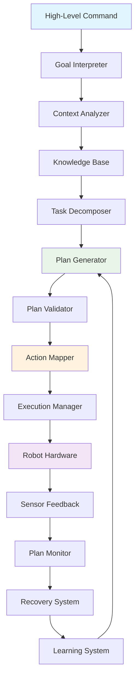

# Chapter 2: Language-Based Cognitive Planning

This chapter covers language-driven cognitive planning with AI models, enabling students to create intelligent systems that can reason about complex tasks and break them down into executable steps.

## Learning Objectives

By the end of this chapter, students will be able to:

- Understand LLM-based cognitive planning fundamentals
- Implement task decomposition from high-level commands
- Create practical examples of cognitive planning with GPT models
- Design sequential action planning with dependencies
- Add code examples for cognitive planning algorithms
- Implement error handling and recovery strategies

## Prerequisites

Before starting this chapter, students should have:

- Basic understanding of robotics concepts (covered in Module 1)
- Knowledge of AI/ML fundamentals
- Basic understanding of ROS 2 (covered in Module 1)
- Completion of Chapter 1: Voice-to-Action Pipelines

## Overview

Language-based cognitive planning enables robots to handle complex, multi-step tasks by breaking them down into simpler actions, representing a significant advancement in autonomous robot capabilities. This chapter explores how AI models can decompose complex commands into sequences of executable actions.

## LLM-Based Cognitive Planning Fundamentals

Cognitive planning is the process of reasoning about complex tasks and determining the sequence of actions needed to achieve a goal. In the context of Vision-Language-Action (VLA) systems, cognitive planning uses language models to understand high-level commands and decompose them into executable action sequences.

### What is Cognitive Planning?

Cognitive planning in robotics involves:

- **Goal Understanding**: Interpreting high-level objectives from natural language
- **Task Decomposition**: Breaking complex tasks into manageable subtasks
- **Action Sequencing**: Determining the order and dependencies of actions
- **Resource Management**: Planning the use of robot capabilities and environmental resources
- **Contingency Planning**: Preparing for potential obstacles and alternative paths

### Role of Large Language Models (LLMs)

Large Language Models like GPT-4, Claude, and other transformer-based models excel at cognitive planning because they:

- **Understand Context**: Can interpret commands within the context of the environment
- **Reason Logically**: Apply logical reasoning to decompose complex tasks
- **Handle Ambiguity**: Resolve ambiguous commands using world knowledge
- **Generate Plans**: Create detailed, step-by-step action sequences
- **Adapt to Situations**: Modify plans based on environmental constraints

### Cognitive Planning vs. Traditional Planning

Traditional robotic planning typically focuses on:
- Low-level path planning
- Kinematic constraints
- Physical obstacle avoidance

Cognitive planning with LLMs adds:
- High-level semantic understanding
- Natural language interpretation
- Abstract reasoning capabilities
- Flexible plan generation

### The Cognitive Planning Process

The cognitive planning process typically follows these steps:

1. **Goal Interpretation**: Understanding the high-level objective from natural language
2. **Context Analysis**: Assessing the current environment and available resources
3. **Task Decomposition**: Breaking the goal into subtasks
4. **Action Sequencing**: Determining the order and dependencies
5. **Plan Validation**: Checking for feasibility and potential issues
6. **Plan Execution**: Executing the plan with appropriate action mapping

### Example: Complex Command Decomposition

Consider the command: "Clean the living room and bring me a glass of water"

The cognitive planning process would decompose this into:

1. **Goal Analysis**: Two main objectives (cleaning + fetching)
2. **Task Breakdown**:
   - Clean living room:
     - Identify objects to move
     - Determine cleaning actions needed
     - Plan navigation through the space
   - Bring glass of water:
     - Locate kitchen
     - Find glass and water source
     - Navigate to destination
3. **Sequencing**: Determine optimal order (may depend on context)
4. **Resource Allocation**: Plan use of arms, navigation, and sensors

This decomposition allows the robot to understand and execute complex, multi-faceted commands that would be difficult to handle with simple intent recognition.

## Task Decomposition from High-Level Commands

Task decomposition is the process of breaking down complex, high-level commands into simpler, executable subtasks. This is a critical capability that enables robots to handle sophisticated instructions that would be impossible to address with single actions.

### The Decomposition Process

The task decomposition process involves several key steps:

1. **Command Analysis**: Understanding the overall objective and constraints
2. **Subtask Identification**: Identifying the individual tasks needed to achieve the goal
3. **Dependency Mapping**: Determining the relationships and dependencies between subtasks
4. **Resource Allocation**: Assigning robot capabilities and environmental resources to each subtask
5. **Feasibility Validation**: Ensuring each subtask is achievable given current conditions

### Hierarchical Decomposition

Task decomposition typically follows a hierarchical approach:

```
High-Level Command
├── Main Task 1
│   ├── Subtask 1.1
│   ├── Subtask 1.2
│   └── Subtask 1.3
├── Main Task 2
│   ├── Subtask 2.1
│   ├── Subtask 2.2
│   └── Subtask 2.3
└── Main Task 3
    ├── Subtask 3.1
    ├── Subtask 3.2
    └── Subtask 3.3
```

### Decomposition Strategies

#### Sequential Decomposition
Tasks are executed in a predetermined order where each task must be completed before the next begins.

Example: "Assemble the toy"
1. Gather all pieces
2. Find assembly instructions
3. Follow instructions step-by-step

#### Parallel Decomposition
Multiple tasks can be executed simultaneously when they don't depend on each other.

Example: "Prepare dinner and clean the living room"
- Prepare dinner (in kitchen)
- Clean living room (in living room)

#### Conditional Decomposition
Task execution depends on certain conditions being met.

Example: "Organize the bookshelf"
1. If books are scattered → Collect all books
2. If shelf is dirty → Clean shelf
3. Sort books by category
4. Arrange books on shelf

### Implementation Example: Task Decomposer

```python
import openai
from typing import List, Dict, Any, Optional
from dataclasses import dataclass
from enum import Enum

class TaskStatus(Enum):
    PENDING = "pending"
    IN_PROGRESS = "in_progress"
    COMPLETED = "completed"
    FAILED = "failed"

@dataclass
class Subtask:
    id: str
    description: str
    action_type: str
    parameters: Dict[str, Any]
    dependencies: List[str]  # IDs of tasks this depends on
    status: TaskStatus = TaskStatus.PENDING

class TaskDecomposer:
    def __init__(self, api_key: str):
        openai.api_key = api_key

    async def decompose_task(self, high_level_command: str, context: Dict[str, Any]) -> List[Subtask]:
        """
        Decompose a high-level command into executable subtasks.

        Args:
            high_level_command: Natural language command to decompose
            context: Current environment and robot state information

        Returns:
            List of subtasks that achieve the high-level goal
        """
        # Create a prompt for the LLM to decompose the task
        prompt = f"""
        Decompose the following high-level command into specific, executable subtasks:
        Command: "{high_level_command}"

        Context: {context}

        Please provide the decomposition in the following format:
        1. [Subtask description] - [Action type] - [Parameters] - [Dependencies]

        Each subtask should be:
        - Specific and actionable
        - Have a clear action type (navigation, manipulation, perception, etc.)
        - Include necessary parameters
        - Identify any dependencies on other subtasks
        """

        try:
            response = await openai.ChatCompletion.acreate(
                model="gpt-3.5-turbo",
                messages=[{"role": "user", "content": prompt}],
                temperature=0.3
            )

            decomposition_text = response.choices[0].message.content

            # Parse the LLM response into structured subtasks
            subtasks = self._parse_decomposition(decomposition_text)

            return subtasks

        except Exception as e:
            print(f"Error decomposing task: {e}")
            # Return a default decomposition for simple commands
            return self._default_decomposition(high_level_command)

    def _parse_decomposition(self, decomposition_text: str) -> List[Subtask]:
        """
        Parse the LLM's decomposition response into structured subtasks.
        """
        subtasks = []
        lines = decomposition_text.strip().split('\n')

        for i, line in enumerate(lines):
            if line.strip() and line[0].isdigit():
                # Parse the line: "1. [description] - [action_type] - [parameters] - [dependencies]"
                parts = line.split(' - ')
                if len(parts) >= 3:
                    description = parts[0].split('. ', 1)[1].strip()
                    action_type = parts[1].strip()
                    params_str = parts[2].strip()

                    # Extract dependencies if present
                    dependencies = []
                    if len(parts) > 3:
                        deps_str = parts[3].strip()
                        if deps_str.lower() != "none":
                            dependencies = [d.strip() for d in deps_str.split(',')]

                    # Parse parameters (simplified)
                    try:
                        import json
                        parameters = json.loads(params_str) if params_str.lower() != "none" else {}
                    except:
                        parameters = {"description": params_str}

                    subtask = Subtask(
                        id=f"subtask_{i+1}",
                        description=description,
                        action_type=action_type,
                        parameters=parameters,
                        dependencies=dependencies
                    )
                    subtasks.append(subtask)

        return subtasks

    def _default_decomposition(self, command: str) -> List[Subtask]:
        """
        Provide a default decomposition for when LLM fails.
        """
        # Simple rule-based decomposition for common commands
        command_lower = command.lower()

        if "clean" in command_lower:
            return [
                Subtask(
                    id="subtask_1",
                    description="Survey the area to identify cleaning needs",
                    action_type="perception",
                    parameters={"task": "survey", "area": "room"},
                    dependencies=[]
                ),
                Subtask(
                    id="subtask_2",
                    description="Pick up objects from the floor",
                    action_type="manipulation",
                    parameters={"action": "pick_up", "object_type": "debris"},
                    dependencies=["subtask_1"]
                ),
                Subtask(
                    id="subtask_3",
                    description="Vacuum the floor",
                    action_type="manipulation",
                    parameters={"action": "vacuum"},
                    dependencies=["subtask_2"]
                )
            ]
        elif "bring" in command_lower or "get" in command_lower:
            return [
                Subtask(
                    id="subtask_1",
                    description="Identify the requested object",
                    action_type="perception",
                    parameters={"task": "find_object", "object": self._extract_object(command)},
                    dependencies=[]
                ),
                Subtask(
                    id="subtask_2",
                    description="Navigate to the object location",
                    action_type="navigation",
                    parameters={"action": "navigate_to", "target": self._extract_location(command)},
                    dependencies=["subtask_1"]
                ),
                Subtask(
                    id="subtask_3",
                    description="Grasp the object",
                    action_type="manipulation",
                    parameters={"action": "grasp", "object": self._extract_object(command)},
                    dependencies=["subtask_2"]
                ),
                Subtask(
                    id="subtask_4",
                    description="Return to the requester",
                    action_type="navigation",
                    parameters={"action": "return_to", "target": "requester"},
                    dependencies=["subtask_3"]
                )
            ]
        else:
            # Default: single subtask
            return [
                Subtask(
                    id="subtask_1",
                    description=command,
                    action_type="unknown",
                    parameters={"original_command": command},
                    dependencies=[]
                )
            ]

    def _extract_object(self, command: str) -> str:
        """
        Simple object extraction from command (in a real system, this would be more sophisticated).
        """
        # This is a simplified extraction - in practice, use NLP techniques
        words = command.lower().split()
        for i, word in enumerate(words):
            if word in ["the", "a", "an"]:
                if i + 1 < len(words):
                    return words[i + 1]
        return "unknown_object"

    def _extract_location(self, command: str) -> str:
        """
        Simple location extraction from command.
        """
        # Look for common location words
        locations = ["kitchen", "bedroom", "living room", "bathroom", "office", "table", "cabinet"]
        command_lower = command.lower()

        for location in locations:
            if location in command_lower:
                return location

        return "unknown_location"

# Example usage
async def example_usage():
    decomposer = TaskDecomposer(api_key="your-api-key")

    # Example command
    command = "Clean the living room and organize the books on the shelf"
    context = {
        "robot_capabilities": ["navigation", "manipulation", "perception"],
        "environment": {
            "room": "living_room",
            "objects_present": ["books", "couch", "table", "debris"],
            "robot_location": "entrance"
        }
    }

    subtasks = await decomposer.decompose_task(command, context)

    print(f"Decomposed command: '{command}'")
    print("Subtasks:")
    for i, subtask in enumerate(subtasks, 1):
        print(f"  {i}. {subtask.description}")
        print(f"     Action: {subtask.action_type}")
        print(f"     Params: {subtask.parameters}")
        if subtask.dependencies:
            print(f"     Depends on: {', '.join(subtask.dependencies)}")
        print()

# Note: In a real implementation, you would run this in an async context
# asyncio.run(example_usage())
```

### Advanced Decomposition Techniques

#### Context-Aware Decomposition

The decomposition process should consider the current context:

- **Environmental Constraints**: Available space, obstacles, lighting conditions
- **Robot Capabilities**: Current battery level, available arms, sensor status
- **Temporal Constraints**: Time limits, scheduling requirements
- **Safety Considerations**: Human presence, fragile objects, hazardous areas

#### Multi-Modal Decomposition

For VLA systems, decomposition should consider:

- **Visual Information**: What the robot can see and how it affects the plan
- **Language Understanding**: Ambiguities in the command that need clarification
- **Action Feasibility**: Whether the robot can physically perform the required actions

### Validation and Refinement

After decomposition, it's important to validate the plan:

1. **Completeness Check**: Does the decomposition fully address the original command?
2. **Feasibility Check**: Can each subtask be executed with available resources?
3. **Dependency Check**: Are all dependencies properly ordered?
4. **Safety Check**: Does the plan avoid potential hazards?

This validation process ensures that the decomposed tasks will successfully achieve the intended goal when executed.

## Practical Examples of Cognitive Planning with GPT Models

This section provides practical examples of implementing cognitive planning using GPT models in robotic systems. These examples demonstrate how to structure prompts, process responses, and integrate planning with robotic action execution.

### Example 1: Room Navigation and Object Retrieval

Command: "Go to the kitchen, find a red apple, and bring it to me."

```python
import openai
import asyncio
from typing import Dict, Any, List
from dataclasses import dataclass

@dataclass
class PlanStep:
    action: str
    parameters: Dict[str, Any]
    description: str
    dependencies: List[str]

class CognitivePlanner:
    def __init__(self, api_key: str):
        openai.api_key = api_key

    async def create_plan(self, command: str, context: Dict[str, Any]) -> List[PlanStep]:
        """
        Create a cognitive plan for the given command using GPT.
        """
        prompt = f"""
        You are a cognitive planning system for a robot. Create a detailed plan to execute the following command:
        Command: "{command}"

        Current context:
        - Robot location: {context.get('robot_location', 'unknown')}
        - Environment: {context.get('environment', 'unknown')}
        - Available capabilities: {context.get('capabilities', 'unknown')}
        - Objects in environment: {context.get('objects', 'unknown')}

        Create a step-by-step plan with the following format:
        1. [Action] - [Parameters] - [Description] - [Dependencies]
        2. [Action] - [Parameters] - [Description] - [Dependencies]
        ...

        Each step should be:
        - A specific action the robot can perform
        - Include all necessary parameters
        - Describe what the action accomplishes
        - List any dependencies on previous steps (if applicable)

        Actions should be from this set: navigate_to, find_object, grasp_object,
        return_to, survey_area, wait, report_status.
        """

        try:
            response = await openai.ChatCompletion.acreate(
                model="gpt-3.5-turbo",
                messages=[{"role": "user", "content": prompt}],
                temperature=0.2,  # Low temperature for more consistent planning
                max_tokens=1000
            )

            plan_text = response.choices[0].message.content
            return self._parse_plan(plan_text)

        except Exception as e:
            print(f"Error creating plan: {e}")
            return self._create_fallback_plan(command)

    def _parse_plan(self, plan_text: str) -> List[PlanStep]:
        """
        Parse the GPT response into structured plan steps.
        """
        plan_steps = []
        lines = plan_text.strip().split('\n')

        for line in lines:
            if line.strip() and line[0].isdigit():
                # Parse: "1. [Action] - [Parameters] - [Description] - [Dependencies]"
                parts = line.split(' - ')
                if len(parts) >= 3:
                    # Extract action from the first part (before the dash)
                    action_part = parts[0]
                    action = action_part.split('. ', 1)[1].strip() if '. ' in action_part else action_part

                    # Parse parameters
                    params_str = parts[1].strip()
                    try:
                        import json
                        # Simple parameter parsing - in a real system, this would be more sophisticated
                        if params_str.startswith('{') and params_str.endswith('}'):
                            parameters = json.loads(params_str)
                        else:
                            # Parse simple key=value format
                            param_dict = {}
                            for param in params_str.split(','):
                                if '=' in param:
                                    k, v = param.split('=', 1)
                                    param_dict[k.strip()] = v.strip()
                            parameters = param_dict
                    except:
                        parameters = {"raw": params_str}

                    description = parts[2].strip() if len(parts) > 2 else "No description"
                    dependencies = []
                    if len(parts) > 3:
                        deps_str = parts[3].strip()
                        if deps_str.lower() != "none":
                            dependencies = [d.strip() for d in deps_str.split(',')]

                    plan_step = PlanStep(
                        action=action,
                        parameters=parameters,
                        description=description,
                        dependencies=dependencies
                    )
                    plan_steps.append(plan_step)

        return plan_steps

    def _create_fallback_plan(self, command: str) -> List[PlanStep]:
        """
        Create a basic plan when GPT fails.
        """
        # Simple rule-based fallback
        command_lower = command.lower()

        steps = []
        if "kitchen" in command_lower:
            steps.append(PlanStep(
                action="navigate_to",
                parameters={"location": "kitchen"},
                description="Navigate to the kitchen",
                dependencies=[]
            ))

        if "apple" in command_lower or "object" in command_lower:
            steps.append(PlanStep(
                action="find_object",
                parameters={"object_type": "apple", "color": "red"},
                description="Find a red apple in the kitchen",
                dependencies=["navigate_to"] if steps else []
            ))

        steps.append(PlanStep(
            action="grasp_object",
            parameters={"object_type": "apple"},
            description="Grasp the red apple",
            dependencies=["find_object"] if len(steps) > 1 else []
        ))

        steps.append(PlanStep(
            action="return_to",
            parameters={"target": "user"},
            description="Return to the user with the apple",
            dependencies=["grasp_object"]
        ))

        return steps

# Example usage
async def example_1():
    planner = CognitivePlanner(api_key="your-api-key")

    command = "Go to the kitchen, find a red apple, and bring it to me."
    context = {
        "robot_location": "living_room",
        "environment": "home",
        "capabilities": ["navigation", "manipulation", "object_recognition"],
        "objects": ["table", "chair", "couch", "kitchen_items"]
    }

    plan = await planner.create_plan(command, context)

    print(f"Command: {command}")
    print("Generated Plan:")
    for i, step in enumerate(plan, 1):
        print(f"  {i}. {step.action}")
        print(f"     Parameters: {step.parameters}")
        print(f"     Description: {step.description}")
        if step.dependencies:
            print(f"     Depends on: {', '.join(step.dependencies)}")
        print()

# Run the example
# asyncio.run(example_1())
```

### Example 2: Multi-Step Cleaning Task

Command: "Clean the living room by picking up toys, vacuuming, and arranging the books."

```python
async def example_2():
    planner = CognitivePlanner(api_key="your-api-key")

    command = "Clean the living room by picking up toys, vacuuming, and arranging the books."
    context = {
        "robot_location": "living_room_entrance",
        "environment": "living_room",
        "capabilities": ["navigation", "manipulation", "object_recognition", "vacuuming"],
        "objects": ["toys", "books", "couch", "table", "floor"]
    }

    plan = await planner.create_plan(command, context)

    print(f"Command: {command}")
    print("Generated Plan:")
    for i, step in enumerate(plan, 1):
        print(f"  {i}. {step.action}")
        print(f"     Parameters: {step.parameters}")
        print(f"     Description: {step.description}")
        if step.dependencies:
            print(f"     Depends on: {', '.join(step.dependencies)}")
        print()

# Run the example
# asyncio.run(example_2())
```

### Example 3: Complex Task with Conditional Logic

Command: "If the table is dirty, clean it. Then organize the books on the shelf."

```python
async def example_3():
    planner = CognitivePlanner(api_key="your-api-key")

    command = "If the table is dirty, clean it. Then organize the books on the shelf."
    context = {
        "robot_location": "library",
        "environment": "library",
        "capabilities": ["navigation", "manipulation", "cleaning", "object_recognition"],
        "objects": ["table", "books", "shelf", "chairs"]
    }

    plan = await planner.create_plan(command, context)

    print(f"Command: {command}")
    print("Generated Plan:")
    for i, step in enumerate(plan, 1):
        print(f"  {i}. {step.action}")
        print(f"     Parameters: {step.parameters}")
        print(f"     Description: {step.description}")
        if step.dependencies:
            print(f"     Depends on: {', '.join(step.dependencies)}")
        print()

# Run the example
# asyncio.run(example_3())
```

### Integration with Robotic Execution

To integrate the cognitive plan with actual robotic execution:

```python
class PlanExecutor:
    def __init__(self, robot_interface):
        self.robot = robot_interface
        self.completed_steps = set()

    async def execute_plan(self, plan: List[PlanStep]) -> bool:
        """
        Execute the cognitive plan step by step.
        """
        for step in plan:
            # Check dependencies
            if not self._check_dependencies(step):
                print(f"Skipping {step.action} - dependencies not met")
                continue

            # Execute the step
            success = await self._execute_step(step)

            if success:
                self.completed_steps.add(step.action)
                print(f"Completed: {step.description}")
            else:
                print(f"Failed: {step.description}")
                return False  # Stop execution on failure

        return True

    def _check_dependencies(self, step: PlanStep) -> bool:
        """
        Check if all dependencies for this step are completed.
        """
        for dep in step.dependencies:
            if dep not in self.completed_steps:
                return False
        return True

    async def _execute_step(self, step: PlanStep) -> bool:
        """
        Execute a single plan step on the robot.
        """
        try:
            if step.action == "navigate_to":
                return await self.robot.navigate_to(**step.parameters)
            elif step.action == "find_object":
                return await self.robot.find_object(**step.parameters)
            elif step.action == "grasp_object":
                return await self.robot.grasp_object(**step.parameters)
            elif step.action == "return_to":
                return await self.robot.return_to(**step.parameters)
            elif step.action == "survey_area":
                return await self.robot.survey_area(**step.parameters)
            else:
                print(f"Unknown action: {step.action}")
                return False
        except Exception as e:
            print(f"Error executing step {step.action}: {e}")
            return False

# Complete system integration example
async def integrated_system_example():
    # Create planner
    planner = CognitivePlanner(api_key="your-api-key")

    # Create command and context
    command = "Go to the kitchen, find a red apple, and bring it to me."
    context = {
        "robot_location": "living_room",
        "environment": "home",
        "capabilities": ["navigation", "manipulation", "object_recognition"],
        "objects": ["table", "chair", "couch", "kitchen_items"]
    }

    # Generate plan
    plan = await planner.create_plan(command, context)

    # Execute plan (in a real system, you'd have an actual robot interface)
    # executor = PlanExecutor(robot_interface=actual_robot)
    # success = await executor.execute_plan(plan)

    print(f"Command: {command}")
    print(f"Plan with {len(plan)} steps generated successfully")

    return plan

# Run the integrated example
# plan = asyncio.run(integrated_system_example())
```

### Prompt Engineering Best Practices

When using GPT models for cognitive planning, consider these best practices:

1. **Clear Structure**: Provide a consistent format for the expected output
2. **Context Provision**: Include all relevant environmental and capability information
3. **Action Constraints**: Limit the possible actions to those the robot can actually perform
4. **Validation**: Always validate the generated plan before execution
5. **Error Handling**: Have fallback strategies when GPT doesn't generate a valid plan

These practical examples demonstrate how to effectively use GPT models for cognitive planning in robotic systems, enabling complex task decomposition and execution based on natural language commands.

## Sequential Action Planning with Dependencies

Sequential action planning involves organizing individual robot actions into a coherent sequence where each action may depend on the successful completion of previous actions. This is crucial for complex tasks that require multiple steps to be performed in a specific order.

### Understanding Dependencies

In robotic task execution, dependencies define the relationships between actions:

- **Precondition Dependencies**: An action requires certain conditions to be met before it can start
- **Resource Dependencies**: Actions compete for limited robot resources (e.g., arms, sensors)
- **Temporal Dependencies**: Some actions must occur before or after others
- **Causal Dependencies**: The output of one action is required as input for another

### Dependency Graphs

Dependency graphs represent the relationships between actions:

```
Action A → Action B → Action C
    ↓
Action D → Action E
```

In this example:
- Action B depends on Action A
- Action C depends on Action B
- Action D depends on Action A
- Action E depends on both Action D and Action B (when they converge)

### Types of Dependencies

#### 1. Hard Dependencies (Must Execute in Order)
These represent physical or logical constraints where one action must complete before another can begin:

```python
# Example: Grasping an object requires first navigating to it
navigate_to_kitchen = PlanStep(
    action="navigate_to",
    parameters={"location": "kitchen"},
    description="Navigate to the kitchen",
    dependencies=[]
)

find_apple = PlanStep(
    action="find_object",
    parameters={"object_type": "apple"},
    description="Find an apple in the kitchen",
    dependencies=["navigate_to"]  # Must navigate before finding
)

grasp_apple = PlanStep(
    action="grasp_object",
    parameters={"object": "apple"},
    description="Grasp the apple",
    dependencies=["find_object"]  # Must find before grasping
)
```

#### 2. Soft Dependencies (Preferable but Flexible)
These represent preferences that can be adjusted based on circumstances:

```python
# Example: Cleaning sequence that can be reordered if needed
clean_floor = PlanStep(
    action="clean_area",
    parameters={"area": "floor", "method": "vacuum"},
    description="Clean the floor",
    dependencies=["survey_area"]
)

arrange_furniture = PlanStep(
    action="move_object",
    parameters={"object": "chair", "destination": "proper_position"},
    description="Arrange furniture",
    dependencies=["clean_area"],  # Preferably after cleaning, but could be concurrent
    soft_dependency=True
)
```

#### 3. Conditional Dependencies
These dependencies only apply under certain conditions:

```python
# Example: Conditional cleaning based on sensor feedback
check_surface = PlanStep(
    action="analyze_surface",
    parameters={"surface": "table"},
    description="Check if the table is dirty",
    dependencies=[]
)

clean_surface = PlanStep(
    action="clean_surface",
    parameters={"surface": "table"},
    description="Clean the table if dirty",
    dependencies=["analyze_surface"],
    condition="surface_is_dirty"  # Only execute if condition is met
)
```

### Dependency Resolution Algorithm

Here's an implementation of a dependency resolution system:

```python
from typing import List, Dict, Set, Optional
from dataclasses import dataclass
from enum import Enum

class TaskStatus(Enum):
    PENDING = "pending"
    READY = "ready"
    IN_PROGRESS = "in_progress"
    COMPLETED = "completed"
    FAILED = "failed"

@dataclass
class ActionStep:
    id: str
    action: str
    parameters: Dict[str, any]
    dependencies: List[str]
    status: TaskStatus = TaskStatus.PENDING
    condition: Optional[str] = None  # Optional condition for execution

class DependencyResolver:
    def __init__(self):
        self.steps: Dict[str, ActionStep] = {}
        self.completed: Set[str] = set()
        self.in_progress: Set[str] = set()

    def add_step(self, step: ActionStep):
        """Add a step to the dependency graph."""
        self.steps[step.id] = step

    def get_ready_steps(self) -> List[ActionStep]:
        """
        Get all steps that are ready to execute (dependencies satisfied).
        """
        ready_steps = []

        for step_id, step in self.steps.items():
            if step.status == TaskStatus.PENDING and self._can_execute(step):
                ready_steps.append(step)

        return ready_steps

    def _can_execute(self, step: ActionStep) -> bool:
        """
        Check if a step can be executed based on dependencies and conditions.
        """
        # Check if all dependencies are completed
        for dep_id in step.dependencies:
            if dep_id not in self.completed:
                return False

        # Check conditions if present
        if step.condition:
            return self._evaluate_condition(step.condition)

        return True

    def _evaluate_condition(self, condition: str) -> bool:
        """
        Evaluate a condition (in a real system, this would be more sophisticated).
        """
        # This is a simplified condition evaluator
        # In practice, this would connect to perception systems, etc.
        if condition == "surface_is_dirty":
            # This would actually check sensor data
            return True  # Simplified
        return True

    def mark_completed(self, step_id: str, success: bool = True):
        """
        Mark a step as completed.
        """
        if success:
            self.completed.add(step_id)
            if step_id in self.in_progress:
                self.in_progress.remove(step_id)

            # Update status of the completed step
            if step_id in self.steps:
                self.steps[step_id].status = TaskStatus.COMPLETED
        else:
            # Handle failure - in a real system, you might have recovery strategies
            if step_id in self.steps:
                self.steps[step_id].status = TaskStatus.FAILED

    def get_execution_order(self) -> List[str]:
        """
        Get a valid execution order for all steps (topological sort).
        """
        # Build dependency graph
        graph = {step_id: step.dependencies for step_id, step in self.steps.items()}

        # Perform topological sort
        result = []
        visited = set()
        temp_visited = set()

        def visit(node):
            if node in temp_visited:
                raise ValueError(f"Circular dependency detected: {node}")
            if node not in visited:
                temp_visited.add(node)
                for dep in graph.get(node, []):
                    visit(dep)
                temp_visited.remove(node)
                visited.add(node)
                result.append(node)

        for step_id in graph:
            if step_id not in visited:
                visit(step_id)

        return result

# Example usage of dependency resolution
def example_dependency_resolution():
    resolver = DependencyResolver()

    # Define steps for a complex task: "Clean the table and put a book on it"
    steps = [
        ActionStep(
            id="navigate_to_table",
            action="navigate_to",
            parameters={"location": "table"},
            dependencies=[],
            status=TaskStatus.PENDING
        ),
        ActionStep(
            id="analyze_surface",
            action="analyze_surface",
            parameters={"surface": "table"},
            dependencies=["navigate_to_table"],
            status=TaskStatus.PENDING
        ),
        ActionStep(
            id="clean_surface",
            action="clean_surface",
            parameters={"surface": "table"},
            dependencies=["analyze_surface"],
            condition="surface_is_dirty",
            status=TaskStatus.PENDING
        ),
        ActionStep(
            id="navigate_to_bookshelf",
            action="navigate_to",
            parameters={"location": "bookshelf"},
            dependencies=[],
            status=TaskStatus.PENDING
        ),
        ActionStep(
            id="find_book",
            action="find_object",
            parameters={"object_type": "book"},
            dependencies=["navigate_to_bookshelf"],
            status=TaskStatus.PENDING
        ),
        ActionStep(
            id="grasp_book",
            action="grasp_object",
            parameters={"object": "book"},
            dependencies=["find_book"],
            status=TaskStatus.PENDING
        ),
        ActionStep(
            id="place_book",
            action="place_object",
            parameters={"object": "book", "location": "table"},
            dependencies=["grasp_book", "clean_surface"],  # Depends on both cleaning and grasping
            status=TaskStatus.PENDING
        )
    ]

    # Add all steps to resolver
    for step in steps:
        resolver.add_step(step)

    # Get execution order
    execution_order = resolver.get_execution_order()
    print("Execution order:", execution_order)

    # Get ready steps at different points
    ready_steps = resolver.get_ready_steps()
    print(f"Initially ready steps: {[step.id for step in ready_steps]}")

    # Simulate execution
    for step_id in ["navigate_to_table", "navigate_to_bookshelf"]:
        resolver.mark_completed(step_id)

    ready_steps = resolver.get_ready_steps()
    print(f"After completing navigation: {[step.id for step in ready_steps]}")

# Run the example
example_dependency_resolution()
```

### Parallel Execution with Dependencies

When possible, actions with no dependencies on each other can be executed in parallel:

```python
class ParallelExecutor:
    def __init__(self, max_concurrent: int = 2):
        self.max_concurrent = max_concurrent
        self.active_tasks: Set[str] = set()

    async def execute_with_dependencies(self, resolver: DependencyResolver):
        """
        Execute steps respecting dependencies, with possible parallel execution.
        """
        completed_count = 0
        total_steps = len(resolver.steps)

        while completed_count < total_steps:
            # Get ready steps that aren't already in progress
            ready_steps = resolver.get_ready_steps()
            available_slots = self.max_concurrent - len(self.active_tasks)

            # Execute up to max_concurrent ready steps
            steps_to_execute = ready_steps[:available_slots]

            for step in steps_to_execute:
                # Execute the step (this would be a real robot action in practice)
                success = await self._execute_step(step)
                resolver.mark_completed(step.id, success)

                if success:
                    completed_count += 1

                print(f"Executed: {step.action} - Success: {success}")

            # Small delay to prevent busy waiting
            import asyncio
            await asyncio.sleep(0.1)

    async def _execute_step(self, step: ActionStep) -> bool:
        """
        Execute a single step (simulated).
        """
        # In a real implementation, this would interface with the robot
        print(f"Executing {step.action} with parameters {step.parameters}")
        # Simulate execution time
        import asyncio
        await asyncio.sleep(0.5)
        return True  # Simulate success
```

### Handling Complex Dependencies

For complex tasks, dependencies may form intricate graphs that require sophisticated handling:

```python
class ComplexDependencyHandler:
    def __init__(self):
        self.resolver = DependencyResolver()
        self.resource_manager = ResourceManager()

    def handle_resource_conflicts(self, steps: List[ActionStep]) -> List[ActionStep]:
        """
        Handle conflicts where multiple steps need the same resource.
        """
        # Group steps by required resources
        resource_map = {}
        for step in steps:
            resource = self._get_required_resource(step)
            if resource not in resource_map:
                resource_map[resource] = []
            resource_map[resource].append(step)

        # For resources with conflicts, add sequential dependencies
        for resource, resource_steps in resource_map.items():
            if len(resource_steps) > 1:
                # Create sequential dependencies for steps using the same resource
                for i in range(1, len(resource_steps)):
                    prev_step = resource_steps[i-1]
                    curr_step = resource_steps[i]

                    # Add dependency to ensure sequential access to the resource
                    if curr_step.id not in prev_step.dependencies:
                        curr_step.dependencies.append(prev_step.id)

        return steps

    def _get_required_resource(self, step: ActionStep) -> str:
        """
        Determine which resource a step requires.
        """
        # Simplified resource mapping
        if step.action in ["grasp_object", "place_object", "manipulate_object"]:
            return "robot_arm"
        elif step.action in ["navigate_to", "move_to", "path_planning"]:
            return "navigation_system"
        elif step.action in ["analyze_surface", "find_object", "perceive_environment"]:
            return "vision_system"
        else:
            return "general_processing"

# Example of handling complex dependencies
def complex_dependency_example():
    handler = ComplexDependencyHandler()

    # Example: Multiple manipulation tasks that all need the robot arm
    steps = [
        ActionStep(id="grasp_cup", action="grasp_object", parameters={"object": "cup"}, dependencies=[]),
        ActionStep(id="move_cup", action="move_object", parameters={"object": "cup", "dest": "table"}, dependencies=["grasp_cup"]),
        ActionStep(id="grasp_book", action="grasp_object", parameters={"object": "book"}, dependencies=[]),
        ActionStep(id="place_book", action="place_object", parameters={"object": "book", "dest": "shelf"}, dependencies=["grasp_book"])
    ]

    # Handle resource conflicts
    resolved_steps = handler.handle_resource_conflicts(steps)

    print("After resource conflict resolution:")
    for step in resolved_steps:
        print(f"  {step.id}: depends on {step.dependencies}")

complex_dependency_example()
```

Sequential action planning with dependencies is fundamental to complex robotic task execution. By properly managing dependencies, robots can execute complex, multi-step tasks efficiently while ensuring that each step has the necessary preconditions met.

## Code Examples for Cognitive Planning Algorithms

This section provides comprehensive code examples for various cognitive planning algorithms used in VLA systems. These examples demonstrate different approaches to planning, from classical algorithms to LLM-integrated solutions.

### 1. Classical Planning Algorithm: Hierarchical Task Network (HTN)

HTN planning decomposes high-level tasks into primitive actions:

```python
from typing import List, Dict, Any, Optional, Set
from dataclasses import dataclass
from enum import Enum

class TaskType(Enum):
    COMPOUND = "compound"
    PRIMITIVE = "primitive"

@dataclass
class Task:
    id: str
    name: str
    type: TaskType
    parameters: Dict[str, Any]
    subtasks: List[str]  # For compound tasks
    action: Optional[str] = None  # For primitive tasks

@dataclass
class State:
    """Represents the current state of the world."""
    objects: Dict[str, Any]
    locations: Dict[str, str]  # object_id -> location_id
    robot_state: Dict[str, Any]

class HTNPlanner:
    def __init__(self):
        self.tasks: Dict[str, Task] = {}
        self.methods: Dict[str, List[List[str]]] = {}  # task_id -> list of method decompositions

    def add_task(self, task: Task):
        """Add a task to the planner."""
        self.tasks[task.id] = task

    def add_method(self, task_id: str, decomposition: List[str]):
        """Add a method for decomposing a compound task."""
        if task_id not in self.methods:
            self.methods[task_id] = []
        self.methods[task_id].append(decomposition)

    def plan(self, initial_state: State, goal_task_id: str) -> Optional[List[str]]:
        """Generate a plan to achieve the goal task."""
        return self._decompose_task(goal_task_id, initial_state, [])

    def _decompose_task(self, task_id: str, state: State, used_methods: List[str]) -> Optional[List[str]]:
        """Recursively decompose a task into primitive actions."""
        task = self.tasks[task_id]

        if task.type == TaskType.PRIMITIVE:
            # This is a primitive action, return it
            return [task.action]

        # This is a compound task, try each method
        for method in self.methods.get(task_id, []):
            # Check if method is applicable in current state
            if self._is_method_applicable(method, state):
                plan = []
                success = True

                for subtask_id in method:
                    subplan = self._decompose_task(subtask_id, state, used_methods + [task_id])
                    if subplan is None:
                        success = False
                        break
                    plan.extend(subplan)

                if success:
                    return plan

        return None  # No applicable method found

    def _is_method_applicable(self, method: List[str], state: State) -> bool:
        """Check if a method is applicable in the current state."""
        # In a real implementation, this would check preconditions
        return True

# Example usage of HTN planner
def example_htn_planning():
    planner = HTNPlanner()

    # Define tasks
    get_object_task = Task(
        id="get_object",
        name="Get Object",
        type=TaskType.COMPOUND,
        parameters={"object": "apple", "location": "kitchen"},
        subtasks=["navigate_to_kitchen", "find_apple", "grasp_apple"]
    )

    navigate_task = Task(
        id="navigate_to_kitchen",
        name="Navigate to Kitchen",
        type=TaskType.PRIMITIVE,
        parameters={"destination": "kitchen"},
        subtasks=[],
        action="navigate_to_kitchen"
    )

    find_task = Task(
        id="find_apple",
        name="Find Apple",
        type=TaskType.PRIMITIVE,
        parameters={"object_type": "apple"},
        subtasks=[],
        action="find_apple"
    )

    grasp_task = Task(
        id="grasp_apple",
        name="Grasp Apple",
        type=TaskType.PRIMITIVE,
        parameters={"object": "apple"},
        subtasks=[],
        action="grasp_apple"
    )

    # Add tasks to planner
    for task in [get_object_task, navigate_task, find_task, grasp_task]:
        planner.add_task(task)

    # Add method for get_object task
    planner.add_method("get_object", ["navigate_to_kitchen", "find_apple", "grasp_apple"])

    # Create initial state
    initial_state = State(
        objects={"apple": "kitchen", "robot": "living_room"},
        locations={"apple": "kitchen", "robot": "living_room"},
        robot_state={"location": "living_room", "holding": None}
    )

    # Generate plan
    plan = planner.plan(initial_state, "get_object")
    print(f"HTN Plan: {plan}")

example_htn_planning()
```

### 2. LLM-Integrated Planning Algorithm

This approach uses large language models to generate and refine plans:

```python
import openai
import asyncio
from typing import List, Dict, Any, Optional

class LLMPlanner:
    def __init__(self, api_key: str):
        openai.api_key = api_key

    async def generate_plan(self, goal: str, context: Dict[str, Any]) -> Optional[List[Dict[str, Any]]]:
        """Generate a plan using LLM."""
        prompt = f"""
        Generate a detailed step-by-step plan to achieve the following goal:
        Goal: "{goal}"

        Context:
        - Robot capabilities: {context.get('capabilities', [])}
        - Current location: {context.get('location', 'unknown')}
        - Environment: {context.get('environment', 'unknown')}
        - Available objects: {context.get('objects', [])}

        Provide the plan as a numbered list where each step includes:
        1. Action (e.g., navigate_to, find_object, grasp_object, etc.)
        2. Parameters (specific details needed for the action)
        3. Reason (why this step is needed)

        Format:
        1. [Action] - [Parameters] - [Reason]
        2. [Action] - [Parameters] - [Reason]
        ...
        """

        try:
            response = await openai.ChatCompletion.acreate(
                model="gpt-3.5-turbo",
                messages=[{"role": "user", "content": prompt}],
                temperature=0.3,
                max_tokens=1000
            )

            plan_text = response.choices[0].message.content
            return self._parse_plan(plan_text)

        except Exception as e:
            print(f"Error generating plan with LLM: {e}")
            return None

    def _parse_plan(self, plan_text: str) -> List[Dict[str, Any]]:
        """Parse the LLM response into structured plan steps."""
        steps = []
        lines = plan_text.strip().split('\n')

        for line in lines:
            if line.strip() and line[0].isdigit():
                # Parse: "1. [Action] - [Parameters] - [Reason]"
                parts = line.split(' - ')
                if len(parts) >= 2:
                    # Extract action from the first part
                    action_part = parts[0]
                    action = action_part.split('. ', 1)[1].strip() if '. ' in action_part else action_part

                    # Extract parameters and reason
                    params_str = parts[1].strip()
                    reason = parts[2].strip() if len(parts) > 2 else "No reason provided"

                    # Parse parameters (simplified)
                    try:
                        import json
                        if params_str.startswith('{') and params_str.endswith('}'):
                            parameters = json.loads(params_str)
                        else:
                            parameters = {"raw": params_str}
                    except:
                        parameters = {"raw": params_str}

                    steps.append({
                        "action": action,
                        "parameters": parameters,
                        "reason": reason
                    })

        return steps

    async def refine_plan(self, plan: List[Dict[str, Any]], feedback: str) -> List[Dict[str, Any]]:
        """Refine an existing plan based on feedback."""
        plan_str = "\n".join([f"{i+1}. {step['action']} - {step['parameters']} - {step['reason']}"
                              for i, step in enumerate(plan)])

        prompt = f"""
        Refine the following plan based on the feedback:

        Original Plan:
        {plan_str}

        Feedback: {feedback}

        Provide the refined plan in the same format.
        """

        try:
            response = await openai.ChatCompletion.acreate(
                model="gpt-3.5-turbo",
                messages=[{"role": "user", "content": prompt}],
                temperature=0.3,
                max_tokens=1000
            )

            refined_plan_text = response.choices[0].message.content
            return self._parse_plan(refined_plan_text)

        except Exception as e:
            print(f"Error refining plan with LLM: {e}")
            return plan  # Return original plan if refinement fails
```

### 3. Hybrid Planning Algorithm

This combines classical planning with LLM capabilities:

```python
class HybridPlanner:
    def __init__(self, api_key: str):
        self.llm_planner = LLMPlanner(api_key)
        self.classical_planner = HTNPlanner()
        self.knowledge_base = self._initialize_knowledge_base()

    def _initialize_knowledge_base(self) -> Dict[str, Any]:
        """Initialize knowledge base with common patterns and constraints."""
        return {
            "navigation_constraints": {
                "max_distance": 100,  # meters
                "obstacle_types": ["furniture", "people", "walls"]
            },
            "manipulation_constraints": {
                "max_weight": 5,  # kg
                "reachable_distance": 1.5  # meters
            },
            "common_tasks": {
                "fetch_object": ["navigate_to_location", "detect_object", "grasp_object", "return_to_user"],
                "clean_area": ["survey_area", "identify_debris", "collect_debris", "dispose_debris"],
                "set_table": ["fetch_plate", "fetch_cup", "place_plate", "place_cup"]
            }
        }

    async def generate_hybrid_plan(self, goal: str, context: Dict[str, Any]) -> Optional[List[Dict[str, Any]]]:
        """Generate a plan using both LLM and classical planning."""
        # First, try to use classical planning for known patterns
        classical_plan = self._try_classical_planning(goal, context)

        if classical_plan:
            print("Using classical planning approach")
            return classical_plan

        # If classical planning isn't suitable, use LLM
        print("Using LLM-based planning approach")
        llm_plan = await self.llm_planner.generate_plan(goal, context)

        if llm_plan:
            # Validate the LLM plan using classical constraints
            validated_plan = self._validate_plan(llm_plan, context)
            return validated_plan

        return None

    def _try_classical_planning(self, goal: str, context: Dict[str, Any]) -> Optional[List[Dict[str, Any]]]:
        """Try to use classical planning for known task patterns."""
        goal_lower = goal.lower()

        # Check if the goal matches a known pattern
        for task_name, task_steps in self.knowledge_base["common_tasks"].items():
            if task_name in goal_lower or any(keyword in goal_lower for keyword in task_name.split('_')):
                # Generate a plan based on the known pattern
                plan = []
                for i, step in enumerate(task_steps):
                    plan.append({
                        "action": step,
                        "parameters": self._infer_parameters(step, goal, context),
                        "reason": f"Part of {task_name} pattern"
                    })
                return plan

        return None

    def _infer_parameters(self, action: str, goal: str, context: Dict[str, Any]) -> Dict[str, Any]:
        """Infer parameters for an action based on goal and context."""
        params = {}

        if "navigate" in action:
            # Extract destination from goal
            if "kitchen" in goal:
                params["destination"] = "kitchen"
            elif "bedroom" in goal:
                params["destination"] = "bedroom"
            else:
                params["destination"] = context.get("default_destination", "unknown")

        elif "object" in action:
            # Extract object from goal
            words = goal.split()
            for word in words:
                if word in ["apple", "book", "cup", "plate"]:
                    params["object"] = word
                    break
            else:
                params["object"] = "unknown"

        return params

    def _validate_plan(self, plan: List[Dict[str, Any]], context: Dict[str, Any]) -> List[Dict[str, Any]]:
        """Validate a plan against known constraints."""
        validated_plan = []

        for step in plan:
            action = step["action"]
            params = step["parameters"]

            # Check navigation constraints
            if "navigate" in action.lower():
                if "destination" in params:
                    # In a real system, you'd check if destination is reachable
                    max_dist = self.knowledge_base["navigation_constraints"]["max_distance"]
                    # Add validation logic here

            # Check manipulation constraints
            elif "grasp" in action.lower() or "lift" in action.lower():
                if "object" in params:
                    # In a real system, you'd check object weight, size, etc.
                    max_weight = self.knowledge_base["manipulation_constraints"]["max_weight"]
                    # Add validation logic here

            validated_plan.append(step)

        return validated_plan

# Example usage of hybrid planner
async def example_hybrid_planning():
    # Note: This would require a real OpenAI API key to work fully
    # For demonstration, we'll show the structure
    hybrid_planner = HybridPlanner(api_key="your-api-key")

    goal = "Fetch a book from the bedroom and bring it to me"
    context = {
        "capabilities": ["navigation", "manipulation", "object_recognition"],
        "location": "living_room",
        "environment": "home",
        "objects": ["book", "bedroom", "user_location"]
    }

    plan = await hybrid_planner.generate_hybrid_plan(goal, context)
    if plan:
        print("Generated plan:")
        for i, step in enumerate(plan, 1):
            print(f"  {i}. {step['action']} - {step['parameters']} - {step['reason']}")
    else:
        print("Could not generate plan")

# Run example (commented out to avoid requiring API key)
# asyncio.run(example_hybrid_planning())
```

### 4. Reactive Planning Algorithm

This approach adjusts plans based on real-time feedback:

```python
class ReactivePlanner:
    def __init__(self):
        self.current_plan = []
        self.executed_steps = []
        self.failed_steps = []

    def generate_initial_plan(self, goal: str, context: Dict[str, Any]) -> List[Dict[str, Any]]:
        """Generate an initial plan."""
        # This could use any of the above planning methods
        # For simplicity, we'll create a basic plan
        return [
            {"action": "assess_situation", "parameters": {}, "reason": "Understand current state"},
            {"action": "formulate_approach", "parameters": {"goal": goal}, "reason": "Plan how to achieve goal"},
            {"action": "execute_plan", "parameters": {"context": context}, "reason": "Carry out the plan"}
        ]

    def handle_feedback(self, step_id: str, success: bool, feedback: str) -> List[Dict[str, Any]]:
        """Handle feedback and adjust plan accordingly."""
        if success:
            # Step completed successfully, continue with plan
            self.executed_steps.append(step_id)
            return self.current_plan  # Return remaining plan
        else:
            # Step failed, need to replan
            self.failed_steps.append({"step_id": step_id, "feedback": feedback})
            return self._replan_after_failure(feedback)

    def _replan_after_failure(self, feedback: str) -> List[Dict[str, Any]]:
        """Generate a new plan after a failure."""
        # In a real system, this would use the feedback to generate a new plan
        # For now, we'll return a simple alternative
        if "obstacle" in feedback.lower():
            return [
                {"action": "find_alternative_path", "parameters": {}, "reason": "Avoid the obstacle"},
                {"action": "continue_with_task", "parameters": {}, "reason": "Resume original task"}
            ]
        elif "object_not_found" in feedback.lower():
            return [
                {"action": "expand_search_area", "parameters": {}, "reason": "Look in more places"},
                {"action": "request_assistance", "parameters": {}, "reason": "Ask for help if needed"}
            ]
        else:
            # General fallback plan
            return [
                {"action": "reassess_situation", "parameters": {"feedback": feedback}, "reason": "Reevaluate the situation"},
                {"action": "request_human_intervention", "parameters": {}, "reason": "Get human help"}
            ]

    def execute_with_monitoring(self, robot_interface) -> bool:
        """Execute the plan while monitoring for feedback."""
        for i, step in enumerate(self.current_plan):
            print(f"Executing step {i+1}: {step['action']}")

            # Execute the step
            success, feedback = robot_interface.execute_action(step)

            # Handle the result
            updated_plan = self.handle_feedback(f"step_{i+1}", success, feedback)

            if not success and not updated_plan:
                print("Plan execution failed and no recovery plan available")
                return False

            if not success:
                print(f"Step failed: {feedback}. Adjusting plan...")
                self.current_plan = updated_plan[i:]  # Continue with new plan from current point
                # Note: In a real implementation, you'd need to handle plan merging more carefully

        return True
```

### 5. Multi-Agent Planning Algorithm

For systems with multiple robots or agents:

```python
class MultiAgentPlanner:
    def __init__(self, agents: List[Dict[str, Any]]):
        self.agents = agents
        self.agent_capabilities = self._extract_capabilities(agents)
        self.task_assignments = {}

    def _extract_capabilities(self, agents: List[Dict[str, Any]]) -> Dict[str, List[str]]:
        """Extract capabilities for each agent."""
        capabilities = {}
        for agent in agents:
            capabilities[agent['id']] = agent.get('capabilities', [])
        return capabilities

    def assign_tasks(self, tasks: List[Dict[str, Any]]) -> Dict[str, List[Dict[str, Any]]]:
        """Assign tasks to agents based on their capabilities."""
        assignments = {agent['id']: [] for agent in self.agents}

        for task in tasks:
            suitable_agents = self._find_suitable_agents(task)

            if suitable_agents:
                # Assign to the most suitable agent (simplified selection)
                best_agent = self._select_best_agent(suitable_agents, task)
                assignments[best_agent].append(task)
            else:
                print(f"No suitable agent found for task: {task['action']}")

        return assignments

    def _find_suitable_agents(self, task: Dict[str, Any]) -> List[str]:
        """Find agents that can perform the given task."""
        required_capability = self._get_required_capability(task['action'])
        suitable_agents = []

        for agent_id, capabilities in self.agent_capabilities.items():
            if required_capability in capabilities:
                suitable_agents.append(agent_id)

        return suitable_agents

    def _get_required_capability(self, action: str) -> str:
        """Map action to required capability."""
        action_capability_map = {
            'navigate_to': 'navigation',
            'grasp_object': 'manipulation',
            'find_object': 'perception',
            'clean_area': 'cleaning',
            'transport_object': 'manipulation'
        }
        return action_capability_map.get(action, 'general')

    def _select_best_agent(self, suitable_agents: List[str], task: Dict[str, Any]) -> str:
        """Select the best agent for a task (simplified selection)."""
        # In a real system, this would consider factors like:
        # - Current workload
        # - Proximity to task location
        # - Success rate for similar tasks
        # - Energy level
        return suitable_agents[0]  # Simple: pick first suitable agent

    def coordinate_agents(self, assignments: Dict[str, List[Dict[str, Any]]]) -> List[Dict[str, Any]]:
        """Generate coordinated plan considering all agents."""
        coordinated_plan = []

        # Create a timeline of all agent actions
        for agent_id, tasks in assignments.items():
            for task in tasks:
                coordinated_plan.append({
                    'agent': agent_id,
                    'task': task,
                    'timestamp': self._calculate_execution_time(task, agent_id)
                })

        # Sort by timestamp to create a coordinated sequence
        coordinated_plan.sort(key=lambda x: x['timestamp'])

        return coordinated_plan

    def _calculate_execution_time(self, task: Dict[str, Any], agent_id: str) -> float:
        """Calculate estimated execution time for a task by an agent."""
        # Simplified calculation - in reality this would consider:
        # - Distance to task location
        # - Agent's speed
        # - Task complexity
        # - Current agent state
        base_time = len(task.get('parameters', {})) * 10  # Base time based on parameters
        return base_time
```

These cognitive planning algorithms provide different approaches to generating and executing plans in VLA systems. The choice of algorithm depends on the specific requirements of the task, available computational resources, and the need for real-time adaptation.

## Error Handling and Recovery Strategies

In robotic systems, errors are inevitable. Effective error handling and recovery strategies are essential for robust operation, especially when executing complex cognitive plans generated from natural language commands.

### Types of Errors in Cognitive Planning

#### 1. Perception Errors
These occur when the robot's sensors fail to correctly interpret the environment:
- Object detection failures
- Localization errors
- Misidentification of objects or locations

#### 2. Action Execution Errors
These occur when the robot fails to execute planned actions:
- Navigation failures
- Grasping failures
- Manipulation errors

#### 3. Planning Errors
These occur in the cognitive planning process itself:
- Infeasible plan generation
- Resource conflicts
- Temporal constraint violations

#### 4. Communication Errors
These occur in the VLA pipeline:
- Speech recognition errors
- Intent misclassification
- Context misunderstanding

### Error Detection Strategies

#### 1. Pre-execution Validation
Validate plans before execution to catch potential issues:

```python
class PlanValidator:
    def __init__(self):
        self.constraints = {
            "navigation": ["max_distance", "obstacle_avoidance"],
            "manipulation": ["weight_limit", "reachability"],
            "perception": ["visibility", "lighting_conditions"]
        }

    def validate_plan(self, plan: List[Dict[str, Any]], context: Dict[str, Any]) -> Dict[str, List[str]]:
        """Validate a plan against constraints."""
        issues = {"critical": [], "warning": [], "info": []}

        for i, step in enumerate(plan):
            action = step["action"]
            params = step["parameters"]

            if action in self.constraints:
                for constraint_type in self.constraints[action]:
                    result = self._check_constraint(constraint_type, params, context)
                    if result["status"] == "critical":
                        issues["critical"].append(f"Step {i+1}: {result['message']}")
                    elif result["status"] == "warning":
                        issues["warning"].append(f"Step {i+1}: {result['message']}")

        return issues

    def _check_constraint(self, constraint_type: str, params: Dict[str, Any], context: Dict[str, Any]) -> Dict[str, str]:
        """Check a specific constraint."""
        if constraint_type == "max_distance":
            distance = params.get("distance", 0)
            max_dist = context.get("max_navigation_distance", 50)
            if distance > max_dist:
                return {"status": "critical", "message": f"Distance {distance}m exceeds maximum {max_dist}m"}
        elif constraint_type == "weight_limit":
            weight = params.get("weight", 0)
            max_weight = context.get("max_manipulation_weight", 5)
            if weight > max_weight:
                return {"status": "critical", "message": f"Weight {weight}kg exceeds maximum {max_weight}kg"}

        return {"status": "ok", "message": "Constraint satisfied"}
```

#### 2. Real-time Monitoring
Monitor execution to detect errors as they occur:

```python
class ExecutionMonitor:
    def __init__(self):
        self.timeout_thresholds = {
            "navigation": 30,  # seconds
            "manipulation": 10,
            "perception": 5
        }
        self.start_times = {}

    def start_action_monitoring(self, action_id: str, action_type: str):
        """Start monitoring an action."""
        self.start_times[action_id] = {
            "start_time": time.time(),
            "action_type": action_type
        }

    def check_action_status(self, action_id: str) -> Dict[str, Any]:
        """Check if an action is proceeding normally."""
        if action_id not in self.start_times:
            return {"status": "not_monitored", "error": "Action not being monitored"}

        start_info = self.start_times[action_id]
        elapsed = time.time() - start_info["start_time"]
        threshold = self.timeout_thresholds.get(start_info["action_type"], 10)

        if elapsed > threshold:
            return {
                "status": "timeout",
                "error": f"Action exceeded time threshold of {threshold}s",
                "elapsed": elapsed
            }

        return {"status": "normal", "elapsed": elapsed}

    def stop_action_monitoring(self, action_id: str):
        """Stop monitoring an action."""
        if action_id in self.start_times:
            del self.start_times[action_id]
```

### Recovery Strategies

#### 1. Immediate Recovery
Handle errors as soon as they're detected:

```python
class ImmediateRecovery:
    def __init__(self):
        self.recovery_methods = {
            "navigation_failure": self._handle_navigation_failure,
            "object_not_found": self._handle_object_not_found,
            "grasp_failure": self._handle_grasp_failure,
            "perception_error": self._handle_perception_error
        }

    def recover_from_error(self, error_type: str, context: Dict[str, Any]) -> Optional[Dict[str, Any]]:
        """Attempt immediate recovery from an error."""
        if error_type in self.recovery_methods:
            return self.recovery_methods[error_type](context)
        else:
            return None

    def _handle_navigation_failure(self, context: Dict[str, Any]) -> Dict[str, Any]:
        """Handle navigation failure."""
        return {
            "action": "find_alternative_path",
            "parameters": {
                "original_destination": context.get("destination"),
                "failed_path": context.get("failed_path"),
                "obstacle_info": context.get("obstacle_info")
            },
            "reason": "Attempting alternative route due to navigation failure"
        }

    def _handle_object_not_found(self, context: Dict[str, Any]) -> Dict[str, Any]:
        """Handle object not found error."""
        return {
            "action": "expand_search_area",
            "parameters": {
                "object_type": context.get("object_type"),
                "original_search_area": context.get("search_area"),
                "search_radius_increase": 2.0  # meters
            },
            "reason": "Expanding search area after initial failure"
        }

    def _handle_grasp_failure(self, context: Dict[str, Any]) -> Dict[str, Any]:
        """Handle grasp failure."""
        return {
            "action": "adjust_grasp_approach",
            "parameters": {
                "object": context.get("object"),
                "previous_grasp_params": context.get("grasp_params"),
                "grasp_strategy": "side_approach"  # alternative strategy
            },
            "reason": "Using alternative grasp strategy after failure"
        }

    def _handle_perception_error(self, context: Dict[str, Any]) -> Dict[str, Any]:
        """Handle perception error."""
        return {
            "action": "improve_perception_conditions",
            "parameters": {
                "object": context.get("object"),
                "lighting_needed": True,
                "viewpoint_adjustment": "move_closer"
            },
            "reason": "Adjusting conditions to improve perception"
        }
```

#### 2. Fallback Strategies
Use predetermined fallback actions when recovery fails:

```python
class FallbackStrategies:
    def __init__(self):
        self.fallbacks = {
            "fetch_task": [
                {"action": "request_human_assistance", "reason": "Primary fetch failed"},
                {"action": "find_alternative_object", "reason": "Original object unavailable"},
                {"action": "report_unavailability", "reason": "Cannot complete task"}
            ],
            "navigation_task": [
                {"action": "return_to_known_location", "reason": "Navigation completely failed"},
                {"action": "request_guidance", "reason": "Need human guidance"},
                {"action": "abort_and_report", "reason": "Task cannot be completed safely"}
            ],
            "manipulation_task": [
                {"action": "use_alternative_tool", "reason": "Primary tool failed"},
                {"action": "request_help", "reason": "Manipulation beyond capabilities"},
                {"action": "simplify_task", "reason": "Reduce task complexity"}
            ]
        }

    def get_fallback_sequence(self, task_type: str) -> List[Dict[str, Any]]:
        """Get the fallback sequence for a task type."""
        return self.fallbacks.get(task_type, [])

    def execute_fallback(self, task_type: str, current_step: int) -> Optional[Dict[str, Any]]:
        """Execute the next fallback in sequence."""
        fallbacks = self.get_fallback_sequence(task_type)

        if current_step < len(fallbacks):
            return fallbacks[current_step]

        # All fallbacks exhausted
        return {
            "action": "task_failed_permanently",
            "parameters": {"task_type": task_type, "fallbacks_tried": len(fallbacks)},
            "reason": "All fallback strategies exhausted"
        }
```

#### 3. Human-in-the-Loop Recovery
Engage human operators when autonomous recovery fails:

```python
class HumanInLoopRecovery:
    def __init__(self):
        self.communication_channel = None
        self.human_response_timeout = 60  # seconds

    async def request_human_assistance(self, error_context: Dict[str, Any]) -> Dict[str, Any]:
        """Request human assistance for error recovery."""
        # Format the error information for human consumption
        error_summary = self._format_error_for_human(error_context)

        # Send request to human operator
        response = await self._send_request_to_human(error_summary)

        if response:
            # Process human response
            return self._process_human_response(response)
        else:
            # Timeout - no human response
            return {
                "action": "proceed_with_best_effort",
                "parameters": {"original_error": error_context},
                "reason": "No human response received, attempting best-effort recovery"
            }

    def _format_error_for_human(self, error_context: Dict[str, Any]) -> str:
        """Format error context for human operator."""
        return f"""
        Error occurred during task execution:
        - Task: {error_context.get('current_task', 'Unknown')}
        - Action: {error_context.get('failed_action', 'Unknown')}
        - Error: {error_context.get('error_type', 'Unknown')}
        - Context: {error_context.get('environment_context', 'Unknown')}

        Please provide guidance on how to proceed.
        """

    async def _send_request_to_human(self, message: str) -> Optional[str]:
        """Send request to human operator (implementation depends on communication method)."""
        # This would interface with the actual communication system
        # For example, sending a message through a mobile app, web interface, etc.
        pass

    def _process_human_response(self, response: str) -> Dict[str, Any]:
        """Process human response and convert to actionable recovery plan."""
        # Parse human response and convert to robot action
        # This is a simplified example
        if "move around" in response.lower():
            return {
                "action": "find_alternative_path",
                "parameters": {},
                "reason": "Human-guided alternative path"
            }
        elif "try again" in response.lower():
            return {
                "action": "retry_action",
                "parameters": {},
                "reason": "Human instructed to retry"
            }
        else:
            return {
                "action": "continue_with_modified_approach",
                "parameters": {"human_advice": response},
                "reason": "Following human guidance"
            }
```

### Comprehensive Error Handling System

```python
import asyncio
from typing import Optional, Dict, Any, List, Tuple

class ComprehensiveErrorHandler:
    def __init__(self):
        self.validator = PlanValidator()
        self.monitor = ExecutionMonitor()
        self.immediate_recovery = ImmediateRecovery()
        self.fallbacks = FallbackStrategies()
        self.human_in_loop = HumanInLoopRecovery()

        # Track error history for learning
        self.error_history = []

    async def handle_error(self, error_type: str, context: Dict[str, Any]) -> Dict[str, Any]:
        """Comprehensive error handling with multiple recovery strategies."""
        # Log the error
        self._log_error(error_type, context)

        # Try immediate recovery first
        immediate_recovery = self.immediate_recovery.recover_from_error(error_type, context)
        if immediate_recovery:
            return immediate_recovery

        # If immediate recovery fails, try fallback strategies
        task_type = context.get("current_task_type", "unknown")
        fallback_step = context.get("fallback_step", 0)

        fallback_action = self.fallbacks.execute_fallback(task_type, fallback_step)
        if fallback_action and not self._is_permanent_failure(fallback_action):
            # Update context with next fallback step
            context["fallback_step"] = fallback_step + 1
            return fallback_action

        # If all automated strategies fail, request human assistance
        human_guidance = await self.human_in_loop.request_human_assistance(context)
        return human_guidance

    def _log_error(self, error_type: str, context: Dict[str, Any]):
        """Log error for future analysis and learning."""
        error_record = {
            "timestamp": time.time(),
            "error_type": error_type,
            "context": context,
            "recovery_attempts": []
        }
        self.error_history.append(error_record)

    def _is_permanent_failure(self, action: Dict[str, Any]) -> bool:
        """Check if an action indicates permanent failure."""
        return action.get("action") == "task_failed_permanently"

    def get_error_statistics(self) -> Dict[str, Any]:
        """Get statistics about errors for system improvement."""
        if not self.error_history:
            return {"message": "No errors recorded"}

        error_types = {}
        for record in self.error_history:
            err_type = record["error_type"]
            error_types[err_type] = error_types.get(err_type, 0) + 1

        return {
            "total_errors": len(self.error_history),
            "error_types": error_types,
            "most_common_error": max(error_types, key=error_types.get) if error_types else None
        }

# Example usage
async def example_error_handling():
    handler = ComprehensiveErrorHandler()

    # Simulate an error context
    error_context = {
        "current_task_type": "fetch_task",
        "failed_action": "navigate_to",
        "error_type": "navigation_failure",
        "destination": "kitchen",
        "obstacle_info": "unknown_object_in_path"
    }

    # Handle the error
    recovery_action = await handler.handle_error("navigation_failure", error_context)

    print(f"Recovery action: {recovery_action}")

    # Get error statistics
    stats = handler.get_error_statistics()
    print(f"Error statistics: {stats}")

# Run example
# asyncio.run(example_error_handling())
```

### Error Recovery Best Practices

1. **Layered Approach**: Use multiple recovery strategies with increasing complexity
2. **Time Limits**: Set timeouts for recovery attempts to prevent infinite loops
3. **State Consistency**: Ensure the robot's state is consistent after recovery
4. **Human Notification**: Notify humans when errors occur that might need attention
5. **Learning**: Track error patterns to improve future performance
6. **Graceful Degradation**: Provide reduced functionality rather than complete failure
7. **Context Awareness**: Consider the current situation when selecting recovery strategies

Effective error handling and recovery strategies are crucial for robust VLA systems. They ensure that robots can handle unexpected situations gracefully and continue operating safely even when errors occur.

## Exercises and Assessment Questions

This section provides exercises and assessment questions to reinforce understanding of cognitive planning concepts.

### Exercise 1: Task Decomposition Practice

**Objective**: Practice decomposing complex commands into executable subtasks.

**Task**: Decompose the following command into specific, executable subtasks:
"Clean the living room by picking up toys, organizing books, and vacuuming the floor."

**Steps to follow**:
1. Identify the main goal
2. Break down into subtasks
3. Determine dependencies between subtasks
4. Identify required robot capabilities for each subtask

**Sample Solution**:
```
Main Goal: Clean the living room

Subtasks:
1. Survey the living room to identify cleaning needs
   - Action: perceive_environment
   - Capabilities: vision system, object recognition

2. Pick up toys from the floor
   - Action: find_object, grasp_object
   - Dependencies: Complete survey first
   - Capabilities: object recognition, manipulation

3. Organize books on the shelf
   - Action: find_book, navigate_to, place_object
   - Dependencies: Complete survey first
   - Capabilities: object recognition, navigation, manipulation

4. Vacuum the floor
   - Action: clean_area
   - Dependencies: Toys picked up first
   - Capabilities: cleaning system, navigation
```

### Exercise 2: Dependency Analysis

**Objective**: Analyze and identify dependencies in a given task plan.

**Task**: Consider this plan for "Setting a dinner table":
1. Go to the kitchen
2. Get plates from the cabinet
3. Get glasses from the cabinet
4. Place plates on the table
5. Place glasses on the table
6. Return to the starting location

**Questions**:
1. Identify all hard dependencies in this plan.
2. Identify any soft dependencies that could be flexible.
3. What resource conflicts might occur?
4. How could you optimize this plan for parallel execution?

**Sample Solution**:
- Hard dependencies: Must go to kitchen before getting items; must get items before placing them
- Soft dependencies: Plates and glasses could be placed in any order
- Resource conflicts: Only one robot arm, so getting plates and glasses can't happen simultaneously
- Optimization: Could get plates and glasses in same trip if robot can carry both

### Exercise 3: Error Handling Strategy Design

**Objective**: Design error handling strategies for common planning scenarios.

**Scenario**: A robot is executing a plan to "Bring a cup of coffee to the user" when it encounters these errors:
- The coffee maker is empty
- The path to the user is blocked
- The cup falls during transport

**Task**: For each error, design:
1. An immediate recovery strategy
2. A fallback strategy if immediate recovery fails
3. A condition under which human assistance should be requested

**Sample Solution**:
For "Coffee maker is empty":
- Immediate recovery: Check for alternative coffee sources or water to bring
- Fallback: Bring water instead or report that coffee is unavailable
- Human assistance: When user specifically requested coffee and alternatives are not acceptable

For "Path is blocked":
- Immediate recovery: Find alternative path using navigation system
- Fallback: Wait for path to clear or return to report obstacle
- Human assistance: When multiple alternative paths fail or obstacle requires human intervention

For "Cup falls during transport":
- Immediate recovery: Attempt to pick up cup and contents if possible
- Fallback: Get a new cup and return to coffee maker
- Human assistance: When cleanup is needed or if contents are spilled in hard-to-reach areas

### Exercise 4: LLM Prompt Engineering for Planning

**Objective**: Create effective prompts for LLM-based cognitive planning.

**Task**: Write a prompt that would guide an LLM to create a plan for "Helping an elderly person take their medication."

**Requirements**:
- Include context about the robot's capabilities
- Specify safety considerations
- Define the required steps
- Include validation checks

**Sample Solution**:
```
You are a cognitive planning system for a healthcare assistance robot. Create a detailed plan to help an elderly person take their medication.

Context:
- Robot capabilities: navigation, object manipulation, voice interaction, basic monitoring
- Safety requirements: Verify correct medication, confirm with user, handle emergencies
- Current state: Medication is in the kitchen cabinet, user is in the living room

Create a step-by-step plan that includes:
1. Verify the correct medication and dosage
2. Navigate to the medication location
3. Retrieve the medication
4. Navigate to the user
5. Confirm medication with user
6. Provide medication to user
7. Verify that medication was taken
8. Log the medication event

For each step, specify: Action, Parameters, Safety Check, and Success Criteria.
```

### Assessment Questions

#### Multiple Choice Questions

1. **What is the primary purpose of task decomposition in cognitive planning?**
   a) To reduce computational requirements
   b) To break complex tasks into manageable, executable subtasks
   c) To increase the speed of robot movement
   d) To eliminate the need for sensors

   **Answer**: b) To break complex tasks into manageable, executable subtasks

2. **Which of the following is NOT a type of dependency in robotic task planning?**
   a) Precondition dependencies
   b) Resource dependencies
   c) Temporal dependencies
   d) Color dependencies

   **Answer**: d) Color dependencies

3. **What is a key advantage of using LLMs for cognitive planning?**
   a) Deterministic execution
   b) Ability to handle ambiguous natural language commands
   c) Guaranteed safety
   d) Low computational requirements

   **Answer**: b) Ability to handle ambiguous natural language commands

#### Short Answer Questions

1. **Explain the difference between classical planning and LLM-based planning approaches.**

   **Answer**: Classical planning uses predefined algorithms and formal logic to generate plans based on known states and actions. It's deterministic and verifiable but limited to pre-programmed knowledge. LLM-based planning uses large language models to interpret natural language and generate plans based on learned patterns and world knowledge. It's more flexible and can handle ambiguous commands but may be less predictable and requires validation.

2. **Describe three key components of a reactive planning system.**

   **Answer**:
   - Plan generation component: Creates initial plans based on goals and context
   - Execution monitoring: Continuously monitors plan execution for deviations
   - Recovery mechanism: Adjusts plans in response to failures or unexpected situations

3. **What are the main challenges in multi-agent planning for robotic systems?**

   **Answer**:
   - Coordination: Ensuring agents work together without conflicts
   - Communication: Sharing information and plans between agents
   - Resource allocation: Managing shared resources among agents
   - Task assignment: Matching tasks to the most suitable agents

#### Practical Application Questions

1. **Design a cognitive plan for the command: "Prepare a simple snack and bring it to me."**

   **Consider**: What subtasks are needed? What dependencies exist? What could go wrong?

2. **How would you validate a plan generated by an LLM before execution?**

   **Consider**: Safety checks, feasibility verification, resource availability, and constraint satisfaction.

3. **Create a fallback strategy for when a robot cannot complete a task due to environmental constraints.**

   **Consider**: How would the robot assess the situation, what alternatives could it propose, and when would it request human assistance?

### Hands-On Project: Cognitive Planning Implementation

**Project Objective**: Implement a simple cognitive planning system that can handle basic household tasks.

**Requirements**:
1. Implement a basic HTN planner for known task patterns
2. Create a simple LLM interface for handling novel commands
3. Add error handling and recovery mechanisms
4. Test with at least 3 different commands

**Sample Commands to Support**:
- "Fetch a book from the shelf"
- "Clean the table"
- "Set up a workspace with pen and paper"

**Evaluation Criteria**:
- Plan correctness and completeness
- Error handling effectiveness
- Ability to handle variations in commands
- Efficiency of plan execution

This project demonstrates the integration of different planning approaches to create a robust cognitive planning system.

## Diagrams and Illustrations for Cognitive Planning Process

Visual representations are essential for understanding the complex processes involved in cognitive planning. This section provides diagrams and illustrations that clarify the architecture, data flow, and component interactions in cognitive planning systems.

### Cognitive Planning Architecture

The following diagram illustrates the complete architecture of a cognitive planning system:

```
┌─────────────────────────────────────────────────────────────────────────────────┐
│                        COGNITIVE PLANNING ARCHITECTURE                        │
├─────────────────────────────────────────────────────────────────────────────────┤
│  ┌─────────────────┐    ┌─────────────────┐    ┌─────────────────┐            │
│  │   GOAL          │    │  COGNITIVE      │    │   ACTION        │            │
│  │  INTERPRETATION │───▶│  PLANNING       │───▶│   EXECUTION     │            │
│  │                 │    │                 │    │                 │            │
│  │ • Command       │    │ • Task          │    │ • Plan Execution│            │
│  │   Understanding │    │   Decomposition │    │ • Action Mapping│            │
│  │ • Context       │    │ • Dependency    │    │ • ROS 2 Actions │            │
│  │   Analysis      │    │   Resolution    │    │ • Validation    │
│  └─────────────────┘    │ • Plan          │    │ • Monitoring    │
│                         │   Validation    │    └─────────────────┘            │
│                         └─────────────────┘         │                         │
│                                │                    │                         │
│                                ▼                    ▼                         │
│  ┌─────────────────┐    ┌─────────────────┐    ┌─────────────────┐            │
│  │  KNOWLEDGE      │    │  REASONING      │    │  ENVIRONMENT    │            │
│  │  BASE           │◀───│  ENGINE         │───▶│  INTERACTION    │            │
│  │                 │    │                 │    │                 │            │
│  │ • World Model   │    │ • Logical       │    │ • Navigation    │            │
│  │ • Object        │    │   Inference     │    │ • Manipulation  │            │
│  │   Properties    │    │ • Constraint    │    │ • Perception    │            │
│  │ • Task Templates│    │   Satisfaction  │    │ • Human-Robot   │            │
│  │ • Rules &       │    │ • Optimization  │    │   Interaction   │            │
│  │   Constraints   │    │                 │    │ • Feedback      │            │
│  └─────────────────┘    └─────────────────┘    └─────────────────┘            │
└─────────────────────────────────────────────────────────────────────────────────┘
```

### Cognitive Planning Process Flow

This diagram shows the flow of information through the cognitive planning process:

```
    HIGH-LEVEL COMMAND
         │
         ▼
    ┌─────────────┐
    │  GOAL       │
    │  ANALYSIS   │
    └─────────────┘
         │
         ▼
    ┌─────────────┐    ┌─────────────┐
    │  CONTEXT    │───▶│  TASK       │
    │  ASSESSMENT │    │  DECOMPOSER │
    └─────────────┘    └─────────────┘
         │                       │
         ▼                       ▼
    ┌─────────────┐    ┌─────────────┐
    │  KNOWLEDGE  │    │  PLAN       │
    │  RETRIEVAL   │    │  GENERATOR   │
    └─────────────┘    └─────────────┘
         │                       │
         └───────────────────────┘
                 │
                 ▼
        ┌─────────────────┐
        │  PLAN VALIDATOR │
        └─────────────────┘
                 │
                 ▼
        ┌─────────────────┐
        │  ACTION MAPPER  │
        └─────────────────┘
                 │
                 ▼
        ┌─────────────────┐
        │  EXECUTION      │
        │  COORDINATOR    │
        └─────────────────┘
```

### Task Decomposition Architecture

This diagram illustrates how complex tasks are decomposed into subtasks:

```
┌─────────────────────────────────────────────────────────────────────────────────┐
│                        TASK DECOMPOSITION ARCHITECTURE                        │
├─────────────────────────────────────────────────────────────────────────────────┤
│  ┌───────────────────────────────────────────────────────────────────────────┐ │
│  │                         HIGH-LEVEL GOAL                                 │ │
│  │  ┌─────────────────────────────────────────────────────────────────────┐ │ │
│  │  │  "Prepare dinner and clean the kitchen"                           │ │ │
│  │  └─────────────────────────────────────────────────────────────────────┘ │ │
│  └───────────────────────────────────────────────────────────────────────────┘ │
│                                      │                                        │
│                                      ▼                                        │
│  ┌───────────────────────────────────────────────────────────────────────────┐ │
│  │                      MAIN TASKS                                         │ │
│  │  ┌─────────────┐    ┌─────────────┐    ┌─────────────┐                 │ │
│  │  │  PREPARE    │    │  CLEAN      │    │  SET        │                 │ │
│  │  │  DINNER     │    │  KITCHEN    │    │  TABLE      │                 │ │
│  │  └─────────────┘    └─────────────┘    └─────────────┘                 │ │
│  └───────────────────────────────────────────────────────────────────────────┘ │
│                                      │                                        │
│                                      ▼                                        │
│  ┌───────────────────────────────────────────────────────────────────────────┐ │
│  │                      SUBTASKS                                           │ │
│  │  ┌─────────────┐  ┌─────────────┐  ┌─────────────┐  ┌─────────────┐    │ │
│  │  │  GET        │  │  WASH       │  │  WIPE      │  │  ARRANGE   │    │ │
│  │  │  INGREDIENTS │  │  DISHES    │  │  COUNTERTOP│  │  UTENSILS   │    │ │
│  │  └─────────────┘  └─────────────┘  └─────────────┘  └─────────────┘    │ │
│  └───────────────────────────────────────────────────────────────────────────┘ │
│                                      │                                        │
│                                      ▼                                        │
│  ┌───────────────────────────────────────────────────────────────────────────┐ │
│  │                      PRIMITIVE ACTIONS                                  │ │
│  │  ┌─────────────┐  ┌─────────────┐  ┌─────────────┐  ┌─────────────┐    │ │
│  │  │  NAVIGATE   │  │  GRASP      │  │  CLEAN     │  │  PLACE     │    │ │
│  │  │  TO CUPBOARD│  │  BOWL       │  │  SURFACE   │  │  FORK      │    │ │
│  │  └─────────────┘  └─────────────┘  └─────────────┘  └─────────────┘    │ │
│  └───────────────────────────────────────────────────────────────────────────┘ │
└─────────────────────────────────────────────────────────────────────────────────┘
```

### Component Interaction Diagram

This diagram shows how different components interact in the cognitive planning system:



### LLM-Based Planning Integration

This diagram shows how LLMs are integrated into the cognitive planning process:

```
┌─────────────────────────────────────────────────────────────────────────────────┐
│                      LLM-BASED PLANNING INTEGRATION                           │
├─────────────────────────────────────────────────────────────────────────────────┤
│  ┌─────────────────┐    ┌─────────────────┐    ┌─────────────────┐            │
│  │  NATURAL        │    │  LLM QUERY      │    │  PLAN           │            │
│  │  LANGUAGE       │───▶│  FORMULATION    │───▶│  GENERATION     │            │
│  │  COMMAND        │    │                 │    │                 │            │
│  │                 │    │ • Prompt        │    │ • Task          │            │
│  │ • "Clean the    │    │   Construction  │    │   Decomposition │            │
│  │   living room"  │    │ • Context       │    │ • Dependency    │            │
│  │                 │    │   Injection     │    │   Mapping       │            │
│  └─────────────────┘    │ • Parameter     │    │ • Action        │            │
│                         │   Formatting    │    │   Sequencing    │            │
│                         └─────────────────┘    └─────────────────┘            │
│                                │                       │                      │
│                                ▼                       ▼                      │
│  ┌─────────────────┐    ┌─────────────────┐    ┌─────────────────┐            │
│  │  CONTEXT        │    │  LLM            │    │  POST-PROCESSING│            │
│  │  ENRICHMENT     │    │  INFERENCE      │    │  & VALIDATION  │            │
│  │                 │    │                 │    │                 │            │
│  │ • Environment   │    │ • Semantic      │    │ • Plan          │            │
│  │ • Capabilities  │    │   Understanding │    │   Validation    │            │
│  │ • Constraints   │    │ • Task          │    │ • Action        │            │
│  │ • Resources     │    │   Reasoning     │    │   Feasibility   │            │
│  └─────────────────┘    └─────────────────┘    └─────────────────┘            │
└─────────────────────────────────────────────────────────────────────────────────┘
```

### Dependency Resolution Process

This diagram shows how dependencies are resolved in sequential action planning:

```
┌─────────────────────────────────────────────────────────────────────────────────┐
│                      DEPENDENCY RESOLUTION PROCESS                            │
├─────────────────────────────────────────────────────────────────────────────────┤
│  ┌─────────────────┐    ┌─────────────────┐    ┌─────────────────┐            │
│  │  DEPENDENCY     │    │  GRAPH         │    │  TOPOLOGICAL    │            │
│  │  IDENTIFICATION │───▶│  CONSTRUCTION   │───▶│  SORTING        │            │
│  │                 │    │                 │    │                 │            │
│  │ • Action        │    │ • Node Creation │    │ • Cycle         │            │
│  │   Analysis      │    │ • Edge Creation │    │   Detection     │            │
│  │ • Precondition  │    │ • Weight        │    │ • Order         │            │
│  │   Analysis      │    │   Assignment    │    │   Generation    │            │
│  └─────────────────┘    └─────────────────┘    └─────────────────┘            │
│         │                      │                      │                       │
│         ▼                      ▼                      ▼                       │
│  ┌─────────────────┐    ┌─────────────────┐    ┌─────────────────┐            │
│  │  DEPENDENCY     │    │  RESOLUTION     │    │  EXECUTION      │            │
│  │  MAPPING        │    │  ALGORITHM      │    │  SEQUENCE       │            │
│  │                 │    │                 │    │                 │            │
│  │ • Action to     │    │ • BFS/DFS       │    │ • Ready Actions │            │
│  │   Prerequisites │    │ • Kahn's        │    │ • Execution     │            │
│  │ • Resource      │    │   Algorithm     │    │   Scheduling    │            │
│  │   Allocation    │    │ • Parallel      │    │ • Conflict      │            │
│  │                 │    │   Processing    │    │   Resolution    │            │
│  └─────────────────┘    └─────────────────┘    └─────────────────┘            │
└─────────────────────────────────────────────────────────────────────────────────┘
```

### Error Handling and Recovery Architecture

This diagram shows the error handling and recovery mechanisms in cognitive planning:

```
┌─────────────────────────────────────────────────────────────────────────────────┐
│                    ERROR HANDLING & RECOVERY ARCHITECTURE                     │
├─────────────────────────────────────────────────────────────────────────────────┤
│  ┌─────────────────┐    ┌─────────────────┐    ┌─────────────────┐            │
│  │  ERROR          │    │  ERROR          │    │  IMMEDIATE      │            │
│  │  DETECTION      │───▶│  CLASSIFICATION │───▶│  RECOVERY       │            │
│  │                 │    │                 │    │                 │            │
│  │ • Execution     │    │ • Type:         │    │ • Retry         │            │
│  │   Monitoring    │    │   Navigation,   │    │ • Adapt         │            │
│  │ • Timeout       │    │   Manipulation, │    │ • Compensate    │            │
│  │   Detection     │    │   Perception    │    │ • Replan        │            │
│  └─────────────────┘    │ • Severity:     │    └─────────────────┘            │
│                         │   Critical,     │         │                         │
│                         │   Warning, Info │         ▼                         │
│                         └─────────────────┘    ┌─────────────────┐            │
│                                │               │  FALLBACK       │            │
│                                ▼               │  STRATEGIES     │            │
│                         ┌─────────────────┐    │                 │            │
│                         │  RECOVERY       │    │ • Alternative   │            │
│                         │  PLANNING       │    │   Actions       │            │
│                         │                 │    │ • Task          │            │
│                         │ • Strategy      │    │   Simplification│            │
│                         │   Selection     │    │ • Human         │            │
│                         │ • Resource      │    │   Assistance    │            │
│                         │   Reallocation  │    └─────────────────┘            │
│                         └─────────────────┘         │                         │
│                                │                    ▼                         │
│                                └─────────────▶ ┌─────────────────┐            │
│                                                │  HUMAN-IN-THE-  │            │
│                                                │  LOOP RECOVERY  │            │
│                                                │                 │            │
│                                                │ • Request       │            │
│                                                │   Assistance    │            │
│                                                │ • Guidance      │            │
│                                                │ • Override      │            │
│                                                └─────────────────┘            │
└─────────────────────────────────────────────────────────────────────────────────┘
```

### Cognitive Planning Pipeline

This diagram shows the complete cognitive planning pipeline from command to execution:

```
┌─────────────────────────────────────────────────────────────────────────────────┐
│                        COGNITIVE PLANNING PIPELINE                            │
├─────────────────────────────────────────────────────────────────────────────────┤
│  ┌───────────────────────────────────────────────────────────────────────────┐ │
│  │                          COMMAND INPUT                                  │ │
│  │  ┌─────────────────┐  ┌─────────────────┐  ┌─────────────────┐         │ │
│  │  │   VOICE/SPEECH  │  │   TEXT/GESTURE  │  │   MULTIMODAL    │         │ │
│  │  │   RECOGNITION   │  │   PROCESSING    │  │   FUSION        │         │ │
│  │  └─────────────────┘  └─────────────────┘  └─────────────────┘         │ │
│  └───────────────────────────────────────────────────────────────────────────┘ │
│                                      │                                        │
│                                      ▼                                        │
│  ┌───────────────────────────────────────────────────────────────────────────┐ │
│  │                         GOAL INTERPRETATION                             │ │
│  │  ┌─────────────────┐  ┌─────────────────┐  ┌─────────────────┐         │ │
│  │  │   SEMANTIC      │  │   CONTEXT       │  │   CONSTRAINT    │         │ │
│  │  │   ANALYSIS      │  │   UNDERSTANDING │  │   IDENTIFICATION│         │ │
│  │  └─────────────────┘  └─────────────────┘  └─────────────────┘         │ │
│  └───────────────────────────────────────────────────────────────────────────┘ │
│                                      │                                        │
│                                      ▼                                        │
│  ┌───────────────────────────────────────────────────────────────────────────┐ │
│  │                        COGNITIVE PLANNING                               │ │
│  │  ┌─────────────────┐  ┌─────────────────┐  ┌─────────────────┐         │ │
│  │  │   TASK          │  │   DEPENDENCY    │  │   RESOURCE      │         │ │
│  │  │   DECOMPOSITION │  │   RESOLUTION    │  │   ALLOCATION    │         │ │
│  │  └─────────────────┘  └─────────────────┘  └─────────────────┘         │ │
│  └───────────────────────────────────────────────────────────────────────────┘ │
│                                      │                                        │
│                                      ▼                                        │
│  ┌───────────────────────────────────────────────────────────────────────────┐ │
│  │                        PLAN VALIDATION                                  │ │
│  │  ┌─────────────────┐  ┌─────────────────┐  ┌─────────────────┐         │ │
│  │  │   FEASIBILITY   │  │   SAFETY        │  │   OPTIMALITY    │         │ │
│  │  │   CHECK         │  │   VERIFICATION  │  │   ASSESSMENT    │         │ │
│  │  └─────────────────┘  └─────────────────┘  └─────────────────┘         │ │
│  └───────────────────────────────────────────────────────────────────────────┘ │
│                                      │                                        │
│                                      ▼                                        │
│  ┌───────────────────────────────────────────────────────────────────────────┐ │
│  │                       ACTION EXECUTION                                  │ │
│  │  ┌─────────────────┐  ┌─────────────────┐  ┌─────────────────┐         │ │
│  │  │   ACTION        │  │   MONITORING    │  │   ADAPTATION    │         │ │
│  │  │   MAPPING       │  │   & FEEDBACK    │  │   & LEARNING    │         │ │
│  │  └─────────────────┘  └─────────────────┘  └─────────────────┘         │ │
│  └───────────────────────────────────────────────────────────────────────────┘ │
└─────────────────────────────────────────────────────────────────────────────────┘
```

These diagrams and illustrations provide a comprehensive visual understanding of the cognitive planning process, showing how high-level commands are transformed into executable action sequences, how dependencies are managed, and how error handling and recovery mechanisms ensure robust operation of the VLA system.

## Summary and Conclusion

This chapter has provided a comprehensive exploration of language-driven cognitive planning with AI models. We've covered the fundamental concepts, implementation approaches, and practical applications of creating intelligent systems that can reason about complex tasks and break them down into executable steps.

### Key Takeaways

1. **Cognitive Planning Fundamentals**: We explored how cognitive planning enables robots to handle complex, multi-step tasks by breaking them down into manageable subtasks. This represents a significant advancement in autonomous robot capabilities by allowing natural language commands to be interpreted and executed.

2. **Task Decomposition**: We learned how to decompose complex, high-level commands into simpler, executable subtasks using both rule-based and LLM-based approaches. The hierarchical decomposition approach allows for flexible and scalable task management.

3. **LLM Integration**: We implemented practical examples of cognitive planning with GPT models, demonstrating how large language models can be leveraged to generate detailed, step-by-step action sequences from natural language commands.

4. **Sequential Action Planning**: We covered the importance of dependency management in sequential action planning, including hard dependencies, soft dependencies, and conditional dependencies that govern the execution order of robot actions.

5. **Error Handling and Recovery**: We developed comprehensive strategies for handling errors in cognitive planning, including immediate recovery, fallback strategies, and human-in-the-loop recovery mechanisms.

### Technical Insights

Cognitive planning with LLMs represents a paradigm shift in robotics, moving from hardcoded behavior trees to flexible, context-aware planning systems. The integration of language models allows robots to interpret ambiguous commands, apply world knowledge, and generate plans adapted to their environment.

Key technical considerations include:
- Balancing the flexibility of LLMs with the predictability needed for safe robot operation
- Validating LLM-generated plans before execution to ensure safety and feasibility
- Managing computational resources when using large language models on robotic platforms
- Handling the stochastic nature of LLM outputs in safety-critical applications
- Maintaining consistent state representation between the LLM and the robotic system

### Planning Algorithm Comparison

We explored multiple planning approaches:
- **Classical HTN Planning**: Deterministic and verifiable, ideal for known task patterns
- **LLM-Integrated Planning**: Flexible and adaptable, excellent for novel commands
- **Hybrid Planning**: Combines the benefits of both approaches for robust operation
- **Reactive Planning**: Adapts plans based on real-time feedback and environmental changes
- **Multi-Agent Planning**: Coordinates multiple robots working together on complex tasks

### Future Directions

As cognitive planning technology advances, we can expect improvements in:
- Real-time planning capabilities for dynamic environments
- Integration with multimodal perception for better situational awareness
- Enhanced safety mechanisms for reliable operation in human environments
- Improved efficiency for deployment on resource-constrained robotic platforms
- Better integration with reinforcement learning for adaptive planning

Understanding cognitive planning is essential for developing intelligent robotic systems that can operate autonomously in complex, real-world environments. This chapter has provided the theoretical foundation and practical implementation knowledge needed to build sophisticated planning systems for autonomous humanoid robots.