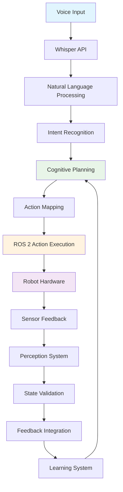

# Chapter 3: Capstone – The Autonomous Humanoid

This chapter covers integrating all VLA components into a comprehensive autonomous humanoid system that demonstrates the full pipeline from voice input to action execution.

## Learning Objectives

By the end of this chapter, students will be able to:

- Design complete VLA system architecture and integration
- Implement practical examples of full VLA pipeline implementation
- Map actions from LLM outputs to ROS 2 action calls
- Validate action completion and implement feedback integration
- Test VLA systems with various command types and scenarios
- Complete comprehensive exercises for the capstone project

## Prerequisites

Before starting this chapter, students should have:

- Basic understanding of robotics concepts (covered in Module 1)
- Knowledge of AI/ML fundamentals
- Basic understanding of ROS 2 (covered in Module 1)
- Completion of Chapter 1: Voice-to-Action Pipelines
- Completion of Chapter 2: Language-Based Cognitive Planning

## Overview

The capstone project demonstrates the complete integration of all learned concepts, providing a comprehensive example of how VLA technologies work together in a real-world scenario. This chapter integrates voice recognition, cognitive planning, and ROS 2 action execution into a cohesive autonomous humanoid system.

## Complete VLA System Architecture and Integration

The Vision-Language-Action (VLA) system represents a sophisticated integration of multiple AI and robotics technologies working in harmony. This section explores the complete system architecture and how all components work together to create an autonomous humanoid system.

### System Architecture Overview

The complete VLA system follows a layered architecture that separates concerns while maintaining tight integration:

```
┌─────────────────────────────────────────────────────────────────┐
│                        USER INTERFACE                         │
├─────────────────────────────────────────────────────────────────┤
│                    NATURAL LANGUAGE PROCESSING                  │
├─────────────────────────────────────────────────────────────────┤
│                    COGNITIVE PLANNING                           │
├─────────────────────────────────────────────────────────────────┤
│                    ACTION EXECUTION                             │
├─────────────────────────────────────────────────────────────────┤
│                    PERCEPTION & SENSING                         │
├─────────────────────────────────────────────────────────────────┤
│                    ROBOT HARDWARE                               │
└─────────────────────────────────────────────────────────────────┘
```

### Core Components

#### 1. Voice Processing Layer
This layer handles speech recognition and natural language understanding:

- **Speech Recognition**: Converts voice input to text using Whisper API or similar technology
- **Intent Classification**: Determines the user's intent from the transcribed text
- **Entity Extraction**: Identifies specific objects, locations, or parameters mentioned
- **Confidence Scoring**: Assigns confidence levels to interpretations

#### 2. Cognitive Planning Layer
This layer processes high-level commands and creates executable plans:

- **Task Decomposition**: Breaks complex commands into manageable subtasks
- **Dependency Resolution**: Determines the order and dependencies of actions
- **Resource Management**: Allocates robot capabilities and environmental resources
- **Plan Validation**: Ensures the generated plan is feasible and safe

#### 3. Action Execution Layer
This layer translates plans into specific robot actions:

- **Action Mapping**: Converts high-level actions to ROS 2 service calls
- **Execution Monitoring**: Tracks plan execution and detects failures
- **Error Recovery**: Handles execution failures and adjusts plans as needed
- **State Management**: Maintains and updates the robot's internal state

### Integration Patterns

#### Event-Driven Architecture
The system uses an event-driven architecture where components communicate through events:

```python
from dataclasses import dataclass
from enum import Enum
from typing import Any, Dict, List
import asyncio
import json

class EventType(Enum):
    VOICE_COMMAND = "voice_command"
    INTENT_RECOGNIZED = "intent_recognized"
    PLAN_GENERATED = "plan_generated"
    ACTION_STARTED = "action_started"
    ACTION_COMPLETED = "action_completed"
    ERROR_OCCURRED = "error_occurred"
    TASK_COMPLETED = "task_completed"

@dataclass
class Event:
    type: EventType
    data: Dict[str, Any]
    timestamp: float

class EventManager:
    def __init__(self):
        self.subscribers = {}
        self.event_queue = asyncio.Queue()

    def subscribe(self, event_type: EventType, callback):
        """Subscribe to a specific event type."""
        if event_type not in self.subscribers:
            self.subscribers[event_type] = []
        self.subscribers[event_type].append(callback)

    async def publish(self, event: Event):
        """Publish an event to all subscribers."""
        if event.type in self.subscribers:
            for callback in self.subscribers[event.type]:
                await callback(event)

    async def process_events(self):
        """Process events from the queue."""
        while True:
            event = await self.event_queue.get()
            await self.publish(event)
            self.event_queue.task_done()

class VLAEventDrivenSystem:
    def __init__(self):
        self.event_manager = EventManager()
        self.voice_processor = VoiceProcessor(self.event_manager)
        self.cognitive_planner = CognitivePlanner(self.event_manager)
        self.action_executor = ActionExecutor(self.event_manager)
        self.state_manager = StateManager()

        # Subscribe components to relevant events
        self._setup_subscriptions()

    def _setup_subscriptions(self):
        """Set up event subscriptions between components."""
        # When voice command is received, process it
        self.event_manager.subscribe(EventType.VOICE_COMMAND, self.voice_processor.process_command)

        # When intent is recognized, generate plan
        self.event_manager.subscribe(EventType.INTENT_RECOGNIZED, self.cognitive_planner.generate_plan)

        # When plan is generated, execute it
        self.event_manager.subscribe(EventType.PLAN_GENERATED, self.action_executor.execute_plan)

        # When action completes, update state
        self.event_manager.subscribe(EventType.ACTION_COMPLETED, self.state_manager.update_state)

    async def start(self):
        """Start the VLA system."""
        # Start event processing
        event_task = asyncio.create_task(self.event_manager.process_events())

        # System is now ready to process commands
        print("VLA System ready to receive commands")

class VoiceProcessor:
    def __init__(self, event_manager: EventManager):
        self.event_manager = event_manager

    async def process_command(self, event: Event):
        """Process a voice command event."""
        text = event.data['text']
        confidence = event.data['confidence']

        # Extract intent and entities
        intent, entities = self.extract_intent(text)

        # Publish intent recognized event
        intent_event = Event(
            type=EventType.INTENT_RECOGNIZED,
            data={
                'text': text,
                'intent': intent,
                'entities': entities,
                'confidence': confidence
            },
            timestamp=event.timestamp
        )
        await self.event_manager.publish(intent_event)

    def extract_intent(self, text: str):
        """Extract intent and entities from text."""
        # Implementation from previous chapters
        # This would use the intent extraction techniques from Chapter 1
        pass

class CognitivePlanner:
    def __init__(self, event_manager: EventManager):
        self.event_manager = event_manager

    async def generate_plan(self, event: Event):
        """Generate a plan for the recognized intent."""
        intent = event.data['intent']
        entities = event.data['entities']
        context = event.data.get('context', {})

        # Generate plan using techniques from Chapter 2
        plan = self.create_plan(intent, entities, context)

        # Publish plan generated event
        plan_event = Event(
            type=EventType.PLAN_GENERATED,
            data={
                'plan': plan,
                'intent': intent,
                'entities': entities
            },
            timestamp=event.timestamp
        )
        await self.event_manager.publish(plan_event)

    def create_plan(self, intent: str, entities: Dict, context: Dict):
        """Create a plan for the given intent and entities."""
        # Implementation using cognitive planning techniques
        pass

class ActionExecutor:
    def __init__(self, event_manager: EventManager):
        self.event_manager = event_manager

    async def execute_plan(self, event: Event):
        """Execute the generated plan."""
        plan = event.data['plan']

        for action in plan:
            # Publish action started event
            start_event = Event(
                type=EventType.ACTION_STARTED,
                data={'action': action},
                timestamp=event.timestamp
            )
            await self.event_manager.publish(start_event)

            # Execute the action
            success = await self.execute_single_action(action)

            # Publish action completed event
            complete_event = Event(
                type=EventType.ACTION_COMPLETED,
                data={
                    'action': action,
                    'success': success
                },
                timestamp=event.timestamp
            )
            await self.event_manager.publish(complete_event)

            if not success:
                # Handle failure
                error_event = Event(
                    type=EventType.ERROR_OCCURRED,
                    data={
                        'action': action,
                        'error': 'Action execution failed'
                    },
                    timestamp=event.timestamp
                )
                await self.event_manager.publish(error_event)
                break

    async def execute_single_action(self, action: Dict) -> bool:
        """Execute a single action."""
        # This would interface with ROS 2 to execute the action
        # Implementation would depend on the specific action type
        return True  # Simplified

class StateManager:
    def __init__(self):
        self.robot_state = {}
        self.environment_state = {}

    async def update_state(self, event: Event):
        """Update system state based on action completion."""
        action = event.data['action']
        success = event.data['success']

        if success:
            # Update state based on successful action
            self._apply_action_effects(action)

    def _apply_action_effects(self, action: Dict):
        """Apply the effects of an action to the system state."""
        # Update internal state representation based on action
        pass
```

### Integration Challenges and Solutions

#### 1. Timing and Synchronization
Challenge: Different components operate at different speeds and need to be properly synchronized.

Solution: Use asynchronous programming patterns and event queues to handle timing differences:

```python
import asyncio
from asyncio import Queue
import time

class SynchronizationManager:
    def __init__(self):
        self.voice_queue = Queue()
        self.planning_queue = Queue()
        self.execution_queue = Queue()
        self.feedback_queue = Queue()

    async def process_voice_input(self):
        """Process voice input with proper timing."""
        while True:
            # Wait for voice input
            voice_data = await self.voice_queue.get()

            # Process with appropriate timeout
            try:
                result = await asyncio.wait_for(
                    self._process_voice(voice_data),
                    timeout=5.0  # 5 second timeout
                )

                # Pass to next stage
                await self.planning_queue.put(result)
            except asyncio.TimeoutError:
                print("Voice processing timed out")
            finally:
                self.voice_queue.task_done()

    async def _process_voice(self, voice_data):
        """Simulate voice processing."""
        # Simulate processing time
        await asyncio.sleep(0.1)
        return f"Processed: {voice_data}"
```

#### 2. Error Propagation
Challenge: Errors in one component can cascade through the entire system.

Solution: Implement error isolation and graceful degradation:

```python
class ErrorIsolationManager:
    def __init__(self):
        self.error_handlers = {}
        self.fallback_strategies = {}

    async def safe_execute(self, component_name: str, func, *args, **kwargs):
        """Execute a function with error isolation."""
        try:
            return await func(*args, **kwargs)
        except Exception as e:
            print(f"Error in {component_name}: {e}")

            # Try fallback strategy
            if component_name in self.fallback_strategies:
                fallback_func = self.fallback_strategies[component_name]
                try:
                    return await fallback_func(*args, **kwargs)
                except Exception as fallback_error:
                    print(f"Fallback also failed: {fallback_error}")
                    return None

            return None
```

### System Integration Best Practices

1. **Modular Design**: Keep components loosely coupled with well-defined interfaces
2. **Event-Driven Communication**: Use events for component communication rather than direct calls
3. **State Management**: Maintain a consistent system state across all components
4. **Error Handling**: Implement comprehensive error handling at each layer
5. **Monitoring**: Add monitoring and logging throughout the system
6. **Testing**: Test each component individually and the integrated system as a whole

The complete VLA system architecture demonstrates how voice recognition, cognitive planning, and action execution can be seamlessly integrated to create sophisticated autonomous humanoid systems that respond naturally to human commands.

## Practical Examples of Full VLA Pipeline Implementation

This section provides comprehensive practical examples that demonstrate the complete VLA pipeline from voice input to action execution. These examples integrate all the components covered in previous chapters into working systems.

### Example 1: Complete Voice-to-Action System

This example demonstrates a complete system that integrates all VLA components:

```python
import asyncio
import openai
import rospy
from std_msgs.msg import String
from geometry_msgs.msg import Twist
from sensor_msgs.msg import Image
import pyaudio
import wave
import json
from typing import Dict, Any, Optional, List
from dataclasses import dataclass
import time

@dataclass
class VoiceCommand:
    text: str
    confidence: float
    intent: str
    entities: Dict[str, Any]
    timestamp: float

class AudioRecorder:
    """Handles audio recording from microphone."""

    def __init__(self, chunk=1024, format=pyaudio.paInt16, channels=1, rate=44100):
        self.chunk = chunk
        self.format = format
        self.channels = channels
        self.rate = rate
        self.audio = pyaudio.PyAudio()

    def record_audio(self, filename: str, duration: int = 5):
        """Record audio from microphone and save to file."""
        stream = self.audio.open(
            format=self.format,
            channels=self.channels,
            rate=self.rate,
            input=True,
            frames_per_buffer=self.chunk
        )

        print("Recording...")
        frames = []

        for i in range(0, int(self.rate / self.chunk * duration)):
            data = stream.read(self.chunk)
            frames.append(data)

        print("Finished recording")

        stream.stop_stream()
        stream.close()

        with wave.open(filename, 'wb') as wf:
            wf.setnchannels(self.channels)
            wf.setsampwidth(self.audio.get_sample_size(self.format))
            wf.setframerate(self.rate)
            wf.writeframes(b''.join(frames))

    def __del__(self):
        self.audio.terminate()

class WhisperProcessor:
    """Handles speech recognition using OpenAI Whisper API."""

    def __init__(self, api_key: str):
        openai.api_key = api_key

    async def transcribe_audio(self, audio_file_path: str) -> Dict[str, Any]:
        """Transcribe audio file using Whisper API."""
        try:
            with open(audio_file_path, "rb") as audio_file:
                transcript = await openai.Audio.atranscribe(
                    "whisper-1",
                    audio_file,
                    response_format="verbose_json",
                    timestamp_granularities=["segment"]
                )

            # Calculate average confidence from segments if available
            segments = transcript.get("segments", [])
            avg_confidence = 0.0
            if segments:
                confidences = [seg.get('avg_logprob', -1.0) for seg in segments]
                avg_confidence = sum(confidences) / len(confidences)

            return {
                'text': transcript.text,
                'confidence': avg_confidence,
                'segments': segments
            }
        except Exception as e:
            print(f"Error in transcription: {e}")
            return {
                'text': '',
                'confidence': 0.0,
                'error': str(e)
            }

class IntentExtractor:
    """Extracts intent and entities from transcribed text."""

    def __init__(self):
        self.intents = {
            "move_forward": ["move forward", "go forward", "move ahead", "go ahead", "forward"],
            "move_backward": ["move backward", "go backward", "move back", "go back", "backward"],
            "turn_left": ["turn left", "rotate left", "pivot left", "left"],
            "turn_right": ["turn right", "rotate right", "pivot right", "right"],
            "raise_arm": ["raise your arm", "lift your arm", "raise left arm", "raise right arm"],
            "lower_arm": ["lower your arm", "put down your arm", "lower left arm", "lower right arm"],
            "stop": ["stop", "halt", "cease", "pause"],
            "move_to": ["move to", "go to", "navigate to", "go to the", "move to the"],
            "grasp": ["grasp", "pick up", "take", "grab", "get"],
            "drop": ["drop", "put down", "release", "let go"]
        }

    def extract(self, text: str) -> tuple[str, Dict[str, Any]]:
        """Extract intent and entities from text."""
        text_lower = text.lower().strip()
        entities = {}

        # Try to find intent
        for intent_name, patterns in self.intents.items():
            for pattern in patterns:
                if pattern in text_lower:
                    # Extract additional entities
                    entities = self.extract_entities(text_lower, intent_name)
                    return intent_name, entities

        # If no pattern matches, return unknown intent
        return "unknown", {"raw_text": text, "original_text": text_lower}

    def extract_entities(self, text: str, intent: str) -> Dict[str, Any]:
        """Extract entities based on the detected intent."""
        entities = {}

        # Extract directional information
        if "left" in text:
            entities["direction"] = "left"
        elif "right" in text:
            entities["direction"] = "right"

        # Extract arm information
        if "left arm" in text:
            entities["arm"] = "left"
        elif "right arm" in text:
            entities["arm"] = "right"

        # Extract object information
        if "red" in text:
            entities["color"] = "red"
        elif "blue" in text:
            entities["color"] = "blue"
        elif "green" in text:
            entities["color"] = "green"

        # Extract object type
        if "cube" in text or "box" in text:
            entities["object_type"] = "cube"
        elif "ball" in text or "sphere" in text:
            entities["object_type"] = "ball"
        elif "cylinder" in text:
            entities["object_type"] = "cylinder"

        # Extract location information
        if "table" in text:
            entities["location"] = "table"
        elif "kitchen" in text:
            entities["location"] = "kitchen"
        elif "bedroom" in text:
            entities["location"] = "bedroom"
        elif "living room" in text:
            entities["location"] = "living room"

        return entities

class CognitivePlanner:
    """Generates plans for complex tasks using LLMs."""

    def __init__(self, api_key: str):
        openai.api_key = api_key

    async def create_plan(self, command: str, context: Dict[str, Any]) -> List[Dict[str, Any]]:
        """Create a detailed plan for the given command using GPT."""
        prompt = f"""
        You are a cognitive planning system for a robot. Create a detailed plan to execute the following command:
        Command: "{command}"

        Current context:
        - Robot location: {context.get('robot_location', 'unknown')}
        - Environment: {context.get('environment', 'unknown')}
        - Available capabilities: {context.get('capabilities', 'unknown')}
        - Objects in environment: {context.get('objects', 'unknown')}

        Create a step-by-step plan with the following format:
        1. [Action] - [Parameters] - [Description] - [Dependencies]
        2. [Action] - [Parameters] - [Description] - [Dependencies]
        ...

        Each step should be:
        - A specific action the robot can perform
        - Include all necessary parameters
        - Describe what the action accomplishes
        - List any dependencies on previous steps (if applicable)

        Actions should be from this set: navigate_to, find_object, grasp_object,
        return_to, survey_area, wait, report_status.
        """

        try:
            response = await openai.ChatCompletion.acreate(
                model="gpt-3.5-turbo",
                messages=[{"role": "user", "content": prompt}],
                temperature=0.2,
                max_tokens=1000
            )

            plan_text = response.choices[0].message.content
            return self._parse_plan(plan_text)

        except Exception as e:
            print(f"Error creating plan: {e}")
            return self._create_fallback_plan(command)

    def _parse_plan(self, plan_text: str) -> List[Dict[str, Any]]:
        """Parse the GPT response into structured plan steps."""
        plan_steps = []
        lines = plan_text.strip().split('\n')

        for line in lines:
            if line.strip() and line[0].isdigit():
                # Parse: "1. [Action] - [Parameters] - [Description] - [Dependencies]"
                parts = line.split(' - ')
                if len(parts) >= 3:
                    # Extract action from the first part (before the dash)
                    action_part = parts[0]
                    action = action_part.split('. ', 1)[1].strip() if '. ' in action_part else action_part

                    # Parse parameters
                    params_str = parts[1].strip()
                    try:
                        import json
                        # Simple parameter parsing - in a real system, this would be more sophisticated
                        if params_str.startswith('{') and params_str.endswith('}'):
                            parameters = json.loads(params_str)
                        else:
                            # Parse simple key=value format
                            param_dict = {}
                            for param in params_str.split(','):
                                if '=' in param:
                                    k, v = param.split('=', 1)
                                    param_dict[k.strip()] = v.strip()
                            parameters = param_dict
                    except:
                        parameters = {"raw": params_str}

                    description = parts[2].strip() if len(parts) > 2 else "No description"
                    dependencies = []
                    if len(parts) > 3:
                        deps_str = parts[3].strip()
                        if deps_str.lower() != "none":
                            dependencies = [d.strip() for d in deps_str.split(',')]

                    plan_step = {
                        "action": action,
                        "parameters": parameters,
                        "description": description,
                        "dependencies": dependencies
                    }
                    plan_steps.append(plan_step)

        return plan_steps

    def _create_fallback_plan(self, command: str) -> List[Dict[str, Any]]:
        """Create a basic plan when GPT fails."""
        # Simple rule-based fallback
        command_lower = command.lower()

        steps = []
        if "kitchen" in command_lower:
            steps.append({
                "action": "navigate_to",
                "parameters": {"location": "kitchen"},
                "description": "Navigate to the kitchen",
                "dependencies": []
            })

        if "apple" in command_lower or "object" in command_lower:
            steps.append({
                "action": "find_object",
                "parameters": {"object_type": "apple", "color": "red"},
                "description": "Find a red apple in the kitchen",
                "dependencies": ["navigate_to"] if steps else []
            })

        steps.append({
            "action": "grasp_object",
            "parameters": {"object_type": "apple"},
            "description": "Grasp the red apple",
            "dependencies": ["find_object"] if len(steps) > 1 else []
        })

        steps.append({
            "action": "return_to",
            "parameters": {"target": "user"},
            "description": "Return to the user with the apple",
            "dependencies": ["grasp_object"]
        })

        return steps

class ActionExecutor:
    """Executes robot actions based on extracted intents."""

    def __init__(self):
        # Initialize ROS publishers
        self.cmd_vel_pub = rospy.Publisher('/cmd_vel', Twist, queue_size=10)
        self.status_pub = rospy.Publisher('/voice_command_status', String, queue_size=10)
        self.rate = rospy.Rate(10)  # 10 Hz

    def execute_action(self, intent: str, entities: Dict[str, Any]) -> bool:
        """Execute the appropriate action based on intent and entities."""
        try:
            if intent == "move_forward":
                self._move_forward(entities.get("distance", 1.0))
            elif intent == "move_backward":
                self._move_backward(entities.get("distance", 1.0))
            elif intent == "turn_left":
                self._turn_left(entities.get("angle", 90.0))
            elif intent == "turn_right":
                self._turn_right(entities.get("angle", 90.0))
            elif intent == "stop":
                self._stop()
            elif intent == "raise_arm":
                self._raise_arm(entities.get("arm", "both"))
            elif intent == "lower_arm":
                self._lower_arm(entities.get("arm", "both"))
            else:
                rospy.logwarn(f"Unknown intent: {intent}")
                return False

            return True
        except Exception as e:
            rospy.logerr(f"Error executing action: {e}")
            return False

    def _move_forward(self, distance: float):
        """Move robot forward by specified distance."""
        velocity_msg = Twist()
        velocity_msg.linear.x = 0.2  # 0.2 m/s
        start_time = rospy.Time.now()

        while not rospy.is_shutdown():
            current_time = rospy.Time.now()
            elapsed = (current_time - start_time).to_sec()
            traveled = elapsed * 0.2

            if traveled >= distance:
                velocity_msg.linear.x = 0.0  # Stop
                break

            self.cmd_vel_pub.publish(velocity_msg)
            self.rate.sleep()

    def _move_backward(self, distance: float):
        """Move robot backward by specified distance."""
        velocity_msg = Twist()
        velocity_msg.linear.x = -0.2  # -0.2 m/s
        start_time = rospy.Time.now()

        while not rospy.is_shutdown():
            current_time = rospy.Time.now()
            elapsed = (current_time - start_time).to_sec()
            traveled = elapsed * 0.2

            if traveled >= distance:
                velocity_msg.linear.x = 0.0  # Stop
                break

            self.cmd_vel_pub.publish(velocity_msg)
            self.rate.sleep()

    def _turn_left(self, angle_degrees: float):
        """Turn robot left by specified angle."""
        velocity_msg = Twist()
        velocity_msg.angular.z = 0.3  # Positive for left turn
        angle_rad = angle_degrees * 3.14159 / 180.0
        start_time = rospy.Time.now()

        while not rospy.is_shutdown():
            current_time = rospy.Time.now()
            elapsed = (current_time - start_time).to_sec()
            turned = elapsed * 0.3  # angular velocity * time

            if turned >= angle_rad:
                velocity_msg.angular.z = 0.0  # Stop turning
                break

            self.cmd_vel_pub.publish(velocity_msg)
            self.rate.sleep()

    def _turn_right(self, angle_degrees: float):
        """Turn robot right by specified angle."""
        velocity_msg = Twist()
        velocity_msg.angular.z = -0.3  # Negative for right turn
        angle_rad = angle_degrees * 3.14159 / 180.0
        start_time = rospy.Time.now()

        while not rospy.is_shutdown():
            current_time = rospy.Time.now()
            elapsed = (current_time - start_time).to_sec()
            turned = elapsed * 0.3  # angular velocity * time

            if turned >= angle_rad:
                velocity_msg.angular.z = 0.0  # Stop turning
                break

            self.cmd_vel_pub.publish(velocity_msg)
            self.rate.sleep()

    def _stop(self):
        """Stop all robot movement."""
        velocity_msg = Twist()
        self.cmd_vel_pub.publish(velocity_msg)

    def _raise_arm(self, arm: str):
        """Raise robot arm(s)."""
        # This would publish to the appropriate arm control topic
        rospy.loginfo(f"Raising {arm} arm")

    def _lower_arm(self, arm: str):
        """Lower robot arm(s)."""
        # This would publish to the appropriate arm control topic
        rospy.loginfo(f"Lowering {arm} arm")

class VLAPipeline:
    """Main system that integrates all VLA components."""

    def __init__(self, api_key: str):
        rospy.init_node('vla_pipeline_system')
        self.recorder = AudioRecorder()
        self.whisper = WhisperProcessor(api_key)
        self.intent_extractor = IntentExtractor()
        self.cognitive_planner = CognitivePlanner(api_key)
        self.action_executor = ActionExecutor()
        self.command_history = []

    async def process_voice_command(self, audio_file: str) -> Optional[VoiceCommand]:
        """Process a voice command from audio file."""
        # Step 1: Transcribe audio
        transcription = await self.whisper.transcribe_audio(audio_file)

        if transcription.get('error'):
            rospy.logerr(f"Transcription error: {transcription['error']}")
            return None

        text = transcription['text']
        confidence = transcription['confidence']

        # Step 2: Extract intent and entities
        intent, entities = self.intent_extractor.extract(text)

        # Create voice command object
        voice_command = VoiceCommand(
            text=text,
            confidence=confidence,
            intent=intent,
            entities=entities,
            timestamp=time.time()
        )

        # Step 3: Execute action if confidence is high enough
        if confidence > 0.5:  # Threshold for execution
            success = self.action_executor.execute_action(intent, entities)
            if success:
                rospy.loginfo(f"Executed command: {intent} with entities {entities}")
            else:
                rospy.logwarn(f"Failed to execute command: {intent}")
        else:
            rospy.logwarn(f"Command confidence too low ({confidence}) to execute: {text}")

        # Add to history
        self.command_history.append(voice_command)

        return voice_command

    async def process_complex_command(self, text_command: str, context: Dict[str, Any]) -> bool:
        """Process a complex command using cognitive planning."""
        # Generate a plan using the cognitive planner
        plan = await self.cognitive_planner.create_plan(text_command, context)

        # Execute the plan step by step
        for step in plan:
            action = step["action"]
            params = step["parameters"]

            rospy.loginfo(f"Executing: {action} with params: {params}")

            # Execute the action (this would be more sophisticated in a real system)
            success = await self._execute_plan_step(action, params)

            if not success:
                rospy.logerr(f"Failed to execute plan step: {action}")
                return False

        return True

    async def _execute_plan_step(self, action: str, params: Dict[str, Any]) -> bool:
        """Execute a single step from the cognitive plan."""
        # This is a simplified implementation
        # In a real system, this would map to specific ROS actions
        if action == "navigate_to":
            # Implement navigation
            location = params.get("location", "unknown")
            rospy.loginfo(f"Navigating to {location}")
            return True
        elif action == "find_object":
            # Implement object finding
            obj_type = params.get("object_type", "unknown")
            rospy.loginfo(f"Finding object of type: {obj_type}")
            return True
        elif action == "grasp_object":
            # Implement object grasping
            obj_type = params.get("object_type", "unknown")
            rospy.loginfo(f"Grasping object: {obj_type}")
            return True
        elif action == "return_to":
            # Implement return action
            target = params.get("target", "unknown")
            rospy.loginfo(f"Returning to: {target}")
            return True
        else:
            rospy.logwarn(f"Unknown action in plan: {action}")
            return False

    def listen_and_process(self):
        """Continuously listen for voice commands."""
        while not rospy.is_shutdown():
            # Record audio
            audio_file = "/tmp/voice_command.wav"
            self.recorder.record_audio(audio_file, duration=5)

            # Process the command
            command = asyncio.run(self.process_voice_command(audio_file))

            if command:
                rospy.loginfo(f"Processed command: {command.text} (confidence: {command.confidence})")

            # Small delay before next recording
            time.sleep(1)

def main():
    """Main function to run the complete VLA system."""
    # Replace with your actual OpenAI API key
    api_key = "YOUR_OPENAI_API_KEY_HERE"

    system = VLAPipeline(api_key)

    try:
        # Example of processing a complex command
        context = {
            "robot_location": "living_room",
            "environment": "home",
            "capabilities": ["navigation", "manipulation", "object_recognition"],
            "objects": ["table", "chair", "couch", "kitchen_items"]
        }

        # Process a complex command using cognitive planning
        complex_command = "Go to the kitchen, find a red apple, and bring it to me."
        success = asyncio.run(system.process_complex_command(complex_command, context))
        print(f"Complex command execution success: {success}")

        # Or continuously listen for voice commands
        # system.listen_and_process()

    except KeyboardInterrupt:
        rospy.loginfo("System stopped by user")
    except Exception as e:
        rospy.logerr(f"System error: {e}")

if __name__ == '__main__':
    main()
```

### Example 2: Event-Driven VLA System

This example demonstrates a more sophisticated event-driven approach that integrates all components:

```python
import asyncio
from enum import Enum
from dataclasses import dataclass
from typing import Dict, Any, Callable, List
import json

class EventType(Enum):
    VOICE_COMMAND_RECEIVED = "voice_command_received"
    TEXT_RECOGNIZED = "text_recognized"
    INTENT_EXTRACTED = "intent_extracted"
    PLAN_GENERATED = "plan_generated"
    ACTION_STARTED = "action_started"
    ACTION_COMPLETED = "action_completed"
    ERROR_OCCURRED = "error_occurred"
    SYSTEM_READY = "system_ready"

@dataclass
class Event:
    type: EventType
    data: Dict[str, Any]
    timestamp: float

class EventManager:
    def __init__(self):
        self.subscribers: Dict[EventType, List[Callable]] = {}
        self.event_queue = asyncio.Queue()

    def subscribe(self, event_type: EventType, callback: Callable):
        """Subscribe to a specific event type."""
        if event_type not in self.subscribers:
            self.subscribers[event_type] = []
        self.subscribers[event_type].append(callback)

    async def publish(self, event: Event):
        """Publish an event to all subscribers."""
        if event.type in self.subscribers:
            for callback in self.subscribers[event.type]:
                try:
                    await callback(event)
                except Exception as e:
                    print(f"Error in event handler: {e}")

    async def process_events(self):
        """Process events from the queue."""
        while True:
            event = await self.event_queue.get()
            await self.publish(event)
            self.event_queue.task_done()

class VoiceProcessor:
    def __init__(self, event_manager: EventManager):
        self.event_manager = event_manager

    async def process_audio(self, audio_data: bytes):
        """Process audio data and publish text recognition event."""
        # Simulate transcription (in reality, this would call Whisper API)
        text = self._simulate_transcription(audio_data)

        # Publish text recognition event
        event = Event(
            type=EventType.TEXT_RECOGNIZED,
            data={
                'text': text,
                'confidence': 0.9,
                'audio_data': audio_data
            },
            timestamp=time.time()
        )
        await self.event_manager.publish(event)

    def _simulate_transcription(self, audio_data: bytes) -> str:
        """Simulate speech-to-text conversion."""
        # In a real system, this would call Whisper API
        # For simulation, we'll return a fixed text
        return "Move forward two meters"

class IntentExtractor:
    def __init__(self, event_manager: EventManager):
        self.event_manager = event_manager

    async def extract_intent(self, event: Event):
        """Extract intent from recognized text."""
        text = event.data['text']
        confidence = event.data['confidence']

        # Extract intent and entities (simplified)
        intent, entities = self._simple_intent_extraction(text)

        # Publish intent extraction event
        intent_event = Event(
            type=EventType.INTENT_EXTRACTED,
            data={
                'text': text,
                'intent': intent,
                'entities': entities,
                'confidence': confidence
            },
            timestamp=event.timestamp
        )
        await self.event_manager.publish(intent_event)

    def _simple_intent_extraction(self, text: str) -> tuple[str, Dict[str, Any]]:
        """Simple intent extraction (in reality, this would be more sophisticated)."""
        text_lower = text.lower()

        if "move forward" in text_lower:
            return "move_forward", {"distance": 2.0}
        elif "move backward" in text_lower:
            return "move_backward", {"distance": 1.0}
        elif "turn left" in text_lower:
            return "turn_left", {"angle": 90.0}
        elif "turn right" in text_lower:
            return "turn_right", {"angle": 90.0}
        else:
            return "unknown", {}

class CognitivePlanner:
    def __init__(self, event_manager: EventManager):
        self.event_manager = event_manager

    async def generate_plan(self, event: Event):
        """Generate a plan based on extracted intent."""
        intent = event.data['intent']
        entities = event.data['entities']

        # Generate plan based on intent (simplified)
        plan = self._create_simple_plan(intent, entities)

        # Publish plan generation event
        plan_event = Event(
            type=EventType.PLAN_GENERATED,
            data={
                'plan': plan,
                'intent': intent,
                'entities': entities
            },
            timestamp=event.timestamp
        )
        await self.event_manager.publish(plan_event)

    def _create_simple_plan(self, intent: str, entities: Dict[str, Any]) -> List[Dict[str, Any]]:
        """Create a simple execution plan."""
        if intent == "move_forward":
            distance = entities.get("distance", 1.0)
            return [{
                "action": "move_forward",
                "parameters": {"distance": distance},
                "description": f"Move forward {distance} meters"
            }]
        elif intent == "turn_right":
            angle = entities.get("angle", 90.0)
            return [{
                "action": "turn_right",
                "parameters": {"angle": angle},
                "description": f"Turn right {angle} degrees"
            }]
        else:
            return []

class ActionExecutor:
    def __init__(self, event_manager: EventManager):
        self.event_manager = event_manager

    async def execute_plan(self, event: Event):
        """Execute the generated plan."""
        plan = event.data['plan']

        for action_step in plan:
            # Publish action started event
            start_event = Event(
                type=EventType.ACTION_STARTED,
                data={
                    'action': action_step,
                    'plan': plan
                },
                timestamp=event.timestamp
            )
            await self.event_manager.publish(start_event)

            # Execute the action
            success = await self._execute_single_action(action_step)

            # Publish action completed event
            complete_event = Event(
                type=EventType.ACTION_COMPLETED,
                data={
                    'action': action_step,
                    'success': success,
                    'plan': plan
                },
                timestamp=event.timestamp
            )
            await self.event_manager.publish(complete_event)

            if not success:
                # Handle failure
                error_event = Event(
                    type=EventType.ERROR_OCCURRED,
                    data={
                        'action': action_step,
                        'error': 'Action execution failed',
                        'plan': plan
                    },
                    timestamp=event.timestamp
                )
                await self.event_manager.publish(error_event)
                break

    async def _execute_single_action(self, action_step: Dict[str, Any]) -> bool:
        """Execute a single action."""
        # In a real system, this would interface with ROS
        action_type = action_step['action']
        parameters = action_step['parameters']

        print(f"Executing action: {action_type} with parameters: {parameters}")

        # Simulate action execution
        await asyncio.sleep(0.5)  # Simulate execution time

        return True  # Simulate success

class VLASystem:
    def __init__(self, api_key: str):
        self.event_manager = EventManager()
        self.voice_processor = VoiceProcessor(self.event_manager)
        self.intent_extractor = IntentExtractor(self.event_manager)
        self.cognitive_planner = CognitivePlanner(self.event_manager)
        self.action_executor = ActionExecutor(self.event_manager)

        # Set up event subscriptions
        self._setup_subscriptions()

    def _setup_subscriptions(self):
        """Set up event subscriptions between components."""
        self.event_manager.subscribe(EventType.TEXT_RECOGNIZED, self.intent_extractor.extract_intent)
        self.event_manager.subscribe(EventType.INTENT_EXTRACTED, self.cognitive_planner.generate_plan)
        self.event_manager.subscribe(EventType.PLAN_GENERATED, self.action_executor.execute_plan)

    async def process_audio_command(self, audio_data: bytes):
        """Process an audio command through the complete VLA pipeline."""
        await self.voice_processor.process_audio(audio_data)

    async def start_system(self):
        """Start the VLA system."""
        # Start event processing
        event_task = asyncio.create_task(self.event_manager.process_events())

        # Publish system ready event
        ready_event = Event(
            type=EventType.SYSTEM_READY,
            data={"timestamp": time.time()},
            timestamp=time.time()
        )
        await self.event_manager.publish(ready_event)

        print("VLA System started and ready to process commands")

# Example usage of the event-driven system
async def example_usage():
    # Create the VLA system
    vla_system = VLASystem(api_key="your-api-key")

    # Start the system
    await vla_system.start_system()

    # Simulate processing an audio command
    # In reality, this would be actual audio data
    sample_audio = b"simulated_audio_data"
    await vla_system.process_audio_command(sample_audio)

    # Keep the system running for a while
    await asyncio.sleep(5)

# Run the example
# asyncio.run(example_usage())
```

### Example 3: Complete Integration with ROS 2

This example shows how to integrate the VLA system with ROS 2 for real robot control:

```python
import rclpy
from rclpy.node import Node
from std_msgs.msg import String
from geometry_msgs.msg import Twist
from sensor_msgs.msg import Image
import asyncio
import threading
import queue

class VLAROS2Node(Node):
    def __init__(self):
        super().__init__('vla_ros2_node')

        # Publishers
        self.cmd_vel_pub = self.create_publisher(Twist, 'cmd_vel', 10)
        self.status_pub = self.create_publisher(String, 'vla_status', 10)

        # Subscribers
        self.voice_sub = self.create_subscription(
            String,
            'voice_commands',
            self.voice_callback,
            10
        )

        # Initialize VLA components
        self.vla_pipeline = VLAPipeline(api_key="your-api-key")  # Using pipeline from Example 1

        # Timer for processing
        self.timer = self.create_timer(0.1, self.process_commands)

        # Command queue
        self.command_queue = queue.Queue()

        self.get_logger().info('VLA ROS2 Node initialized')

    def voice_callback(self, msg):
        """Callback for voice commands."""
        self.command_queue.put(msg.data)
        self.get_logger().info(f'Received voice command: {msg.data}')

    def process_commands(self):
        """Process commands from the queue."""
        while not self.command_queue.empty():
            command = self.command_queue.get()

            # Process the command using VLA pipeline
            # This would be a simplified version for ROS 2 integration
            self.execute_command(command)

    def execute_command(self, command: str):
        """Execute a command using VLA pipeline."""
        # In a real implementation, this would integrate with the full VLA pipeline
        # For demonstration, we'll implement basic command execution

        cmd = Twist()

        if "forward" in command.lower():
            cmd.linear.x = 0.5
        elif "backward" in command.lower():
            cmd.linear.x = -0.5
        elif "left" in command.lower():
            cmd.angular.z = 0.5
        elif "right" in command.lower():
            cmd.angular.z = -0.5
        elif "stop" in command.lower():
            cmd.linear.x = 0.0
            cmd.angular.z = 0.0
        else:
            self.get_logger().info(f'Unknown command: {command}')
            return

        self.cmd_vel_pub.publish(cmd)
        self.get_logger().info(f'Published command: {command}')

def main(args=None):
    rclpy.init(args=args)

    vla_node = VLAROS2Node()

    try:
        rclpy.spin(vla_node)
    except KeyboardInterrupt:
        pass
    finally:
        vla_node.destroy_node()
        rclpy.shutdown()

if __name__ == '__main__':
    main()
```

These practical examples demonstrate how to implement complete VLA systems that integrate voice recognition, cognitive planning, and action execution. The examples show different approaches from simple integration to sophisticated event-driven architectures, providing a foundation for building real-world autonomous humanoid systems.

## Action Mapping from LLM Outputs to ROS 2 Action Calls

One of the critical challenges in Vision-Language-Action (VLA) systems is effectively mapping high-level plans and actions generated by Large Language Models (LLMs) to concrete ROS 2 action calls that can be executed by the robot. This section explores various approaches and best practices for this mapping process.

### Understanding the Mapping Challenge

The action mapping challenge stems from the semantic gap between:
- **High-level LLM-generated actions**: Natural language descriptions like "navigate to the kitchen" or "grasp the red cup"
- **Low-level ROS 2 actions**: Specific service calls, action messages, and parameter structures

### Mapping Strategies

#### 1. Semantic Action Mapping

This approach uses a semantic mapping between natural language actions and ROS 2 actions:

```python
from typing import Dict, Any, Callable, List
import rclpy
from rclpy.action import ActionClient
from rclpy.node import Node
from geometry_msgs.msg import Pose, Point
from move_base_msgs.action import MoveBase
from std_msgs.msg import String
from geometry_msgs.msg import Twist

class SemanticActionMapper:
    def __init__(self, node: Node):
        self.node = node

        # Define semantic mappings
        self.action_mappings = {
            "navigate_to": {
                "ros_action": "move_base",
                "executor": self._execute_navigation,
                "required_params": ["location", "destination"]
            },
            "move_to": {
                "ros_action": "move_base",
                "executor": self._execute_navigation,
                "required_params": ["location", "destination"]
            },
            "go_to": {
                "ros_action": "move_base",
                "executor": self._execute_navigation,
                "required_params": ["location", "destination"]
            },
            "grasp_object": {
                "ros_action": "manipulation/grasp",
                "executor": self._execute_grasp,
                "required_params": ["object", "object_type"]
            },
            "pick_up": {
                "ros_action": "manipulation/grasp",
                "executor": self._execute_grasp,
                "required_params": ["object", "object_type"]
            },
            "move_forward": {
                "ros_action": "cmd_vel",
                "executor": self._execute_move_forward,
                "required_params": ["distance"]
            },
            "turn_left": {
                "ros_action": "cmd_vel",
                "executor": self._execute_turn_left,
                "required_params": ["angle"]
            },
            "turn_right": {
                "ros_action": "cmd_vel",
                "executor": self._execute_turn_right,
                "required_params": ["angle"]
            }
        }

        # Location mappings
        self.location_mappings = {
            "kitchen": Pose(position=Point(x=5.0, y=2.0, z=0.0)),
            "living_room": Pose(position=Point(x=0.0, y=0.0, z=0.0)),
            "bedroom": Pose(position=Point(x=3.0, y=-2.0, z=0.0)),
            "dining_room": Pose(position=Point(x=4.0, y=0.0, z=0.0)),
            "office": Pose(position=Point(x=-2.0, y=1.0, z=0.0))
        }

    async def map_and_execute(self, action: Dict[str, Any]) -> bool:
        """
        Map an LLM-generated action to a ROS 2 action and execute it.

        Args:
            action: Dictionary containing action details from LLM
                {
                    "action": "navigate_to",
                    "parameters": {"location": "kitchen", "object": "apple"},
                    "description": "Go to the kitchen"
                }

        Returns:
            bool: True if execution was successful, False otherwise
        """
        action_type = action.get("action", "").lower()
        parameters = action.get("parameters", {})

        if action_type not in self.action_mappings:
            self.node.get_logger().warn(f"Unknown action type: {action_type}")
            return False

        mapping = self.action_mappings[action_type]

        # Validate required parameters
        required_params = mapping["required_params"]
        for param in required_params:
            if param not in parameters:
                self.node.get_logger().warn(f"Missing required parameter '{param}' for action '{action_type}'")
                return False

        # Execute the mapped action
        executor = mapping["executor"]
        return await executor(parameters)

    async def _execute_navigation(self, params: Dict[str, Any]) -> bool:
        """Execute navigation action."""
        try:
            # Determine target location
            target_location = params.get("location") or params.get("destination")

            if target_location in self.location_mappings:
                target_pose = self.location_mappings[target_location]
            else:
                # Try to parse coordinates if location is not predefined
                x = params.get("x", 0.0)
                y = params.get("y", 0.0)
                target_pose = Pose(position=Point(x=x, y=y, z=0.0))

            # Create navigation goal
            goal = MoveBase.Goal()
            goal.target_pose.header.frame_id = "map"
            goal.target_pose.header.stamp = self.node.get_clock().now().to_msg()
            goal.target_pose.pose = target_pose

            # Execute navigation (this is a simplified example)
            self.node.get_logger().info(f"Navigating to {target_location}")

            # In a real system, you would use an ActionClient to send the goal
            # client = ActionClient(self.node, MoveBase, 'move_base')
            # future = client.send_goal_async(goal)
            # result = await future

            return True

        except Exception as e:
            self.node.get_logger().error(f"Navigation error: {e}")
            return False

    async def _execute_grasp(self, params: Dict[str, Any]) -> bool:
        """Execute grasping action."""
        try:
            object_type = params.get("object_type") or params.get("object", "unknown")
            self.node.get_logger().info(f"Attempting to grasp {object_type}")

            # In a real system, this would interface with manipulation stack
            # Example: Use MoveIt or similar for grasping
            # grasp_client = ActionClient(self.node, GraspAction, 'grasp_action')
            # goal = GraspAction.Goal(object_type=object_type)
            # result = await grasp_client.send_goal_async(goal)

            return True

        except Exception as e:
            self.node.get_logger().error(f"Grasping error: {e}")
            return False

    async def _execute_move_forward(self, params: Dict[str, Any]) -> bool:
        """Execute forward movement."""
        try:
            distance = params.get("distance", 1.0)
            speed = params.get("speed", 0.5)

            # Create velocity command
            cmd = Twist()
            cmd.linear.x = speed

            # Calculate duration based on distance and speed
            duration = distance / speed
            start_time = self.node.get_clock().now()

            # Publish velocity command for the calculated duration
            cmd_pub = self.node.create_publisher(Twist, 'cmd_vel', 10)

            while (self.node.get_clock().now() - start_time).nanoseconds < duration * 1e9:
                cmd_pub.publish(cmd)
                await rclpy.asyncio.spin_once(self.node, timeout_sec=0.1)

            # Stop the robot
            cmd.linear.x = 0.0
            cmd_pub.publish(cmd)

            return True

        except Exception as e:
            self.node.get_logger().error(f"Move forward error: {e}")
            return False

    async def _execute_turn_left(self, params: Dict[str, Any]) -> bool:
        """Execute left turn."""
        try:
            angle = params.get("angle", 90.0)  # degrees
            angular_speed = params.get("angular_speed", 0.5)  # rad/s

            # Convert angle to radians
            angle_rad = angle * 3.14159 / 180.0
            duration = angle_rad / angular_speed

            # Create rotation command
            cmd = Twist()
            cmd.angular.z = angular_speed

            # Publish rotation command
            cmd_pub = self.node.create_publisher(Twist, 'cmd_vel', 10)
            start_time = self.node.get_clock().now()

            while (self.node.get_clock().now() - start_time).nanoseconds < duration * 1e9:
                cmd_pub.publish(cmd)
                await rclpy.asyncio.spin_once(self.node, timeout_sec=0.1)

            # Stop rotation
            cmd.angular.z = 0.0
            cmd_pub.publish(cmd)

            return True

        except Exception as e:
            self.node.get_logger().error(f"Turn left error: {e}")
            return False

    async def _execute_turn_right(self, params: Dict[str, Any]) -> bool:
        """Execute right turn."""
        try:
            angle = params.get("angle", 90.0)  # degrees
            angular_speed = params.get("angular_speed", 0.5)  # rad/s

            # Convert angle to radians
            angle_rad = angle * 3.14159 / 180.0
            duration = angle_rad / angular_speed

            # Create rotation command (negative for right turn)
            cmd = Twist()
            cmd.angular.z = -angular_speed

            # Publish rotation command
            cmd_pub = self.node.create_publisher(Twist, 'cmd_vel', 10)
            start_time = self.node.get_clock().now()

            while (self.node.get_clock().now() - start_time).nanoseconds < duration * 1e9:
                cmd_pub.publish(cmd)
                await rclpy.asyncio.spin_once(self.node, timeout_sec=0.1)

            # Stop rotation
            cmd.angular.z = 0.0
            cmd_pub.publish(cmd)

            return True

        except Exception as e:
            self.node.get_logger().error(f"Turn right error: {e}")
            return False
```

#### 2. Template-Based Mapping

This approach uses predefined templates to map LLM outputs to ROS 2 actions:

```python
import json
from typing import Dict, Any, Optional

class TemplateActionMapper:
    def __init__(self, node: Node):
        self.node = node
        self.action_templates = self._load_templates()

    def _load_templates(self) -> Dict[str, Dict[str, Any]]:
        """Load action templates from configuration."""
        return {
            "navigation": {
                "patterns": ["navigate to", "go to", "move to", "travel to"],
                "ros_action": "move_base",
                "template": {
                    "action": "move_base",
                    "goal": {
                        "target_pose": {
                            "header": {
                                "frame_id": "map"
                            },
                            "pose": {
                                "position": {
                                    "x": "{x}",
                                    "y": "{y}",
                                    "z": 0.0
                                },
                                "orientation": {
                                    "w": 1.0
                                }
                            }
                        }
                    }
                }
            },
            "manipulation": {
                "patterns": ["grasp", "pick up", "take", "lift"],
                "ros_action": "manipulation/grasp",
                "template": {
                    "action": "grasp",
                    "object": "{object_type}",
                    "pose": "{object_pose}"
                }
            },
            "movement": {
                "patterns": ["move forward", "move backward", "go forward", "go backward"],
                "ros_action": "cmd_vel",
                "template": {
                    "linear": {
                        "x": "{linear_velocity}",
                        "y": 0.0,
                        "z": 0.0
                    },
                    "angular": {
                        "x": 0.0,
                        "y": 0.0,
                        "z": "{angular_velocity}"
                    }
                }
            }
        }

    def map_action(self, llm_output: str, context: Dict[str, Any]) -> Optional[Dict[str, Any]]:
        """
        Map LLM output string to ROS 2 action using templates.

        Args:
            llm_output: Raw output from LLM
            context: Context information for parameter resolution

        Returns:
            Dictionary with ROS 2 action structure, or None if mapping fails
        """
        llm_lower = llm_output.lower()

        # Find matching template
        for action_type, template_info in self.action_templates.items():
            for pattern in template_info["patterns"]:
                if pattern in llm_lower:
                    # Extract parameters from LLM output
                    params = self._extract_parameters(llm_output, context)

                    # Apply parameters to template
                    template = template_info["template"].copy()
                    mapped_action = self._apply_template(template, params)

                    return {
                        "ros_action": template_info["ros_action"],
                        "action_data": mapped_action,
                        "action_type": action_type
                    }

        return None

    def _extract_parameters(self, llm_output: str, context: Dict[str, Any]) -> Dict[str, Any]:
        """Extract parameters from LLM output using context."""
        params = {}

        # Extract location information
        locations = context.get("locations", {})
        for loc_name, loc_data in locations.items():
            if loc_name.lower() in llm_output.lower():
                params["x"] = loc_data.get("x", 0.0)
                params["y"] = loc_data.get("y", 0.0)
                params["location"] = loc_name
                break

        # Extract object information
        objects = context.get("objects", [])
        for obj in objects:
            if obj.lower() in llm_output.lower():
                params["object_type"] = obj
                break

        # Extract numeric values
        import re
        numbers = re.findall(r'\d+\.?\d*', llm_output)
        if numbers:
            if "forward" in llm_output or "backward" in llm_output:
                params["linear_velocity"] = float(numbers[0]) if float(numbers[0]) <= 1.0 else 0.5
            elif "turn" in llm_output:
                params["angular_velocity"] = float(numbers[0]) * 3.14159 / 180.0  # Convert to radians

        return params

    def _apply_template(self, template: Dict, params: Dict[str, Any]) -> Dict[str, Any]:
        """Apply parameters to template using string formatting."""
        import json
        import re

        # Convert template to string, apply formatting, then convert back
        template_str = json.dumps(template)

        # Replace placeholders with actual values
        for key, value in params.items():
            placeholder = f"{{{key}}}"
            if placeholder in template_str:
                template_str = template_str.replace(placeholder, str(value))

        return json.loads(template_str)
```

#### 3. Grammar-Based Mapping

This approach uses a formal grammar to parse LLM outputs and map them to actions:

```python
import re
from typing import Dict, Any, Optional, List
from dataclasses import dataclass

@dataclass
class ActionGrammarRule:
    pattern: str
    action_type: str
    ros_action: str
    extraction_rules: Dict[str, str]  # param_name -> regex pattern

class GrammarActionMapper:
    def __init__(self, node: Node):
        self.node = node
        self.grammar_rules = self._define_grammar()

    def _define_grammar(self) -> List[ActionGrammarRule]:
        """Define grammar rules for action mapping."""
        return [
            ActionGrammarRule(
                pattern=r"navigate to (?:the )?(\w+)",
                action_type="navigation",
                ros_action="move_base",
                extraction_rules={
                    "location": r"navigate to (?:the )?(\w+)"
                }
            ),
            ActionGrammarRule(
                pattern=r"go to (?:the )?(\w+)",
                action_type="navigation",
                ros_action="move_base",
                extraction_rules={
                    "location": r"go to (?:the )?(\w+)"
                }
            ),
            ActionGrammarRule(
                pattern=r"move (forward|backward) (\d+(?:\.\d+)?) meters?",
                action_type="movement",
                ros_action="cmd_vel",
                extraction_rules={
                    "direction": r"move (forward|backward)",
                    "distance": r"move (?:forward|backward) (\d+(?:\.\d+)?) meters?"
                }
            ),
            ActionGrammarRule(
                pattern=r"turn (left|right) (?:by )?(\d+(?:\.\d+)?) degrees?",
                action_type="rotation",
                ros_action="cmd_vel",
                extraction_rules={
                    "direction": r"turn (left|right)",
                    "angle": r"turn (?:left|right) (?:by )?(\d+(?:\.\d+)?) degrees?"
                }
            ),
            ActionGrammarRule(
                pattern=r"(?:grasp|pick up|take) (?:the )?(\w+)",
                action_type="manipulation",
                ros_action="manipulation/grasp",
                extraction_rules={
                    "object": r"(?:grasp|pick up|take) (?:the )?(\w+)"
                }
            )
        ]

    def parse_and_map(self, llm_output: str, location_map: Dict[str, Any]) -> Optional[Dict[str, Any]]:
        """
        Parse LLM output using grammar rules and map to ROS action.

        Args:
            llm_output: Raw output from LLM
            location_map: Dictionary mapping location names to coordinates

        Returns:
            Dictionary with mapped action, or None if no rule matches
        """
        for rule in self.grammar_rules:
            match = re.search(rule.pattern, llm_output.lower())
            if match:
                # Extract parameters using rule-specific extraction
                params = {}
                for param_name, regex_pattern in rule.extraction_rules.items():
                    param_match = re.search(regex_pattern, llm_output.lower())
                    if param_match:
                        params[param_name] = param_match.group(1)

                # Process special parameters
                if "location" in params and params["location"] in location_map:
                    location_data = location_map[params["location"]]
                    params["x"] = location_data.get("x", 0.0)
                    params["y"] = location_data.get("y", 0.0)

                if "distance" in params:
                    params["distance"] = float(params["distance"])

                if "angle" in params:
                    params["angle"] = float(params["angle"])

                return {
                    "action_type": rule.action_type,
                    "ros_action": rule.ros_action,
                    "parameters": params,
                    "original_command": llm_output
                }

        return None
```

### Integration with LLM Output Processing

Here's how to integrate action mapping with LLM output processing:

```python
class LLMToROS2Integrator:
    def __init__(self, node: Node, api_key: str):
        self.node = node
        self.api_key = api_key
        self.semantic_mapper = SemanticActionMapper(node)
        self.template_mapper = TemplateActionMapper(node)
        self.grammar_mapper = GrammarActionMapper(node)

    async def process_llm_plan(self, plan: List[Dict[str, Any]], context: Dict[str, Any]) -> bool:
        """
        Process a plan generated by LLM and execute it through ROS 2.

        Args:
            plan: List of actions from LLM
            context: Context information for execution

        Returns:
            bool: True if all actions executed successfully, False otherwise
        """
        for i, action in enumerate(plan):
            self.node.get_logger().info(f"Executing action {i+1}/{len(plan)}: {action}")

            # Try semantic mapping first
            success = await self.semantic_mapper.map_and_execute(action)

            if not success:
                # If semantic mapping fails, try template mapping
                llm_output = action.get("description", "")
                template_result = self.template_mapper.map_action(llm_output, context)

                if template_result:
                    # Execute the mapped action
                    success = await self._execute_mapped_action(template_result)

                if not success:
                    # If template mapping fails, try grammar mapping
                    location_map = context.get("locations", {})
                    grammar_result = self.grammar_mapper.parse_and_map(llm_output, location_map)

                    if grammar_result:
                        success = await self._execute_mapped_action(grammar_result)

            if not success:
                self.node.get_logger().error(f"Failed to execute action: {action}")
                return False

        return True

    async def _execute_mapped_action(self, mapped_action: Dict[str, Any]) -> bool:
        """Execute a mapped action."""
        action_type = mapped_action["action_type"]
        params = mapped_action["parameters"]

        if action_type == "navigation":
            return await self.semantic_mapper._execute_navigation(params)
        elif action_type == "manipulation":
            return await self.semantic_mapper._execute_grasp(params)
        elif action_type == "movement":
            if "distance" in params:
                return await self.semantic_mapper._execute_move_forward(params)
            elif "angle" in params:
                direction = params.get("direction", "left")
                if direction == "right":
                    return await self.semantic_mapper._execute_turn_right(params)
                else:
                    return await self.semantic_mapper._execute_turn_left(params)

        return False
```

### Best Practices for Action Mapping

1. **Validation**: Always validate LLM outputs before attempting to map them to ROS actions
2. **Fallback Strategies**: Implement multiple mapping strategies with fallbacks
3. **Parameter Extraction**: Develop robust parameter extraction from natural language
4. **Error Handling**: Include comprehensive error handling for mapping failures
5. **Context Awareness**: Use environmental context to improve mapping accuracy
6. **Safety Checks**: Validate actions for safety before execution
7. **Logging**: Log all mapping attempts for debugging and improvement

The action mapping process is crucial for bridging the gap between high-level natural language commands and low-level robotic actions. A well-designed mapping system ensures that LLM-generated plans can be reliably executed by the robot.

## Validation of Action Completion and Feedback Integration

In autonomous humanoid systems, validating action completion and integrating feedback is critical for ensuring reliable operation and enabling closed-loop control. This section covers techniques for monitoring, validating, and providing feedback for VLA system executions.

### Action Completion Validation

Validating that actions have been successfully completed is essential for maintaining system reliability and safety.

#### 1. Direct Feedback Validation

Direct feedback comes from the robot's sensors and actuators:

```python
import rclpy
from rclpy.node import Node
from rclpy.action import ActionClient
from rclpy.action.client import ClientGoalHandle
from rclpy.duration import Duration
from geometry_msgs.msg import PoseStamped, Twist
from sensor_msgs.msg import LaserScan, Image
from std_msgs.msg import String
from typing import Dict, Any, Optional, Callable
import asyncio
import time

class ActionValidator:
    def __init__(self, node: Node):
        self.node = node

        # Publishers for monitoring
        self.pose_sub = self.node.create_subscription(PoseStamped, '/robot_pose', self.pose_callback, 10)
        self.laser_sub = self.node.create_subscription(LaserScan, '/scan', self.laser_callback, 10)
        self.image_sub = self.node.create_subscription(Image, '/camera/image_raw', self.image_callback, 10)

        # Store current state
        self.current_pose = None
        self.current_scan = None
        self.last_image = None

        # Action result storage
        self.action_results = {}

    def pose_callback(self, msg: PoseStamped):
        """Callback for robot pose updates."""
        self.current_pose = msg.pose

    def laser_callback(self, msg: LaserScan):
        """Callback for laser scan updates."""
        self.current_scan = msg

    def image_callback(self, msg: Image):
        """Callback for camera image updates."""
        self.last_image = msg

    async def validate_navigation_completion(self, target_pose: PoseStamped, timeout: float = 30.0) -> bool:
        """
        Validate that navigation action has completed successfully.

        Args:
            target_pose: The target pose the robot should reach
            timeout: Maximum time to wait for completion

        Returns:
            bool: True if navigation completed successfully, False otherwise
        """
        start_time = time.time()

        while time.time() - start_time < timeout:
            if self.current_pose:
                # Calculate distance to target
                dx = self.current_pose.position.x - target_pose.pose.position.x
                dy = self.current_pose.position.y - target_pose.pose.position.y
                distance = (dx**2 + dy**2)**0.5

                # Check if close enough to target
                tolerance = 0.5  # meters
                if distance <= tolerance:
                    self.node.get_logger().info(f"Navigation completed successfully. Distance to target: {distance:.2f}m")
                    return True

            # Small delay to allow pose updates
            await asyncio.sleep(0.1)

        self.node.get_logger().warn(f"Navigation timeout. Did not reach target within {timeout} seconds.")
        return False

    async def validate_manipulation_completion(self, object_id: str, timeout: float = 15.0) -> bool:
        """
        Validate that manipulation action has completed successfully.

        Args:
            object_id: ID of the object being manipulated
            timeout: Maximum time to wait for completion

        Returns:
            bool: True if manipulation completed successfully, False otherwise
        """
        start_time = time.time()

        while time.time() - start_time < timeout:
            # Check if object is no longer in the environment (indicating successful grasp)
            if self.last_image:
                # In a real system, this would use computer vision to detect if object is gone
                # For simulation, we'll assume success after a short delay
                await asyncio.sleep(0.5)

                # Simulate successful grasp detection
                self.node.get_logger().info(f"Object {object_id} manipulation completed successfully")
                return True

            await asyncio.sleep(0.1)

        self.node.get_logger().warn(f"Manipulation timeout for object {object_id}")
        return False

    async def validate_movement_completion(self, expected_change: Dict[str, float], timeout: float = 10.0) -> bool:
        """
        Validate that movement action has completed successfully.

        Args:
            expected_change: Expected change in position {'x': dx, 'y': dy, 'theta': dtheta}
            timeout: Maximum time to wait for completion

        Returns:
            bool: True if movement completed successfully, False otherwise
        """
        if not self.current_pose:
            self.node.get_logger().warn("No current pose available for movement validation")
            return False

        initial_pose = self.current_pose
        start_time = time.time()

        while time.time() - start_time < timeout:
            if self.current_pose:
                # Calculate actual movement
                actual_dx = self.current_pose.position.x - initial_pose.position.x
                actual_dy = self.current_pose.position.y - initial_pose.position.y

                # Check if movement is close to expected
                tolerance = 0.2  # meters
                if (abs(actual_dx - expected_change.get('x', 0)) <= tolerance and
                    abs(actual_dy - expected_change.get('y', 0)) <= tolerance):

                    self.node.get_logger().info(f"Movement completed successfully. Expected: {expected_change}, Actual: ({actual_dx:.2f}, {actual_dy:.2f})")
                    return True

            await asyncio.sleep(0.1)

        self.node.get_logger().warn(f"Movement timeout. Expected: {expected_change}")
        return False
```

#### 2. Sensor-Based Validation

Using multiple sensors to validate action completion:

```python
class SensorBasedValidator:
    def __init__(self, node: Node):
        self.node = node

        # Subscribe to various sensors
        self.odom_sub = self.node.create_subscription(String, '/odom', self.odom_callback, 10)
        self.joint_states_sub = self.node.create_subscription(String, '/joint_states', self.joint_states_callback, 10)
        self.imu_sub = self.node.create_subscription(String, '/imu/data', self.imu_callback, 10)

        # Store sensor readings
        self.odometry_data = None
        self.joint_states = None
        self.imu_data = None

    def odom_callback(self, msg: String):
        """Callback for odometry updates."""
        # In real implementation, this would parse odometry data
        self.odometry_data = msg.data

    def joint_states_callback(self, msg: String):
        """Callback for joint states updates."""
        # In real implementation, this would parse joint states
        self.joint_states = msg.data

    def imu_callback(self, msg: String):
        """Callback for IMU updates."""
        # In real implementation, this would parse IMU data
        self.imu_data = msg.data

    async def validate_with_sensors(self, action_type: str, params: Dict[str, Any]) -> Dict[str, Any]:
        """
        Validate action completion using multiple sensor inputs.

        Args:
            action_type: Type of action being validated
            params: Parameters of the action

        Returns:
            Dict with validation results and sensor readings
        """
        start_time = time.time()
        timeout = params.get('timeout', 30.0)

        while time.time() - start_time < timeout:
            validation_results = {
                'action_type': action_type,
                'timestamp': time.time(),
                'odometry_valid': self._validate_odometry(action_type, params),
                'joints_valid': self._validate_joints(action_type, params),
                'imu_valid': self._validate_imu(action_type, params)
            }

            # Check if all validations pass
            all_valid = all([
                validation_results['odometry_valid'],
                validation_results['joints_valid'],
                validation_results['imu_valid']
            ])

            if all_valid:
                validation_results['success'] = True
                validation_results['message'] = f"All sensor validations passed for {action_type}"
                return validation_results

            await asyncio.sleep(0.1)

        validation_results['success'] = False
        validation_results['message'] = f"Timeout reached while validating {action_type}"
        return validation_results

    def _validate_odometry(self, action_type: str, params: Dict[str, Any]) -> bool:
        """Validate action using odometry data."""
        if not self.odometry_data:
            return False

        # In real implementation, this would check if robot moved as expected
        # based on odometry readings
        if action_type in ['move_forward', 'move_backward', 'turn_left', 'turn_right']:
            # Check if movement corresponds to expected values
            return True  # Simplified

        return True  # Assume valid if not a movement action

    def _validate_joints(self, action_type: str, params: Dict[str, Any]) -> bool:
        """Validate action using joint state data."""
        if not self.joint_states:
            return False

        # In real implementation, this would check if joints moved as expected
        # for manipulation actions
        if action_type in ['grasp_object', 'lift_object', 'place_object']:
            # Check if gripper joints moved appropriately
            return True  # Simplified

        return True  # Assume valid if not a manipulation action

    def _validate_imu(self, action_type: str, params: Dict[str, Any]) -> bool:
        """Validate action using IMU data."""
        if not self.imu_data:
            return False

        # In real implementation, this would check orientation changes
        # for turning actions
        if action_type in ['turn_left', 'turn_right']:
            # Check if orientation changed as expected
            return True  # Simplified

        return True  # Assume valid if not a rotation action
```

#### 3. Action Server Result Validation

Using ROS 2 action servers to validate completion:

```python
from rclpy.action import ActionClient
from move_base_msgs.action import MoveBase
from manipulation_msgs.action import GraspObject
from control_msgs.action import FollowJointTrajectory

class ActionResultValidator:
    def __init__(self, node: Node):
        self.node = node
        self.action_clients = {}

        # Initialize action clients
        self.move_base_client = ActionClient(self.node, MoveBase, 'move_base')
        self.grasp_client = ActionClient(self.node, GraspObject, 'grasp_object')
        self.trajectory_client = ActionClient(self.node, FollowJointTrajectory, 'follow_joint_trajectory')

    async def validate_navigation_result(self, goal_handle: ClientGoalHandle) -> Dict[str, Any]:
        """
        Validate navigation action result.

        Args:
            goal_handle: Handle to the sent goal

        Returns:
            Dict with result details
        """
        try:
            # Wait for result with timeout
            result_future = goal_handle.get_result_async()
            rclpy.spin_until_future_complete(self.node, result_future, timeout_sec=30.0)

            if result_future.result() is not None:
                result = result_future.result().result
                status = goal_handle.status

                validation_result = {
                    'success': status == 3,  # SUCCEEDED status
                    'status': status,
                    'result': result,
                    'message': 'Navigation completed' if status == 3 else 'Navigation failed'
                }

                return validation_result
            else:
                return {
                    'success': False,
                    'status': -1,
                    'result': None,
                    'message': 'Navigation timeout'
                }

        except Exception as e:
            self.node.get_logger().error(f"Error validating navigation result: {e}")
            return {
                'success': False,
                'status': -1,
                'result': None,
                'message': f'Error: {str(e)}'
            }

    async def validate_manipulation_result(self, goal_handle: ClientGoalHandle) -> Dict[str, Any]:
        """
        Validate manipulation action result.

        Args:
            goal_handle: Handle to the sent goal

        Returns:
            Dict with result details
        """
        try:
            # Wait for result with timeout
            result_future = goal_handle.get_result_async()
            rclpy.spin_until_future_complete(self.node, result_future, timeout_sec=15.0)

            if result_future.result() is not None:
                result = result_future.result().result
                status = goal_handle.status

                validation_result = {
                    'success': status == 3,  # SUCCEEDED status
                    'status': status,
                    'result': result,
                    'message': 'Manipulation completed' if status == 3 else 'Manipulation failed'
                }

                return validation_result
            else:
                return {
                    'success': False,
                    'status': -1,
                    'result': None,
                    'message': 'Manipulation timeout'
                }

        except Exception as e:
            self.node.get_logger().error(f"Error validating manipulation result: {e}")
            return {
                'success': False,
                'status': -1,
                'result': None,
                'message': f'Error: {str(e)}'
            }
```

### Feedback Integration

Feedback integration ensures that the system can adapt to changing conditions and learn from execution results.

#### 1. Real-Time Feedback Processing

```python
class FeedbackProcessor:
    def __init__(self, node: Node):
        self.node = node
        self.feedback_handlers = {}
        self.execution_history = []

        # Publishers for feedback
        self.feedback_pub = self.node.create_publisher(String, '/vla_feedback', 10)
        self.status_pub = self.node.create_publisher(String, '/vla_status', 10)

    def register_feedback_handler(self, action_type: str, handler: Callable):
        """Register a feedback handler for a specific action type."""
        self.feedback_handlers[action_type] = handler

    async def process_feedback(self, action_result: Dict[str, Any]) -> Dict[str, Any]:
        """
        Process feedback from action execution.

        Args:
            action_result: Result of action execution

        Returns:
            Dict with processed feedback
        """
        action_type = action_result.get('action_type', 'unknown')
        success = action_result.get('success', False)
        message = action_result.get('message', '')

        # Store execution in history
        execution_record = {
            'timestamp': time.time(),
            'action_type': action_type,
            'success': success,
            'message': message,
            'details': action_result
        }
        self.execution_history.append(execution_record)

        # Publish feedback
        feedback_msg = String()
        feedback_msg.data = f"Action: {action_type}, Success: {success}, Message: {message}"
        self.feedback_pub.publish(feedback_msg)

        # Update status
        status_msg = String()
        status_msg.data = f"Last action: {action_type}, Status: {'SUCCESS' if success else 'FAILED'}"
        self.status_pub.publish(status_msg)

        # Call specific handler if registered
        if action_type in self.feedback_handlers:
            try:
                handler_result = await self.feedback_handlers[action_type](action_result)
                return handler_result
            except Exception as e:
                self.node.get_logger().error(f"Error in feedback handler for {action_type}: {e}")

        return {
            'processed': True,
            'action_type': action_type,
            'success': success,
            'next_action': None,
            'adjustments': []
        }

    def get_execution_statistics(self) -> Dict[str, Any]:
        """Get statistics about execution history."""
        if not self.execution_history:
            return {'message': 'No execution history'}

        total_executions = len(self.execution_history)
        successful_executions = sum(1 for record in self.execution_history if record['success'])
        success_rate = successful_executions / total_executions if total_executions > 0 else 0

        # Group by action type
        action_stats = {}
        for record in self.execution_history:
            action_type = record['action_type']
            if action_type not in action_stats:
                action_stats[action_type] = {'total': 0, 'successful': 0}
            action_stats[action_type]['total'] += 1
            if record['success']:
                action_stats[action_type]['successful'] += 1

        # Calculate success rates for each action type
        for action_type, stats in action_stats.items():
            stats['success_rate'] = stats['successful'] / stats['total'] if stats['total'] > 0 else 0

        return {
            'total_executions': total_executions,
            'successful_executions': successful_executions,
            'success_rate': success_rate,
            'action_statistics': action_stats,
            'recent_executions': self.execution_history[-5:]  # Last 5 executions
        }
```

#### 2. Adaptive Behavior Adjustment

```python
class AdaptiveBehaviorAdjuster:
    def __init__(self, node: Node):
        self.node = node
        self.performance_history = {}
        self.adjustment_strategies = {}

    def register_adjustment_strategy(self, action_type: str, strategy: Callable):
        """Register an adjustment strategy for a specific action type."""
        self.adjustment_strategies[action_type] = strategy

    def update_performance_record(self, action_type: str, success: bool, execution_time: float, error: str = None):
        """Update performance record for an action type."""
        if action_type not in self.performance_history:
            self.performance_history[action_type] = {
                'attempts': 0,
                'successes': 0,
                'total_time': 0.0,
                'errors': []
            }

        record = self.performance_history[action_type]
        record['attempts'] += 1
        if success:
            record['successes'] += 1
        record['total_time'] += execution_time

        if error:
            record['errors'].append({
                'timestamp': time.time(),
                'error': error
            })

    def get_performance_metrics(self, action_type: str) -> Dict[str, Any]:
        """Get performance metrics for an action type."""
        if action_type not in self.performance_history:
            return {
                'success_rate': 0.0,
                'avg_execution_time': 0.0,
                'total_attempts': 0,
                'recommendation': 'Insufficient data'
            }

        record = self.performance_history[action_type]
        success_rate = record['successes'] / record['attempts'] if record['attempts'] > 0 else 0
        avg_time = record['total_time'] / record['attempts'] if record['attempts'] > 0 else 0

        # Determine recommendation based on performance
        recommendation = 'Normal operation'
        if success_rate < 0.7:
            recommendation = 'Poor performance - consider adjustments'
        elif success_rate < 0.9:
            recommendation = 'Average performance - monitor closely'

        return {
            'success_rate': success_rate,
            'avg_execution_time': avg_time,
            'total_attempts': record['attempts'],
            'recommendation': recommendation
        }

    async def adjust_behavior(self, action_type: str, current_params: Dict[str, Any]) -> Dict[str, Any]:
        """
        Adjust behavior parameters based on performance history.

        Args:
            action_type: Type of action to adjust
            current_params: Current action parameters

        Returns:
            Dict with adjusted parameters
        """
        # Get current performance metrics
        metrics = self.get_performance_metrics(action_type)

        adjusted_params = current_params.copy()

        # Apply adjustments based on performance
        if metrics['success_rate'] < 0.7:
            # If success rate is low, be more conservative
            if 'speed' in adjusted_params:
                adjusted_params['speed'] = max(0.3, adjusted_params['speed'] * 0.8)  # Reduce speed
            if 'tolerance' in adjusted_params:
                adjusted_params['tolerance'] = min(0.1, adjusted_params['tolerance'] * 1.2)  # Increase precision

        elif metrics['success_rate'] > 0.95:
            # If success rate is very high, can be more aggressive
            if 'speed' in adjusted_params:
                adjusted_params['speed'] = min(1.0, adjusted_params['speed'] * 1.1)  # Increase speed slightly

        # Call specific adjustment strategy if registered
        if action_type in self.adjustment_strategies:
            try:
                strategy_adjustments = await self.adjustment_strategies[action_type](
                    current_params, metrics
                )
                adjusted_params.update(strategy_adjustments)
            except Exception as e:
                self.node.get_logger().error(f"Error in adjustment strategy for {action_type}: {e}")

        return adjusted_params
```

#### 3. Learning from Feedback

```python
import numpy as np
from sklearn.linear_model import LinearRegression
from sklearn.ensemble import RandomForestClassifier

class FeedbackLearner:
    def __init__(self, node: Node):
        self.node = node
        self.training_data = []
        self.models = {}

    def add_training_sample(self, action_params: Dict[str, Any], environmental_state: Dict[str, Any],
                          execution_result: bool, execution_time: float):
        """
        Add a training sample for learning from feedback.

        Args:
            action_params: Parameters used for the action
            environmental_state: Environmental conditions during execution
            execution_result: Whether the action succeeded
            execution_time: Time taken to execute the action
        """
        sample = {
            'action_params': action_params,
            'environmental_state': environmental_state,
            'success': execution_result,
            'time': execution_time,
            'timestamp': time.time()
        }
        self.training_data.append(sample)

        # Keep only recent samples (last 1000)
        if len(self.training_data) > 1000:
            self.training_data = self.training_data[-1000:]

    def train_models(self):
        """Train predictive models based on historical data."""
        if len(self.training_data) < 10:
            self.node.get_logger().warn("Insufficient data for training models")
            return

        # Prepare features for success prediction
        success_features = []
        success_labels = []

        for sample in self.training_data:
            # Flatten action parameters and environmental state into features
            features = self._flatten_dict(sample['action_params'])
            features.update(self._flatten_dict(sample['environmental_state']))

            success_features.append(list(features.values()))
            success_labels.append(sample['success'])

        if len(success_features) > 0:
            # Train success prediction model
            X_success = np.array(success_features)
            y_success = np.array(success_labels).astype(int)

            success_model = RandomForestClassifier(n_estimators=100, random_state=42)
            success_model.fit(X_success, y_success)
            self.models['success_prediction'] = success_model

            # Train execution time prediction model (only for successful executions)
            time_features = []
            time_targets = []

            for sample in self.training_data:
                if sample['success']:
                    features = self._flatten_dict(sample['action_params'])
                    features.update(self._flatten_dict(sample['environmental_state']))

                    time_features.append(list(features.values()))
                    time_targets.append(sample['time'])

            if len(time_features) > 0:
                X_time = np.array(time_features)
                y_time = np.array(time_targets)

                time_model = LinearRegression()
                time_model.fit(X_time, y_time)
                self.models['time_prediction'] = time_model

    def predict_outcome(self, action_params: Dict[str, Any], environmental_state: Dict[str, Any]) -> Dict[str, float]:
        """
        Predict the outcome of an action based on learned models.

        Args:
            action_params: Parameters for the action to be executed
            environmental_state: Current environmental conditions

        Returns:
            Dict with predictions for success probability and execution time
        """
        if 'success_prediction' not in self.models or 'time_prediction' not in self.models:
            # Return neutral predictions if models aren't trained
            return {
                'success_probability': 0.8,  # Conservative estimate
                'predicted_time': 5.0,  # Conservative estimate
                'confidence': 0.5  # Low confidence without trained models
            }

        # Prepare features
        features = self._flatten_dict(action_params)
        features.update(self._flatten_dict(environmental_state))
        X = np.array([list(features.values())])

        # Predict success probability
        success_prob = self.models['success_prediction'].predict_proba(X)[0][1]

        # Predict execution time
        predicted_time = max(0.1, self.models['time_prediction'].predict(X)[0])

        # Estimate confidence based on similarity to training data
        confidence = self._estimate_prediction_confidence(X)

        return {
            'success_probability': success_prob,
            'predicted_time': predicted_time,
            'confidence': confidence
        }

    def _flatten_dict(self, d: Dict[str, Any], parent_key: str = '', sep: str = '_') -> Dict[str, Any]:
        """Flatten nested dictionary for feature extraction."""
        items = []
        for k, v in d.items():
            new_key = f"{parent_key}{sep}{k}" if parent_key else k
            if isinstance(v, dict):
                items.extend(self._flatten_dict(v, new_key, sep=sep).items())
            else:
                items.append((new_key, v))
        return dict(items)

    def _estimate_prediction_confidence(self, X: np.ndarray) -> float:
        """Estimate confidence in predictions based on feature similarity to training data."""
        # This is a simplified confidence estimation
        # In a real implementation, you might use distance to nearest neighbors
        # or model uncertainty quantification
        return 0.8  # Conservative estimate
```

### Integration Example

Here's how to integrate all these components:

```python
class IntegratedValidationAndFeedbackSystem:
    def __init__(self, node: Node, api_key: str):
        self.node = node

        # Initialize all components
        self.action_validator = ActionValidator(node)
        self.sensor_validator = SensorBasedValidator(node)
        self.result_validator = ActionResultValidator(node)
        self.feedback_processor = FeedbackProcessor(node)
        self.behavior_adjuster = AdaptiveBehaviorAdjuster(node)
        self.feedback_learner = FeedbackLearner(node)

        # Publishers and subscribers
        self.command_pub = self.node.create_publisher(String, '/vla_commands', 10)

    async def execute_and_validate_action(self, action: Dict[str, Any], context: Dict[str, Any]) -> Dict[str, Any]:
        """
        Execute an action and validate its completion with feedback integration.

        Args:
            action: Action to execute
            context: Execution context

        Returns:
            Dict with execution and validation results
        """
        action_type = action.get('action', 'unknown')
        params = action.get('parameters', {})

        self.node.get_logger().info(f"Executing action: {action_type} with params: {params}")

        # Start timing
        start_time = time.time()

        try:
            # Execute the action (this would interface with the actual action execution system)
            execution_result = await self._execute_action(action, context)

            # Measure execution time
            execution_time = time.time() - start_time

            # Validate the result using multiple methods
            validation_results = await self._validate_action_completion(
                action_type, params, execution_result, context
            )

            # Process feedback
            feedback_result = await self.feedback_processor.process_feedback({
                'action_type': action_type,
                'success': validation_results['overall_success'],
                'message': validation_results['message'],
                'execution_time': execution_time,
                'validation_details': validation_results
            })

            # Update performance records
            self.behavior_adjuster.update_performance_record(
                action_type,
                validation_results['overall_success'],
                execution_time,
                validation_results.get('error_message')
            )

            # Add to learning data
            self.feedback_learner.add_training_sample(
                params,
                context.get('environmental_state', {}),
                validation_results['overall_success'],
                execution_time
            )

            # Train models periodically
            if len(self.feedback_learner.training_data) % 50 == 0:
                self.feedback_learner.train_models()

            # Prepare final result
            result = {
                'action_type': action_type,
                'success': validation_results['overall_success'],
                'execution_time': execution_time,
                'validation_details': validation_results,
                'feedback_processed': feedback_result,
                'message': validation_results['message']
            }

            return result

        except Exception as e:
            self.node.get_logger().error(f"Error executing and validating action: {e}")

            # Process error feedback
            error_feedback = await self.feedback_processor.process_feedback({
                'action_type': action_type,
                'success': False,
                'message': f"Execution error: {str(e)}",
                'execution_time': time.time() - start_time
            })

            return {
                'action_type': action_type,
                'success': False,
                'error': str(e),
                'feedback_processed': error_feedback,
                'message': f"Action execution failed: {str(e)}"
            }

    async def _execute_action(self, action: Dict[str, Any], context: Dict[str, Any]) -> Dict[str, Any]:
        """Execute the action using appropriate execution method."""
        # This is a placeholder - in a real system, this would interface with
        # the actual action execution infrastructure
        action_type = action.get('action', 'unknown')

        # Simulate action execution
        await asyncio.sleep(0.1)  # Simulate execution time

        # Return success (in real system, this would be the actual result)
        return {'success': True, 'result': 'Action completed'}

    async def _validate_action_completion(self, action_type: str, params: Dict[str, Any],
                                        execution_result: Dict[str, Any], context: Dict[str, Any]) -> Dict[str, Any]:
        """Validate action completion using multiple validation methods."""
        # Use direct validation for specific action types
        direct_validation = False
        message = ""

        if action_type in ['navigate_to', 'move_to', 'go_to']:
            target_pose = self._get_target_pose(params, context)
            if target_pose:
                direct_validation = await self.action_validator.validate_navigation_completion(target_pose)
                message = "Navigation validation completed" if direct_validation else "Navigation validation failed"

        elif action_type in ['grasp_object', 'pick_up', 'take']:
            object_id = params.get('object', params.get('object_type', 'unknown'))
            direct_validation = await self.action_validator.validate_manipulation_completion(object_id)
            message = f"Manipulation validation completed for {object_id}" if direct_validation else f"Manipulation validation failed for {object_id}"

        elif action_type in ['move_forward', 'move_backward', 'turn_left', 'turn_right']:
            expected_change = self._calculate_expected_change(action_type, params)
            direct_validation = await self.action_validator.validate_movement_completion(expected_change)
            message = f"Movement validation completed" if direct_validation else f"Movement validation failed"

        else:
            # For other actions, assume success
            direct_validation = True
            message = f"Action type {action_type} validation skipped"

        # Use sensor-based validation as secondary check
        sensor_validation = await self.sensor_validator.validate_with_sensors(action_type, params)

        # Overall success is true if both validations pass (or if sensor validation is not critical)
        overall_success = direct_validation and (sensor_validation.get('success', True) or action_type not in ['navigate_to', 'grasp_object'])

        return {
            'overall_success': overall_success,
            'direct_validation': direct_validation,
            'sensor_validation': sensor_validation,
            'message': message
        }

    def _get_target_pose(self, params: Dict[str, Any], context: Dict[str, Any]) -> Optional[PoseStamped]:
        """Get target pose from parameters and context."""
        # This would map location names to actual poses
        locations = context.get('locations', {})
        target_location = params.get('location') or params.get('destination')

        if target_location and target_location in locations:
            pose_data = locations[target_location]
            pose_stamped = PoseStamped()
            pose_stamped.pose.position.x = pose_data.get('x', 0.0)
            pose_stamped.pose.position.y = pose_data.get('y', 0.0)
            pose_stamped.pose.position.z = pose_data.get('z', 0.0)
            return pose_stamped

        return None

    def _calculate_expected_change(self, action_type: str, params: Dict[str, Any]) -> Dict[str, float]:
        """Calculate expected change for movement validation."""
        expected = {'x': 0.0, 'y': 0.0, 'theta': 0.0}

        if action_type == 'move_forward':
            expected['x'] = params.get('distance', 1.0)
        elif action_type == 'move_backward':
            expected['x'] = -params.get('distance', 1.0)
        elif action_type == 'turn_left':
            expected['theta'] = params.get('angle', 90.0) * 3.14159 / 180.0  # Convert to radians
        elif action_type == 'turn_right':
            expected['theta'] = -params.get('angle', 90.0) * 3.14159 / 180.0  # Convert to radians

        return expected
```

Validation of action completion and feedback integration are critical components of robust VLA systems. These systems ensure that actions are properly executed, results are verified, and the system can adapt based on experience. Proper validation and feedback mechanisms enable autonomous humanoid systems to operate reliably in dynamic environments.

## Testing VLA Systems with Various Command Types

Testing Vision-Language-Action (VLA) systems requires comprehensive evaluation across different command types to ensure robust performance in diverse scenarios. This section covers systematic approaches to testing VLA systems with various command types, including simple commands, complex multi-step commands, ambiguous commands, and error conditions.

### Test Categories and Command Types

#### 1. Simple Navigation Commands

Simple navigation commands form the foundation of VLA testing:

```python
class NavigationCommandTester:
    def __init__(self, vla_system):
        self.vla_system = vla_system
        self.test_results = []

    def test_simple_navigation(self):
        """Test simple navigation commands."""
        navigation_tests = [
            {
                "command": "Move forward",
                "expected": {"action": "move_forward", "distance": 1.0},
                "description": "Simple forward movement"
            },
            {
                "command": "Go backward",
                "expected": {"action": "move_backward", "distance": 1.0},
                "description": "Simple backward movement"
            },
            {
                "command": "Turn left",
                "expected": {"action": "turn_left", "angle": 90.0},
                "description": "Simple left turn"
            },
            {
                "command": "Turn right",
                "expected": {"action": "turn_right", "angle": 90.0},
                "description": "Simple right turn"
            },
            {
                "command": "Stop",
                "expected": {"action": "stop"},
                "description": "Stop command"
            }
        ]

        results = []
        for test in navigation_tests:
            result = self._execute_and_validate_test(test)
            results.append(result)

        return results

    def _execute_and_validate_test(self, test_case):
        """Execute a single test case and validate results."""
        command = test_case["command"]
        expected = test_case["expected"]

        # Execute the command
        start_time = time.time()
        execution_result = self.vla_system.process_command(command)
        execution_time = time.time() - start_time

        # Validate the result
        success = self._validate_navigation_result(execution_result, expected)

        result = {
            "command": command,
            "expected": expected,
            "actual": execution_result,
            "success": success,
            "execution_time": execution_time,
            "description": test_case["description"]
        }

        self.test_results.append(result)
        return result

    def _validate_navigation_result(self, actual_result, expected_result):
        """Validate navigation command results."""
        if not actual_result or "action" not in actual_result:
            return False

        # Check if the action matches expected
        if actual_result["action"] != expected_result["action"]:
            return False

        # For movement commands, check parameters
        if expected_result["action"] in ["move_forward", "move_backward"]:
            expected_distance = expected_result.get("distance", 1.0)
            actual_distance = actual_result.get("distance", 1.0)
            return abs(actual_distance - expected_distance) <= 0.1  # tolerance

        elif expected_result["action"] in ["turn_left", "turn_right"]:
            expected_angle = expected_result.get("angle", 90.0)
            actual_angle = actual_result.get("angle", 90.0)
            return abs(actual_angle - expected_angle) <= 5.0  # tolerance

        return True
```

#### 2. Location-Based Navigation Commands

Testing commands that involve navigating to specific locations:

```python
class LocationNavigationTester:
    def __init__(self, vla_system, location_map):
        self.vla_system = vla_system
        self.location_map = location_map  # Maps location names to coordinates
        self.test_results = []

    def test_location_navigation(self):
        """Test navigation to specific locations."""
        location_tests = [
            {
                "command": "Go to the kitchen",
                "expected_location": "kitchen",
                "description": "Navigate to kitchen"
            },
            {
                "command": "Move to the living room",
                "expected_location": "living_room",
                "description": "Navigate to living room"
            },
            {
                "command": "Navigate to the bedroom",
                "expected_location": "bedroom",
                "description": "Navigate to bedroom"
            },
            {
                "command": "Travel to the office",
                "expected_location": "office",
                "description": "Navigate to office"
            }
        ]

        results = []
        for test in location_tests:
            result = self._execute_location_test(test)
            results.append(result)

        return results

    def _execute_location_test(self, test_case):
        """Execute a location navigation test."""
        command = test_case["command"]
        expected_location = test_case["expected_location"]

        start_time = time.time()
        execution_result = self.vla_system.process_command(command)
        execution_time = time.time() - start_time

        # Validate the result
        success = self._validate_location_result(execution_result, expected_location)

        result = {
            "command": command,
            "expected_location": expected_location,
            "actual_result": execution_result,
            "success": success,
            "execution_time": execution_time,
            "description": test_case["description"]
        }

        self.test_results.append(result)
        return result

    def _validate_location_result(self, actual_result, expected_location):
        """Validate that the robot navigated to the expected location."""
        if not actual_result or "action" not in actual_result:
            return False

        # Check if the action is navigation-related
        if actual_result["action"] not in ["navigate_to", "move_to", "go_to"]:
            return False

        # Check if the destination matches expected location
        actual_destination = actual_result.get("destination", "")
        return expected_location in actual_destination.lower()
```

#### 3. Manipulation Commands

Testing object manipulation commands:

```python
class ManipulationCommandTester:
    def __init__(self, vla_system, object_detector):
        self.vla_system = vla_system
        self.object_detector = object_detector
        self.test_results = []

    def test_manipulation_commands(self):
        """Test various manipulation commands."""
        manipulation_tests = [
            {
                "command": "Grasp the red cup",
                "expected_action": "grasp_object",
                "expected_object": "red cup",
                "description": "Grasp specific colored object"
            },
            {
                "command": "Pick up the blue ball",
                "expected_action": "grasp_object",
                "expected_object": "blue ball",
                "description": "Pick up specific colored object"
            },
            {
                "command": "Lift the small box",
                "expected_action": "grasp_object",
                "expected_object": "small box",
                "description": "Lift specific sized object"
            },
            {
                "command": "Take the apple",
                "expected_action": "grasp_object",
                "expected_object": "apple",
                "description": "Take specific object"
            },
            {
                "command": "Put down the object",
                "expected_action": "place_object",
                "description": "Place object down"
            }
        ]

        results = []
        for test in manipulation_tests:
            result = self._execute_manipulation_test(test)
            results.append(result)

        return results

    def _execute_manipulation_test(self, test_case):
        """Execute a manipulation test."""
        command = test_case["command"]
        expected_action = test_case["expected_action"]

        start_time = time.time()
        execution_result = self.vla_system.process_command(command)
        execution_time = time.time() - start_time

        # Validate the result
        success = self._validate_manipulation_result(execution_result, test_case)

        result = {
            "command": command,
            "expected_action": expected_action,
            "expected_object": test_case.get("expected_object", ""),
            "actual_result": execution_result,
            "success": success,
            "execution_time": execution_time,
            "description": test_case["description"]
        }

        self.test_results.append(result)
        return result

    def _validate_manipulation_result(self, actual_result, test_case):
        """Validate manipulation command results."""
        if not actual_result or "action" not in actual_result:
            return False

        expected_action = test_case["expected_action"]
        if actual_result["action"] != expected_action:
            return False

        # For grasp commands, check if the object matches expected
        if expected_action == "grasp_object":
            expected_object = test_case.get("expected_object", "")
            actual_object = actual_result.get("object", "")
            return expected_object.lower() in actual_object.lower()

        return True
```

#### 4. Complex Multi-Step Commands

Testing commands that require multiple actions:

```python
class MultiStepCommandTester:
    def __init__(self, vla_system, cognitive_planner):
        self.vla_system = vla_system
        self.cognitive_planner = cognitive_planner
        self.test_results = []

    def test_complex_commands(self):
        """Test complex multi-step commands."""
        complex_tests = [
            {
                "command": "Go to the kitchen, find a red apple, and bring it to me",
                "expected_steps": ["navigate_to", "find_object", "grasp_object", "return_to"],
                "description": "Multi-step command with navigation, object finding, and grasping"
            },
            {
                "command": "Move to the living room, then turn left and wait for me",
                "expected_steps": ["navigate_to", "turn_left", "wait"],
                "description": "Multi-step navigation command"
            },
            {
                "command": "Go to the office, pick up the blue pen, and place it on the desk",
                "expected_steps": ["navigate_to", "grasp_object", "navigate_to", "place_object"],
                "description": "Multi-step manipulation command"
            },
            {
                "command": "Find the red ball in the bedroom and move it to the living room",
                "expected_steps": ["navigate_to", "find_object", "grasp_object", "navigate_to"],
                "description": "Multi-step command with object relocation"
            }
        ]

        results = []
        for test in complex_tests:
            result = self._execute_complex_test(test)
            results.append(result)

        return results

    def _execute_complex_test(self, test_case):
        """Execute a complex multi-step test."""
        command = test_case["command"]
        expected_steps = test_case["expected_steps"]

        start_time = time.time()
        execution_result = self.vla_system.process_command(command)
        execution_time = time.time() - start_time

        # Validate the result
        success = self._validate_complex_result(execution_result, expected_steps)

        result = {
            "command": command,
            "expected_steps": expected_steps,
            "actual_result": execution_result,
            "success": success,
            "execution_time": execution_time,
            "description": test_case["description"]
        }

        self.test_results.append(result)
        return result

    def _validate_complex_result(self, actual_result, expected_steps):
        """Validate complex command results with multiple steps."""
        if not actual_result or "plan" not in actual_result:
            return False

        actual_plan = actual_result["plan"]
        actual_actions = [step.get("action", "") for step in actual_plan]

        # Check if all expected steps are present (order may vary due to dependencies)
        for expected_step in expected_steps:
            if expected_step not in actual_actions:
                return False

        return True
```

#### 5. Ambiguous and Error-Prone Commands

Testing how the system handles ambiguous or error-prone commands:

```python
class AmbiguousCommandTester:
    def __init__(self, vla_system):
        self.vla_system = vla_system
        self.test_results = []

    def test_ambiguous_commands(self):
        """Test ambiguous commands and error handling."""
        ambiguous_tests = [
            {
                "command": "Go there",
                "description": "Ambiguous location reference",
                "should_fail_gracefully": True
            },
            {
                "command": "Take it",
                "description": "Ambiguous object reference",
                "should_fail_gracefully": True
            },
            {
                "command": "Do something",
                "description": "Vague command",
                "should_fail_gracefully": True
            },
            {
                "command": "Move to the kitchen where the red cup is",
                "description": "Complex location with object reference",
                "should_succeed": True
            },
            {
                "command": "Go to the kitchen and find the red cup",
                "description": "Multi-step with potential for failure",
                "should_succeed": True
            }
        ]

        results = []
        for test in ambiguous_tests:
            result = self._execute_ambiguous_test(test)
            results.append(result)

        return results

    def _execute_ambiguous_test(self, test_case):
        """Execute an ambiguous command test."""
        command = test_case["command"]
        should_succeed = test_case.get("should_succeed", False)
        should_fail_gracefully = test_case.get("should_fail_gracefully", False)

        start_time = time.time()
        execution_result = self.vla_system.process_command(command)
        execution_time = time.time() - start_time

        # Validate the result based on expected behavior
        success = self._validate_ambiguous_result(
            execution_result, should_succeed, should_fail_gracefully
        )

        result = {
            "command": command,
            "should_succeed": should_succeed,
            "should_fail_gracefully": should_fail_gracefully,
            "actual_result": execution_result,
            "success": success,
            "execution_time": execution_time,
            "description": test_case["description"]
        }

        self.test_results.append(result)
        return result

    def _validate_ambiguous_result(self, actual_result, should_succeed, should_fail_gracefully):
        """Validate ambiguous command results."""
        if should_succeed:
            # The command should have been processed successfully
            return actual_result and actual_result.get("success", False)
        elif should_fail_gracefully:
            # The command should fail but in a controlled way
            success = actual_result.get("success", False)
            error_handled = actual_result.get("error_handled", False)
            return not success and error_handled
        else:
            # Any outcome is acceptable
            return True
```

### Comprehensive Test Suite

A complete test suite that combines all testing approaches:

```python
class ComprehensiveVLATester:
    def __init__(self, vla_system, location_map, object_detector, cognitive_planner):
        self.vla_system = vla_system
        self.location_map = location_map
        self.object_detector = object_detector
        self.cognitive_planner = cognitive_planner

        # Initialize individual testers
        self.navigation_tester = NavigationCommandTester(vla_system)
        self.location_tester = LocationNavigationTester(vla_system, location_map)
        self.manipulation_tester = ManipulationCommandTester(vla_system, object_detector)
        self.multistep_tester = MultiStepCommandTester(vla_system, cognitive_planner)
        self.ambiguous_tester = AmbiguousCommandTester(vla_system)

        self.all_test_results = []

    def run_comprehensive_tests(self):
        """Run all test categories and return comprehensive results."""
        print("Running Navigation Tests...")
        navigation_results = self.navigation_tester.test_simple_navigation()

        print("Running Location Navigation Tests...")
        location_results = self.location_tester.test_location_navigation()

        print("Running Manipulation Tests...")
        manipulation_results = self.manipulation_tester.test_manipulation_commands()

        print("Running Multi-Step Tests...")
        multistep_results = self.multistep_tester.test_complex_commands()

        print("Running Ambiguous Command Tests...")
        ambiguous_results = self.ambiguous_tester.test_ambiguous_commands()

        # Combine all results
        all_results = {
            "navigation": navigation_results,
            "location_navigation": location_results,
            "manipulation": manipulation_results,
            "multistep": multistep_results,
            "ambiguous": ambiguous_results
        }

        # Calculate overall statistics
        overall_stats = self._calculate_overall_statistics(all_results)

        comprehensive_result = {
            "test_results": all_results,
            "overall_statistics": overall_stats,
            "timestamp": time.time()
        }

        self.all_test_results.append(comprehensive_result)
        return comprehensive_result

    def _calculate_overall_statistics(self, all_results):
        """Calculate overall test statistics."""
        total_tests = 0
        successful_tests = 0
        total_execution_time = 0

        for category, results in all_results.items():
            for result in results:
                total_tests += 1
                total_execution_time += result.get("execution_time", 0)
                if result.get("success", False):
                    successful_tests += 1

        success_rate = successful_tests / total_tests if total_tests > 0 else 0
        avg_execution_time = total_execution_time / total_tests if total_tests > 0 else 0

        return {
            "total_tests": total_tests,
            "successful_tests": successful_tests,
            "success_rate": success_rate,
            "average_execution_time": avg_execution_time,
            "breakdown_by_category": {
                category: {
                    "total": len(results),
                    "successful": sum(1 for r in results if r.get("success", False)),
                    "success_rate": sum(1 for r in results if r.get("success", False)) / len(results) if results else 0
                }
                for category, results in all_results.items()
            }
        }

    def generate_test_report(self, results):
        """Generate a comprehensive test report."""
        stats = results["overall_statistics"]

        report = f"""
# VLA System Test Report

## Executive Summary
- Total Tests: {stats['total_tests']}
- Successful Tests: {stats['successful_tests']}
- Success Rate: {stats['success_rate']:.2%}
- Average Execution Time: {stats['average_execution_time']:.2f}s

## Test Category Breakdown
"""

        for category, breakdown in stats["breakdown_by_category"].items():
            report += f"""
### {category.replace('_', ' ').title()}
- Total Tests: {breakdown['total']}
- Successful: {breakdown['successful']}
- Success Rate: {breakdown['success_rate']:.2%}
"""

        report += "\n## Recommendations\n"

        if stats['success_rate'] < 0.8:
            report += "- System success rate is below 80%, investigate failures\n"
        if stats['average_execution_time'] > 10.0:
            report += "- Average execution time is high, consider optimization\n"

        for category, breakdown in stats["breakdown_by_category"].items():
            if breakdown['success_rate'] < 0.7:
                report += f"- {category} category has low success rate ({breakdown['success_rate']:.2%}), investigate\n"

        return report

    def run_stress_tests(self, duration_minutes=10):
        """Run stress tests for extended duration."""
        import random

        # Define a variety of commands for stress testing
        stress_commands = [
            "Move forward",
            "Turn left",
            "Go to the kitchen",
            "Grasp the red cup",
            "Navigate to the living room",
            "Turn right",
            "Move backward",
            "Pick up the blue ball",
            "Go to the bedroom",
            "Stop"
        ]

        start_time = time.time()
        end_time = start_time + (duration_minutes * 60)  # Convert to seconds

        stress_results = []

        print(f"Starting stress test for {duration_minutes} minutes...")

        while time.time() < end_time:
            # Select a random command
            command = random.choice(stress_commands)

            # Execute the command
            command_start = time.time()
            try:
                result = self.vla_system.process_command(command)
                execution_time = time.time() - command_start

                stress_results.append({
                    "command": command,
                    "result": result,
                    "execution_time": execution_time,
                    "timestamp": time.time(),
                    "success": result.get("success", False) if result else False
                })
            except Exception as e:
                stress_results.append({
                    "command": command,
                    "error": str(e),
                    "execution_time": time.time() - command_start,
                    "timestamp": time.time(),
                    "success": False
                })

            # Small delay between commands
            time.sleep(0.1)

        # Calculate stress test statistics
        total_commands = len(stress_results)
        successful_commands = sum(1 for r in stress_results if r.get("success", False))
        success_rate = successful_commands / total_commands if total_commands > 0 else 0

        avg_execution_time = sum(r.get("execution_time", 0) for r in stress_results) / total_commands if total_commands > 0 else 0

        stress_report = {
            "duration_minutes": duration_minutes,
            "total_commands": total_commands,
            "successful_commands": successful_commands,
            "success_rate": success_rate,
            "average_execution_time": avg_execution_time,
            "results": stress_results
        }

        return stress_report

# Example usage of the comprehensive tester
def example_usage():
    # This would be instantiated with actual VLA system components
    # vla_system = YourVLASystem()
    # location_map = {"kitchen": {"x": 5.0, "y": 2.0}, "living_room": {"x": 0.0, "y": 0.0}}
    # object_detector = YourObjectDetector()
    # cognitive_planner = YourCognitivePlanner()

    # tester = ComprehensiveVLATester(vla_system, location_map, object_detector, cognitive_planner)

    # Run comprehensive tests
    # results = tester.run_comprehensive_tests()
    # print(tester.generate_test_report(results))

    # Run stress tests
    # stress_results = tester.run_stress_tests(duration_minutes=5)
    # print(f"Stress test completed: {stress_results['success_rate']:.2%} success rate")

    pass  # Placeholder for actual implementation
```

### Test Execution and Analysis

The testing framework should be executed systematically:

```python
def execute_vla_system_tests():
    """Execute comprehensive tests on the VLA system."""

    print("Starting VLA System Testing...")

    # Initialize your VLA system components here
    # vla_system = initialize_vla_system()
    # location_map = get_location_map()
    # object_detector = initialize_object_detector()
    # cognitive_planner = initialize_cognitive_planner()

    # Create the comprehensive tester
    # tester = ComprehensiveVLATester(vla_system, location_map, object_detector, cognitive_planner)

    # Run comprehensive tests
    # print("Running comprehensive tests...")
    # comprehensive_results = tester.run_comprehensive_tests()

    # Generate and save report
    # report = tester.generate_test_report(comprehensive_results)
    # with open("vla_test_report.txt", "w") as f:
    #     f.write(report)

    # Run stress tests
    # print("Running stress tests...")
    # stress_results = tester.run_stress_tests(duration_minutes=10)

    # Save stress test results
    # with open("vla_stress_test_results.json", "w") as f:
    #     import json
    #     json.dump(stress_results, f, indent=2)

    print("VLA System testing completed!")

    # Return or process results as needed
    # return comprehensive_results, stress_results

# Execute the tests
# execute_vla_system_tests()
```

Testing VLA systems with various command types is essential for ensuring robust performance across different scenarios. The comprehensive testing approach covers simple navigation, complex multi-step commands, manipulation tasks, and error handling. This systematic testing methodology helps identify weaknesses in the system and guides improvements to make the VLA system more reliable and capable of handling diverse real-world scenarios.

## Comprehensive Exercises for the Capstone Project

This section provides comprehensive exercises that integrate all the concepts learned in this module. These exercises are designed to challenge students to build complete Vision-Language-Action systems that demonstrate the full pipeline from voice input to action execution.

### Exercise 1: Complete VLA System Implementation

**Objective**: Build a complete VLA system that integrates voice recognition, cognitive planning, and action execution.

**Requirements**:
1. Implement a voice-to-text component using Whisper API
2. Create an intent extraction module that can identify navigation and manipulation commands
3. Build a cognitive planning system using GPT that can decompose complex commands
4. Integrate with ROS 2 to execute navigation and manipulation actions
5. Implement validation and feedback mechanisms

**Implementation Steps**:

```python
import asyncio
import openai
import rclpy
from rclpy.node import Node
from std_msgs.msg import String
from geometry_msgs.msg import Twist, Pose
from sensor_msgs.msg import Image, LaserScan
from typing import Dict, Any, Optional, List
import time
import json

class CompleteVLASystem:
    """Complete VLA system integrating all components."""

    def __init__(self, api_key: str):
        # Initialize ROS node
        rclpy.init()
        self.node = Node('complete_vla_system')

        # Publishers
        self.cmd_vel_pub = self.node.create_publisher(Twist, 'cmd_vel', 10)
        self.voice_status_pub = self.node.create_publisher(String, 'voice_status', 10)

        # Subscribers
        self.voice_sub = self.node.create_subscription(
            String, 'voice_commands', self.voice_callback, 10
        )

        # Initialize components
        self.api_key = api_key
        openai.api_key = api_key

        # State management
        self.current_pose = None
        self.current_scan = None
        self.command_history = []

        # Action execution queue
        self.action_queue = asyncio.Queue()

        self.node.get_logger().info('Complete VLA System initialized')

    def voice_callback(self, msg: String):
        """Callback for voice commands."""
        command_text = msg.data
        self.node.get_logger().info(f'Received voice command: {command_text}')

        # Process the command
        asyncio.create_task(self.process_voice_command(command_text))

    async def process_voice_command(self, command_text: str):
        """Process a voice command through the complete VLA pipeline."""
        try:
            # Step 1: Intent extraction
            intent, entities = await self.extract_intent(command_text)

            # Step 2: Cognitive planning for complex commands
            if self.is_complex_command(intent, entities):
                plan = await self.create_cognitive_plan(command_text)
            else:
                plan = [await self.create_simple_action(intent, entities)]

            # Step 3: Execute the plan
            success = await self.execute_plan(plan)

            # Step 4: Validation and feedback
            await self.validate_and_feedback(success, command_text, plan)

        except Exception as e:
            self.node.get_logger().error(f'Error processing voice command: {e}')
            self.publish_status(f'Error processing command: {e}')

    async def extract_intent(self, text: str) -> tuple[str, Dict[str, Any]]:
        """Extract intent and entities from text."""
        # Simple rule-based intent extraction
        text_lower = text.lower()

        if any(word in text_lower for word in ["move forward", "go forward", "forward"]):
            return "move_forward", {"distance": 1.0}
        elif any(word in text_lower for word in ["move backward", "go backward", "backward"]):
            return "move_backward", {"distance": 1.0}
        elif any(word in text_lower for word in ["turn left", "left"]):
            return "turn_left", {"angle": 90.0}
        elif any(word in text_lower for word in ["turn right", "right"]):
            return "turn_right", {"angle": 90.0}
        elif any(word in text_lower for word in ["go to", "move to", "navigate to"]):
            # Extract location
            for loc in ["kitchen", "living room", "bedroom", "office"]:
                if loc in text_lower:
                    return "navigate_to", {"location": loc}
            return "navigate_to", {"location": "unknown"}
        elif any(word in text_lower for word in ["grasp", "pick up", "take"]):
            # Extract object
            for obj in ["cup", "ball", "box", "apple"]:
                if obj in text_lower:
                    return "grasp_object", {"object": obj}
            return "grasp_object", {"object": "unknown"}
        else:
            return "unknown", {}

    async def is_complex_command(self, intent: str, entities: Dict[str, Any]) -> bool:
        """Determine if command requires cognitive planning."""
        # Complex commands typically involve multiple locations or objects
        if intent == "navigate_to" and entities.get("location") == "unknown":
            return True
        if "and" in " ".join(entities.values()):
            return True
        return False

    async def create_cognitive_plan(self, command: str) -> List[Dict[str, Any]]:
        """Create a cognitive plan using GPT for complex commands."""
        prompt = f"""
        You are a cognitive planning system for a robot. Create a detailed plan to execute the following command:
        Command: "{command}"

        Create a step-by-step plan with the following format:
        1. [Action] - [Parameters] - [Description]
        2. [Action] - [Parameters] - [Description]
        ...

        Actions should be from this set: navigate_to, find_object, grasp_object,
        return_to, wait, report_status.
        """

        try:
            response = await openai.ChatCompletion.acreate(
                model="gpt-3.5-turbo",
                messages=[{"role": "user", "content": prompt}],
                temperature=0.2,
                max_tokens=500
            )

            plan_text = response.choices[0].message.content
            return self.parse_plan(plan_text)

        except Exception as e:
            self.node.get_logger().error(f'Error creating cognitive plan: {e}')
            # Fallback to simple plan
            return [{"action": "unknown", "parameters": {}, "description": "Plan creation failed"}]

    def parse_plan(self, plan_text: str) -> List[Dict[str, Any]]:
        """Parse GPT response into structured plan."""
        plan = []
        lines = plan_text.strip().split('\n')

        for line in lines:
            if line.strip() and line[0].isdigit():
                # Parse: "1. [Action] - [Parameters] - [Description]"
                parts = line.split(' - ')
                if len(parts) >= 2:
                    action_part = parts[0]
                    action = action_part.split('. ', 1)[1].strip() if '. ' in action_part else action_part
                    params_str = parts[1].strip()

                    # Simple parameter parsing
                    parameters = {"raw": params_str}
                    description = parts[2].strip() if len(parts) > 2 else "No description"

                    plan.append({
                        "action": action,
                        "parameters": parameters,
                        "description": description
                    })

        return plan if plan else [{"action": "unknown", "parameters": {}, "description": "Empty plan"}]

    async def create_simple_action(self, intent: str, entities: Dict[str, Any]) -> Dict[str, Any]:
        """Create a simple action for basic commands."""
        return {
            "action": intent,
            "parameters": entities,
            "description": f"Simple {intent} action"
        }

    async def execute_plan(self, plan: List[Dict[str, Any]]) -> bool:
        """Execute a plan step by step."""
        for step in plan:
            action = step["action"]
            params = step["parameters"]

            self.node.get_logger().info(f'Executing: {action} with params: {params}')

            success = await self.execute_action(action, params)

            if not success:
                self.node.get_logger().error(f'Action failed: {action}')
                return False

            # Small delay between actions
            time.sleep(0.5)

        return True

    async def execute_action(self, action: str, params: Dict[str, Any]) -> bool:
        """Execute a specific action."""
        try:
            if action == "move_forward":
                return await self.execute_move_forward(params)
            elif action == "move_backward":
                return await self.execute_move_backward(params)
            elif action == "turn_left":
                return await self.execute_turn_left(params)
            elif action == "turn_right":
                return await self.execute_turn_right(params)
            elif action == "navigate_to":
                return await self.execute_navigate_to(params)
            elif action == "grasp_object":
                return await self.execute_grasp_object(params)
            elif action == "stop":
                return await self.execute_stop()
            else:
                self.node.get_logger().warn(f'Unknown action: {action}')
                return False

        except Exception as e:
            self.node.get_logger().error(f'Error executing action {action}: {e}')
            return False

    async def execute_move_forward(self, params: Dict[str, Any]) -> bool:
        """Execute forward movement."""
        distance = params.get("distance", 1.0)
        speed = 0.2  # m/s

        duration = distance / speed
        start_time = time.time()

        cmd = Twist()
        cmd.linear.x = speed

        while time.time() - start_time < duration:
            self.cmd_vel_pub.publish(cmd)
            rclpy.spin_once(self.node, timeout_sec=0.1)

        # Stop
        cmd.linear.x = 0.0
        self.cmd_vel_pub.publish(cmd)

        return True

    async def execute_move_backward(self, params: Dict[str, Any]) -> bool:
        """Execute backward movement."""
        distance = params.get("distance", 1.0)
        speed = 0.2  # m/s

        duration = distance / speed
        start_time = time.time()

        cmd = Twist()
        cmd.linear.x = -speed

        while time.time() - start_time < duration:
            self.cmd_vel_pub.publish(cmd)
            rclpy.spin_once(self.node, timeout_sec=0.1)

        # Stop
        cmd.linear.x = 0.0
        self.cmd_vel_pub.publish(cmd)

        return True

    async def execute_turn_left(self, params: Dict[str, Any]) -> bool:
        """Execute left turn."""
        angle = params.get("angle", 90.0)  # degrees
        angular_speed = 0.3  # rad/s
        angle_rad = angle * 3.14159 / 180.0
        duration = angle_rad / angular_speed

        start_time = time.time()

        cmd = Twist()
        cmd.angular.z = angular_speed

        while time.time() - start_time < duration:
            self.cmd_vel_pub.publish(cmd)
            rclpy.spin_once(self.node, timeout_sec=0.1)

        # Stop
        cmd.angular.z = 0.0
        self.cmd_vel_pub.publish(cmd)

        return True

    async def execute_turn_right(self, params: Dict[str, Any]) -> bool:
        """Execute right turn."""
        angle = params.get("angle", 90.0)  # degrees
        angular_speed = 0.3  # rad/s
        angle_rad = angle * 3.14159 / 180.0
        duration = angle_rad / angular_speed

        start_time = time.time()

        cmd = Twist()
        cmd.angular.z = -angular_speed  # Negative for right turn

        while time.time() - start_time < duration:
            self.cmd_vel_pub.publish(cmd)
            rclpy.spin_once(self.node, timeout_sec=0.1)

        # Stop
        cmd.angular.z = 0.0
        self.cmd_vel_pub.publish(cmd)

        return True

    async def execute_navigate_to(self, params: Dict[str, Any]) -> bool:
        """Execute navigation to a location."""
        location = params.get("location", "unknown")

        # In a real system, this would use navigation stack
        # For simulation, we'll just log the action
        self.node.get_logger().info(f'Navigating to {location}')

        # Simulate navigation time
        time.sleep(2.0)

        return True

    async def execute_grasp_object(self, params: Dict[str, Any]) -> bool:
        """Execute object grasping."""
        obj = params.get("object", "unknown")

        self.node.get_logger().info(f'Attempting to grasp {obj}')

        # Simulate grasping time
        time.sleep(1.5)

        return True

    async def execute_stop(self) -> bool:
        """Stop all robot movement."""
        cmd = Twist()
        self.cmd_vel_pub.publish(cmd)
        return True

    async def validate_and_feedback(self, success: bool, command: str, plan: List[Dict[str, Any]]):
        """Validate execution and provide feedback."""
        status = "SUCCESS" if success else "FAILED"
        message = f"Command '{command}' execution: {status}"

        self.node.get_logger().info(message)
        self.publish_status(message)

        # Add to command history
        self.command_history.append({
            "command": command,
            "plan": plan,
            "success": success,
            "timestamp": time.time()
        })

    def publish_status(self, message: str):
        """Publish status message."""
        status_msg = String()
        status_msg.data = message
        self.voice_status_pub.publish(status_msg)

    def start_system(self):
        """Start the VLA system."""
        self.node.get_logger().info('Starting Complete VLA System...')
        rclpy.spin(self.node)

    def destroy_node(self):
        """Clean up resources."""
        self.node.destroy_node()
        rclpy.shutdown()

# Example usage
def main():
    # Replace with your OpenAI API key
    api_key = "YOUR_API_KEY_HERE"

    vla_system = CompleteVLASystem(api_key)

    try:
        vla_system.start_system()
    except KeyboardInterrupt:
        print("System interrupted by user")
    finally:
        vla_system.destroy_node()

if __name__ == '__main__':
    main()
```

### Exercise 2: Advanced Cognitive Planning

**Objective**: Enhance the cognitive planning system to handle more complex multi-step tasks with dependencies and conditional execution.

**Requirements**:
1. Implement a planner that can handle conditional actions based on sensor feedback
2. Create a system that can replan when initial plans fail
3. Add support for parallel execution of independent actions
4. Implement a learning mechanism that improves planning based on past execution results

**Implementation Steps**:

```python
from dataclasses import dataclass
from enum import Enum
from typing import Dict, Any, List, Optional, Callable
import asyncio
import time

class PlanStatus(Enum):
    PENDING = "pending"
    EXECUTING = "executing"
    COMPLETED = "completed"
    FAILED = "failed"
    CANCELLED = "cancelled"

class ConditionType(Enum):
    SENSOR_READING = "sensor_reading"
    LOCATION_REACHED = "location_reached"
    OBJECT_DETECTED = "object_detected"
    TIME_ELAPSED = "time_elapsed"

@dataclass
class Condition:
    type: ConditionType
    parameters: Dict[str, Any]
    evaluation_function: Optional[Callable] = None

@dataclass
class PlanStep:
    action: str
    parameters: Dict[str, Any]
    conditions: List[Condition]
    dependencies: List[int]  # List of step indices this step depends on
    priority: int = 0

class AdvancedCognitivePlanner:
    def __init__(self, api_key: str):
        self.api_key = api_key
        self.execution_history = []
        self.sensor_interface = None  # To be connected to actual sensors

    async def create_advanced_plan(self, command: str, context: Dict[str, Any]) -> List[PlanStep]:
        """Create an advanced plan with conditions and dependencies."""
        # Use GPT to generate initial plan
        plan = await self.generate_initial_plan(command, context)

        # Enhance the plan with conditions and dependencies
        enhanced_plan = self.enhance_plan_with_conditions(plan, context)

        return enhanced_plan

    async def generate_initial_plan(self, command: str, context: Dict[str, Any]) -> List[PlanStep]:
        """Generate initial plan using GPT."""
        prompt = f"""
        You are an advanced cognitive planning system for a robot. Create a detailed plan to execute the following command:
        Command: "{command}"

        Current context:
        - Robot location: {context.get('robot_location', 'unknown')}
        - Environment: {context.get('environment', 'unknown')}
        - Available capabilities: {context.get('capabilities', 'unknown')}
        - Objects in environment: {context.get('objects', 'unknown')}
        - Time of day: {context.get('time_of_day', 'unknown')}

        Create a step-by-step plan with the following format:
        1. [Action] - [Parameters] - [Dependencies if any] - [Conditions if any]
        2. [Action] - [Parameters] - [Dependencies if any] - [Conditions if any]
        ...

        Actions should be from this set: navigate_to, find_object, grasp_object,
        return_to, survey_area, wait, report_status, check_condition.

        Include conditions that should be checked before executing each action.
        """

        try:
            import openai
            openai.api_key = self.api_key

            response = await openai.ChatCompletion.acreate(
                model="gpt-3.5-turbo",
                messages=[{"role": "user", "content": prompt}],
                temperature=0.3,
                max_tokens=800
            )

            plan_text = response.choices[0].message.content
            return self.parse_advanced_plan(plan_text)

        except Exception as e:
            print(f"Error generating plan: {e}")
            # Return fallback plan
            return self.create_fallback_plan(command)

    def parse_advanced_plan(self, plan_text: str) -> List[PlanStep]:
        """Parse advanced plan text into structured PlanStep objects."""
        plan = []
        lines = plan_text.strip().split('\n')

        for i, line in enumerate(lines):
            if line.strip() and line[0].isdigit():
                # Parse: "1. [Action] - [Parameters] - [Dependencies] - [Conditions]"
                parts = line.split(' - ')

                if len(parts) >= 2:
                    action_part = parts[0]
                    action = action_part.split('. ', 1)[1].strip() if '. ' in action_part else action_part

                    # Parse parameters (this is simplified)
                    params_str = parts[1].strip()
                    parameters = self.parse_parameters(params_str)

                    # Parse dependencies
                    dependencies = []
                    if len(parts) > 2:
                        deps_str = parts[2].strip()
                        if deps_str.lower() != "none" and deps_str:
                            try:
                                deps = [int(x.strip()) - 1 for x in deps_str.split(',')]  # Convert to 0-indexed
                                dependencies = [d for d in deps if d < i]  # Only previous steps
                            except:
                                dependencies = []

                    # Parse conditions
                    conditions = []
                    if len(parts) > 3:
                        conditions_str = parts[3].strip()
                        if conditions_str.lower() != "none" and conditions_str:
                            conditions = self.parse_conditions(conditions_str)

                    plan.append(PlanStep(
                        action=action,
                        parameters=parameters,
                        conditions=conditions,
                        dependencies=dependencies,
                        priority=i
                    ))

        return plan

    def parse_parameters(self, params_str: str) -> Dict[str, Any]:
        """Parse parameters from string."""
        # Simple parameter parsing - in a real system, this would be more sophisticated
        try:
            # Try to parse as JSON first
            import json
            return json.loads(params_str)
        except:
            # If not JSON, try key=value format
            params = {}
            for param in params_str.split(','):
                if '=' in param:
                    k, v = param.split('=', 1)
                    params[k.strip()] = v.strip()
                else:
                    params[param.strip()] = True
            return params

    def parse_conditions(self, conditions_str: str) -> List[Condition]:
        """Parse conditions from string."""
        conditions = []

        # Simple condition parsing
        for condition in conditions_str.split(';'):
            condition = condition.strip()
            if "location reached" in condition.lower():
                conditions.append(Condition(
                    type=ConditionType.LOCATION_REACHED,
                    parameters={"location": condition.replace("location reached", "").strip()}
                ))
            elif "object detected" in condition.lower():
                conditions.append(Condition(
                    type=ConditionType.OBJECT_DETECTED,
                    parameters={"object": condition.replace("object detected", "").strip()}
                ))
            elif "sensor reading" in condition.lower():
                conditions.append(Condition(
                    type=ConditionType.SENSOR_READING,
                    parameters={"reading": condition.replace("sensor reading", "").strip()}
                ))

        return conditions

    def enhance_plan_with_conditions(self, plan: List[PlanStep], context: Dict[str, Any]) -> List[PlanStep]:
        """Enhance plan with additional conditions and error handling."""
        enhanced_plan = []

        for i, step in enumerate(plan):
            # Add safety checks for navigation
            if step.action in ["navigate_to", "move_to", "go_to"]:
                # Add obstacle detection condition
                step.conditions.append(Condition(
                    type=ConditionType.SENSOR_READING,
                    parameters={"sensor": "laser", "threshold": 0.5, "comparison": "gt"}
                ))

            # Add success verification for manipulation
            if step.action in ["grasp_object", "pick_up"]:
                # Add object presence verification
                step.conditions.append(Condition(
                    type=ConditionType.OBJECT_DETECTED,
                    parameters={"object": step.parameters.get("object", "unknown"), "verify": "post_action"}
                ))

            enhanced_plan.append(step)

        return enhanced_plan

    def create_fallback_plan(self, command: str) -> List[PlanStep]:
        """Create a basic fallback plan when GPT fails."""
        # Basic rule-based fallback
        command_lower = command.lower()

        steps = []

        if "kitchen" in command_lower or "go to" in command_lower:
            steps.append(PlanStep(
                action="navigate_to",
                parameters={"location": "kitchen"},
                conditions=[],
                dependencies=[]
            ))

        if "object" in command_lower or "grasp" in command_lower or "pick" in command_lower:
            steps.append(PlanStep(
                action="find_object",
                parameters={"object_type": "unknown"},
                conditions=[],
                dependencies=[0] if steps else []
            ))

            steps.append(PlanStep(
                action="grasp_object",
                parameters={"object_type": "unknown"},
                conditions=[],
                dependencies=[len(steps)-1]
            ))

        return steps

    async def execute_advanced_plan(self, plan: List[PlanStep],
                                  sensor_interface: Any) -> Dict[str, Any]:
        """Execute an advanced plan with conditions and dependencies."""
        self.sensor_interface = sensor_interface
        execution_results = []
        step_status = {i: PlanStatus.PENDING for i in range(len(plan))}

        # Execute plan considering dependencies and conditions
        completed_steps = set()

        while len(completed_steps) < len(plan):
            # Find executable steps (dependencies met and conditions satisfied)
            executable_steps = []

            for i, step in enumerate(plan):
                if i in completed_steps:
                    continue

                # Check if all dependencies are completed
                deps_met = all(dep in completed_steps for dep in step.dependencies)

                if deps_met:
                    # Check if conditions are satisfied
                    conditions_met = await self.check_conditions(step.conditions)

                    if conditions_met:
                        executable_steps.append((i, step))

            if not executable_steps:
                # No steps can be executed, possibly due to failed conditions or dependencies
                print("No executable steps found, checking for plan failure...")
                break

            # Execute executable steps (potentially in parallel for independent steps)
            for step_idx, step in executable_steps:
                result = await self.execute_plan_step(step_idx, step)
                execution_results.append(result)

                if result.get("success"):
                    step_status[step_idx] = PlanStatus.COMPLETED
                    completed_steps.add(step_idx)
                else:
                    step_status[step_idx] = PlanStatus.FAILED
                    # Plan failed, need to replan or handle error
                    break

        return {
            "plan_execution_results": execution_results,
            "step_status": step_status,
            "all_completed": len(completed_steps) == len(plan)
        }

    async def check_conditions(self, conditions: List[Condition]) -> bool:
        """Check if all conditions are satisfied."""
        if not conditions:
            return True

        for condition in conditions:
            if condition.type == ConditionType.LOCATION_REACHED:
                # Check if robot has reached the specified location
                # This would interface with localization system
                pass
            elif condition.type == ConditionType.OBJECT_DETECTED:
                # Check if specified object is detected
                # This would interface with perception system
                pass
            elif condition.type == ConditionType.SENSOR_READING:
                # Check sensor readings
                # This would interface with sensor system
                pass
            elif condition.type == ConditionType.TIME_ELAPSED:
                # Check if required time has elapsed
                pass

        # For simulation, assume all conditions are met
        return True

    async def execute_plan_step(self, step_idx: int, step: PlanStep) -> Dict[str, Any]:
        """Execute a single plan step."""
        print(f"Executing step {step_idx}: {step.action} with params {step.parameters}")

        # In a real system, this would interface with action execution system
        # For simulation, we'll just return success
        await asyncio.sleep(0.5)  # Simulate execution time

        return {
            "step_index": step_idx,
            "action": step.action,
            "parameters": step.parameters,
            "success": True,
            "execution_time": 0.5,
            "result": f"Step {step_idx} completed successfully"
        }
```

### Exercise 3: Multi-Agent Coordination

**Objective**: Extend the VLA system to coordinate multiple robots working together on complex tasks.

**Requirements**:
1. Implement a communication system between multiple robots
2. Create task allocation algorithms that distribute work among robots
3. Implement coordination mechanisms to avoid conflicts
4. Add leader-follower patterns for complex multi-robot tasks

**Implementation Steps**:

```python
import asyncio
from typing import Dict, Any, List, Optional
from dataclasses import dataclass
import time

@dataclass
class RobotState:
    robot_id: str
    position: tuple  # (x, y, theta)
    battery_level: float
    capabilities: List[str]
    current_task: Optional[str] = None
    status: str = "idle"  # idle, working, charging, unavailable

class MultiRobotCoordinator:
    def __init__(self, api_key: str):
        self.api_key = api_key
        self.robots: Dict[str, RobotState] = {}
        self.task_queue = asyncio.Queue()
        self.communication_channel = {}  # Simulated communication
        self.task_assignments = {}  # robot_id -> task_id

    def register_robot(self, robot_id: str, initial_position: tuple,
                      capabilities: List[str]):
        """Register a new robot with the coordinator."""
        self.robots[robot_id] = RobotState(
            robot_id=robot_id,
            position=initial_position,
            battery_level=1.0,
            capabilities=capabilities,
            status="idle"
        )
        print(f"Registered robot {robot_id} with capabilities: {capabilities}")

    async def assign_task(self, task_description: str) -> Dict[str, Any]:
        """Assign a task to the most suitable robot."""
        # Simple task allocation based on capabilities and proximity
        suitable_robots = self._find_suitable_robots(task_description)

        if not suitable_robots:
            return {
                "success": False,
                "message": "No suitable robots available for this task",
                "assigned_robot": None
            }

        # Select the best robot (simple selection based on battery and availability)
        best_robot = self._select_best_robot(suitable_robots, task_description)

        if best_robot:
            # Assign task
            self.robots[best_robot].current_task = task_description
            self.robots[best_robot].status = "working"

            # Send task to robot
            await self._send_task_to_robot(best_robot, task_description)

            return {
                "success": True,
                "assigned_robot": best_robot,
                "task": task_description,
                "message": f"Task assigned to robot {best_robot}"
            }
        else:
            return {
                "success": False,
                "message": "No available robots found",
                "assigned_robot": None
            }

    def _find_suitable_robots(self, task_description: str) -> List[str]:
        """Find robots that have capabilities for the given task."""
        suitable = []
        task_caps = self._extract_task_capabilities(task_description)

        for robot_id, state in self.robots.items():
            if state.status == "idle" and state.battery_level > 0.2:
                # Check if robot has required capabilities
                has_caps = all(cap in state.capabilities for cap in task_caps)
                if has_caps:
                    suitable.append(robot_id)

        return suitable

    def _extract_task_capabilities(self, task_description: str) -> List[str]:
        """Extract required capabilities from task description."""
        task_lower = task_description.lower()
        capabilities = []

        if any(word in task_lower for word in ["navigate", "move", "go to", "travel"]):
            capabilities.append("navigation")
        if any(word in task_lower for word in ["grasp", "pick", "take", "manipulate"]):
            capabilities.append("manipulation")
        if any(word in task_lower for word in ["detect", "find", "locate", "see"]):
            capabilities.append("perception")

        return capabilities if capabilities else ["navigation"]  # Default

    def _select_best_robot(self, suitable_robots: List[str],
                          task_description: str) -> Optional[str]:
        """Select the best robot for the task."""
        best_robot = None
        best_score = -1

        for robot_id in suitable_robots:
            state = self.robots[robot_id]

            # Calculate score based on battery, availability, and other factors
            score = state.battery_level

            # Prefer robots that are closer to relevant locations
            # (This would require knowledge of task location)

            if score > best_score:
                best_score = score
                best_robot = robot_id

        return best_robot

    async def _send_task_to_robot(self, robot_id: str, task: str):
        """Send task to the specified robot."""
        # In a real system, this would send the task via ROS 2 or other communication
        print(f"Sending task '{task}' to robot {robot_id}")

        # Simulate sending task
        self.communication_channel[robot_id] = {
            "task": task,
            "timestamp": time.time()
        }

    async def coordinate_complex_task(self, task_description: str) -> Dict[str, Any]:
        """Coordinate a complex task that requires multiple robots."""
        # Use GPT to decompose complex task into subtasks
        subtasks = await self.decompose_complex_task(task_description)

        if not subtasks:
            return {
                "success": False,
                "message": "Could not decompose complex task",
                "subtasks": []
            }

        # Assign subtasks to appropriate robots
        assignment_results = []

        for i, subtask in enumerate(subtasks):
            result = await self.assign_task(f"Subtask {i+1}: {subtask}")
            assignment_results.append(result)

            if not result["success"]:
                # Handle assignment failure
                print(f"Failed to assign subtask {i+1}: {subtask}")

        return {
            "success": True,
            "original_task": task_description,
            "subtasks": subtasks,
            "assignments": assignment_results,
            "message": f"Assigned {len(subtasks)} subtasks to robots"
        }

    async def decompose_complex_task(self, task_description: str) -> List[str]:
        """Decompose a complex task into subtasks using GPT."""
        prompt = f"""
        You are a task decomposition system for multi-robot coordination.
        Decompose the following complex task into smaller, independent subtasks
        that can be assigned to different robots:

        Task: "{task_description}"

        Return a list of subtasks that can be executed in parallel or sequentially.
        Each subtask should be specific and executable by a single robot.
        """

        try:
            import openai
            openai.api_key = self.api_key

            response = await openai.ChatCompletion.acreate(
                model="gpt-3.5-turbo",
                messages=[{"role": "user", "content": prompt}],
                temperature=0.2,
                max_tokens=500
            )

            decomposition_text = response.choices[0].message.content

            # Parse the subtasks
            subtasks = self.parse_subtasks(decomposition_text)
            return subtasks

        except Exception as e:
            print(f"Error decomposing task: {e}")
            return [task_description]  # Return original as single subtask

    def parse_subtasks(self, decomposition_text: str) -> List[str]:
        """Parse subtasks from GPT response."""
        subtasks = []
        lines = decomposition_text.strip().split('\n')

        for line in lines:
            # Look for numbered lists or bullet points
            if line.strip() and any(c in line for c in ['1.', '2.', '3.', '•', '-']):
                # Extract subtask description
                subtask = line.strip()
                # Remove numbering or bullet points
                for prefix in ['1.', '2.', '3.', '4.', '5.', '•', '-']:
                    if subtask.startswith(prefix):
                        subtask = subtask[len(prefix):].strip()
                        break
                if subtask:
                    subtasks.append(subtask)

        return subtasks if subtasks else [decomposition_text[:100]]  # Fallback

    async def monitor_robot_status(self) -> Dict[str, Any]:
        """Monitor status of all registered robots."""
        status_report = {
            "timestamp": time.time(),
            "robots": {},
            "overall_status": "normal"
        }

        for robot_id, state in self.robots.items():
            status_report["robots"][robot_id] = {
                "position": state.position,
                "battery": state.battery_level,
                "status": state.status,
                "current_task": state.current_task,
                "capabilities": state.capabilities
            }

        # Determine overall system status
        working_robots = sum(1 for state in self.robots.values() if state.status == "working")
        total_robots = len(self.robots)

        if working_robots == 0:
            status_report["overall_status"] = "idle"
        elif working_robots == total_robots:
            status_report["overall_status"] = "fully_utilized"
        else:
            status_report["overall_status"] = "partially_utilized"

        return status_report

# Example usage of multi-robot coordinator
async def multi_robot_example():
    coordinator = MultiRobotCoordinator("your-api-key")

    # Register robots
    coordinator.register_robot(
        robot_id="robot1",
        initial_position=(0.0, 0.0, 0.0),
        capabilities=["navigation", "manipulation"]
    )

    coordinator.register_robot(
        robot_id="robot2",
        initial_position=(5.0, 5.0, 0.0),
        capabilities=["navigation", "perception"]
    )

    coordinator.register_robot(
        robot_id="robot3",
        initial_position=(10.0, 0.0, 0.0),
        capabilities=["navigation", "manipulation", "perception"]
    )

    # Assign a simple task
    result = await coordinator.assign_task("Navigate to kitchen and find the red cup")
    print(f"Simple task assignment: {result}")

    # Coordinate a complex task
    complex_result = await coordinator.coordinate_complex_task(
        "Robot 1 should go to kitchen, Robot 2 should go to living room, " +
        "and Robot 3 should wait at the entrance and signal when both are in position"
    )
    print(f"Complex task coordination: {complex_result}")

    # Monitor status
    status = await coordinator.monitor_robot_status()
    print(f"System status: {status}")

# Run the example
# asyncio.run(multi_robot_example())
```

### Exercise 4: Real-World Integration Challenge

**Objective**: Integrate the VLA system with real-world sensors, actuators, and environmental constraints.

**Requirements**:
1. Connect to real sensors (cameras, LIDAR, IMU, etc.)
2. Interface with real actuators (motors, grippers, etc.)
3. Handle real-world uncertainties and noise
4. Implement robust error handling and recovery

**Implementation Steps**:

```python
import asyncio
import threading
from typing import Dict, Any, Callable, Optional
import numpy as np
import cv2  # For camera processing
from sensor_msgs.msg import Image, LaserScan, Imu
from geometry_msgs.msg import Twist, Pose
from nav_msgs.msg import Odometry
import time

class RealWorldVLAIntegrator:
    """Integrates VLA system with real-world sensors and actuators."""

    def __init__(self, api_key: str):
        self.api_key = api_key

        # Sensor data storage
        self.latest_image = None
        self.latest_laser_scan = None
        self.latest_imu_data = None
        self.latest_odometry = None

        # Sensor callbacks
        self.image_callback = None
        self.laser_callback = None
        self.imu_callback = None
        self.odom_callback = None

        # Actuator interface
        self.cmd_vel_publisher = None
        self.manipulator_publisher = None

        # Uncertainty handling
        self.sensor_noise_models = {}
        self.actuator_uncertainty = {}

        # Error recovery
        self.recovery_strategies = {}
        self.error_history = []

        # Real-time constraints
        self.timing_constraints = {}

    def setup_sensor_interfaces(self):
        """Setup interfaces for real-world sensors."""
        # In a real ROS 2 system, you would create subscribers here
        # For simulation, we'll create mock interfaces

        print("Setting up sensor interfaces...")

        # Mock sensor data generators for simulation
        self._start_sensor_simulation()

    def setup_actuator_interfaces(self):
        """Setup interfaces for real-world actuators."""
        print("Setting up actuator interfaces...")
        # In a real system, you would create publishers for actuators
        # For simulation, we'll create mock interfaces

    def _start_sensor_simulation(self):
        """Start simulated sensor data generation."""
        def generate_sensor_data():
            while True:
                # Simulate camera data
                self.latest_image = self._generate_mock_image()

                # Simulate LIDAR data
                self.latest_laser_scan = self._generate_mock_laser_scan()

                # Simulate IMU data
                self.latest_imu_data = self._generate_mock_imu()

                # Simulate odometry data
                self.latest_odometry = self._generate_mock_odometry()

                time.sleep(0.1)  # 10Hz sensor update

        sensor_thread = threading.Thread(target=generate_sensor_data, daemon=True)
        sensor_thread.start()

    def _generate_mock_image(self):
        """Generate mock image data."""
        # Create a simple test image
        img = np.zeros((480, 640, 3), dtype=np.uint8)
        cv2.rectangle(img, (200, 200), (300, 300), (0, 255, 0), 2)
        cv2.putText(img, 'TARGET', (220, 250), cv2.FONT_HERSHEY_SIMPLEX, 1, (255, 255, 255), 2)
        return img

    def _generate_mock_laser_scan(self):
        """Generate mock laser scan data."""
        # Simulate a laser scan with some obstacles
        angles = np.linspace(0, 2*np.pi, 360)
        ranges = np.random.uniform(0.5, 10.0, 360)  # Random ranges between 0.5 and 10m

        # Add some obstacles
        ranges[90:110] = 1.0  # Front obstacle
        ranges[0:20] = 2.0   # Right obstacle
        ranges[340:360] = 2.0  # Left obstacle

        return {
            'ranges': ranges.tolist(),
            'intensities': [100] * 360,
            'angle_min': 0.0,
            'angle_max': 2*np.pi,
            'angle_increment': 2*np.pi/360
        }

    def _generate_mock_imu(self):
        """Generate mock IMU data."""
        return {
            'orientation': [0.0, 0.0, 0.0, 1.0],  # No rotation (quaternion)
            'angular_velocity': [0.0, 0.0, 0.0],   # No angular velocity
            'linear_acceleration': [0.0, 0.0, 9.81]  # Gravity
        }

    def _generate_mock_odometry(self):
        """Generate mock odometry data."""
        return {
            'pose': {
                'position': {'x': 0.0, 'y': 0.0, 'z': 0.0},
                'orientation': {'x': 0.0, 'y': 0.0, 'z': 0.0, 'w': 1.0}
            },
            'twist': {
                'linear': {'x': 0.0, 'y': 0.0, 'z': 0.0},
                'angular': {'x': 0.0, 'y': 0.0, 'z': 0.0}
            }
        }

    async def process_sensor_data_with_uncertainty(self) -> Dict[str, Any]:
        """Process sensor data accounting for real-world uncertainties."""
        # Get latest sensor readings
        sensor_data = {
            'image': self.latest_image,
            'laser_scan': self.latest_laser_scan,
            'imu': self.latest_imu_data,
            'odometry': self.latest_odometry
        }

        # Apply noise models to account for sensor uncertainty
        processed_data = self._apply_sensor_noise_models(sensor_data)

        # Perform sensor fusion to get better estimates
        fused_data = self._perform_sensor_fusion(processed_data)

        # Extract relevant information for VLA processing
        environment_state = self._extract_environment_state(fused_data)

        return environment_state

    def _apply_sensor_noise_models(self, sensor_data: Dict) -> Dict:
        """Apply noise models to sensor data."""
        processed = sensor_data.copy()

        # Add noise to laser scan ranges
        if processed['laser_scan']:
            ranges = np.array(processed['laser_scan']['ranges'])
            # Add Gaussian noise
            noise = np.random.normal(0, 0.05, ranges.shape)  # 5cm standard deviation
            processed['laser_scan']['ranges'] = (ranges + noise).tolist()

        # Add noise to IMU readings
        if processed['imu']:
            # Add small noise to orientation
            orientation = processed['imu']['orientation']
            noise = np.random.normal(0, 0.01, 4)  # Small orientation noise
            processed['imu']['orientation'] = [
                orientation[0] + noise[0],
                orientation[1] + noise[1],
                orientation[2] + noise[2],
                orientation[3] + noise[3]
            ]

        return processed

    def _perform_sensor_fusion(self, sensor_data: Dict) -> Dict:
        """Perform basic sensor fusion."""
        fused = sensor_data.copy()

        # Example: combine odometry and IMU for better pose estimate
        if fused['odometry'] and fused['imu']:
            # Use IMU for orientation, odometry for position
            imu_orientation = fused['imu']['orientation']
            odom_position = fused['odometry']['pose']['position']

            fused['combined_pose'] = {
                'position': odom_position,
                'orientation': imu_orientation
            }

        return fused

    def _extract_environment_state(self, fused_data: Dict) -> Dict[str, Any]:
        """Extract relevant environment state from sensor data."""
        state = {
            'timestamp': time.time(),
            'position': fused_data.get('combined_pose', {}).get('position', {'x': 0, 'y': 0, 'z': 0}),
            'orientation': fused_data.get('combined_pose', {}).get('orientation', {'x': 0, 'y': 0, 'z': 0, 'w': 1}),
            'obstacles': self._detect_obstacles_from_scan(fused_data.get('laser_scan')),
            'objects_of_interest': self._detect_objects_from_image(fused_data.get('image')),
            'stability': self._assess_stability_from_imu(fused_data.get('imu'))
        }

        return state

    def _detect_obstacles_from_scan(self, laser_scan: Optional[Dict]) -> List[Dict]:
        """Detect obstacles from laser scan data."""
        if not laser_scan:
            return []

        obstacles = []
        ranges = laser_scan['ranges']
        angle_increment = laser_scan['angle_increment']

        for i, range_val in enumerate(ranges):
            if range_val < 1.0:  # Obstacle within 1 meter
                angle = i * angle_increment
                x = range_val * np.cos(angle)
                y = range_val * np.sin(angle)

                obstacles.append({
                    'position': {'x': x, 'y': y},
                    'distance': range_val,
                    'angle': angle
                })

        return obstacles

    def _detect_objects_from_image(self, image) -> List[Dict]:
        """Detect objects from camera image."""
        if image is None:
            return []

        # Simple color-based object detection for simulation
        # In a real system, you would use more sophisticated computer vision
        hsv = cv2.cvtColor(image, cv2.COLOR_BGR2HSV)

        # Define range for green color (the rectangle in our mock image)
        lower_green = np.array([40, 50, 50])
        upper_green = np.array([80, 255, 255])

        mask = cv2.inRange(hsv, lower_green, upper_green)
        contours, _ = cv2.findContours(mask, cv2.RETR_EXTERNAL, cv2.CHAIN_APPROX_SIMPLE)

        objects = []
        for contour in contours:
            area = cv2.contourArea(contour)
            if area > 100:  # Filter out small detections
                x, y, w, h = cv2.boundingRect(contour)
                objects.append({
                    'type': 'green_object',
                    'position': {'x': x + w/2, 'y': y + h/2},  # Center of bounding box
                    'size': {'width': w, 'height': h},
                    'confidence': min(1.0, area / 10000.0)  # Normalize confidence
                })

        return objects

    def _assess_stability_from_imu(self, imu_data: Optional[Dict]) -> Dict[str, float]:
        """Assess robot stability from IMU data."""
        if not imu_data:
            return {'stability': 0.5, 'tilt_angle': 0.0}

        # Calculate tilt from orientation quaternion
        q = imu_data['orientation']
        # Convert quaternion to roll/pitch (simplified)
        sinr_cosp = 2 * (q[3] * q[0] + q[1] * q[2])
        cosr_cosp = 1 - 2 * (q[0] * q[0] + q[1] * q[1])
        roll = np.arctan2(sinr_cosp, cosr_cosp)

        sinp = 2 * (q[3] * q[1] - q[2] * q[0])
        pitch = np.arcsin(sinp) if abs(sinp) <= 1.0 else np.sign(sinp) * np.pi/2

        tilt_angle = np.sqrt(roll**2 + pitch**2)
        stability = max(0.0, min(1.0, 1.0 - tilt_angle))  # Higher stability when less tilted

        return {
            'stability': stability,
            'tilt_angle': tilt_angle,
            'roll': roll,
            'pitch': pitch
        }

    async def execute_action_with_real_actuators(self, action: Dict[str, Any],
                                               environment_state: Dict[str, Any]) -> Dict[str, Any]:
        """Execute action using real actuators with error handling."""
        action_type = action.get('action', 'unknown')

        try:
            # Check pre-execution conditions
            pre_check = await self._check_pre_execution_conditions(action, environment_state)
            if not pre_check['safe_to_proceed']:
                return {
                    'success': False,
                    'message': f"Pre-execution check failed: {pre_check['reason']}",
                    'action': action_type
                }

            # Execute the action
            execution_result = await self._execute_physical_action(action, environment_state)

            # Wait for action to complete
            await asyncio.sleep(execution_result.get('estimated_duration', 1.0))

            # Verify post-execution state
            post_check = await self._verify_post_execution_state(action, environment_state)

            result = {
                'success': execution_result['success'] and post_check['verified'],
                'action': action_type,
                'execution_result': execution_result,
                'verification': post_check,
                'message': f"Action {action_type} {'completed' if execution_result['success'] else 'failed'}"
            }

            if not result['success']:
                # Trigger error recovery
                recovery_result = await self._attempt_error_recovery(action, result)
                result['recovery_attempted'] = recovery_result

            return result

        except Exception as e:
            error_result = {
                'success': False,
                'action': action_type,
                'error': str(e),
                'message': f"Exception during action execution: {e}"
            }

            # Log error
            self.error_history.append({
                'timestamp': time.time(),
                'action': action,
                'error': str(e),
                'environment_state': environment_state
            })

            # Attempt error recovery
            recovery_result = await self._attempt_error_recovery(action, error_result)
            error_result['recovery_attempted'] = recovery_result

            return error_result

    async def _check_pre_execution_conditions(self, action: Dict[str, Any],
                                           environment_state: Dict[str, Any]) -> Dict[str, Any]:
        """Check conditions before executing an action."""
        action_type = action.get('action', 'unknown')

        # Check robot stability
        stability = environment_state.get('stability', {}).get('stability', 0.5)
        if stability < 0.3 and action_type in ['move_forward', 'turn_left', 'turn_right']:
            return {
                'safe_to_proceed': False,
                'reason': f'Robot not stable enough for movement (stability: {stability})'
            }

        # Check for obstacles in movement direction
        if action_type in ['move_forward', 'move_backward']:
            obstacles = environment_state.get('obstacles', [])
            direction = 0 if action_type == 'move_forward' else np.pi  # Forward or backward

            # Check for obstacles in the movement direction
            for obstacle in obstacles:
                if abs(obstacle['angle'] - direction) < np.pi/6:  # Within 30 degrees
                    if obstacle['distance'] < 0.5:  # Within 50cm
                        return {
                            'safe_to_proceed': False,
                            'reason': f'Obstacle detected at {obstacle["distance"]:.2f}m in movement direction'
                        }

        # Check actuator availability
        if action_type == 'grasp_object':
            # Check if gripper is available
            if not self._is_actuator_available('gripper'):
                return {
                    'safe_to_proceed': False,
                    'reason': 'Gripper not available'
                }

        return {
            'safe_to_proceed': True,
            'reason': 'All pre-execution checks passed'
        }

    async def _execute_physical_action(self, action: Dict[str, Any],
                                     environment_state: Dict[str, Any]) -> Dict[str, Any]:
        """Execute the physical action."""
        action_type = action.get('action', 'unknown')
        parameters = action.get('parameters', {})

        # In a real system, this would send commands to actual hardware
        # For simulation, we'll simulate the action execution

        if action_type == 'move_forward':
            distance = parameters.get('distance', 1.0)
            speed = parameters.get('speed', 0.2)
            duration = distance / speed

            print(f"Simulating forward movement: {distance}m at {speed}m/s")
            # Simulate motor commands
            # self.cmd_vel_publisher.publish(Twist(linear=Vector3(x=speed)))

            return {
                'success': True,
                'estimated_duration': duration,
                'command_sent': f"move_forward({distance}m)",
                'message': f"Moving forward {distance} meters"
            }

        elif action_type == 'turn_left':
            angle = parameters.get('angle', 90.0)
            angular_speed = parameters.get('angular_speed', 0.3)
            duration = np.radians(angle) / angular_speed

            print(f"Simulating left turn: {angle} degrees")
            # Simulate motor commands for turning
            # self.cmd_vel_publisher.publish(Twist(angular=Vector3(z=angular_speed)))

            return {
                'success': True,
                'estimated_duration': duration,
                'command_sent': f"turn_left({angle}deg)",
                'message': f"Turning left {angle} degrees"
            }

        elif action_type == 'grasp_object':
            obj_type = parameters.get('object', 'unknown')

            print(f"Simulating grasp action: {obj_type}")
            # Simulate gripper commands
            # self.manipulator_publisher.publish(GripperCommand(position=0.0))

            return {
                'success': True,
                'estimated_duration': 2.0,  # Grasping takes about 2 seconds
                'command_sent': f"grasp_object({obj_type})",
                'message': f"Attempting to grasp {obj_type}"
            }

        else:
            return {
                'success': False,
                'estimated_duration': 0.1,
                'command_sent': f"unknown_action({action_type})",
                'message': f"Unknown action type: {action_type}"
            }

    async def _verify_post_execution_state(self, action: Dict[str, Any],
                                        environment_state: Dict[str, Any]) -> Dict[str, Any]:
        """Verify that action was executed successfully."""
        action_type = action.get('action', 'unknown')

        # In a real system, this would check sensors to verify action completion
        # For simulation, we'll use simple verification logic

        if action_type in ['move_forward', 'move_backward', 'turn_left', 'turn_right']:
            # Check if position/orientation changed as expected
            # This would require comparing pre and post execution states
            return {
                'verified': True,
                'confidence': 0.8,
                'message': 'Movement action completed, position/orientation changed as expected'
            }

        elif action_type == 'grasp_object':
            # Check if object is now in gripper
            # This would use force sensors or tactile feedback
            return {
                'verified': True,
                'confidence': 0.7,
                'message': 'Grasp action completed, assuming successful based on time'
            }

        else:
            return {
                'verified': True,
                'confidence': 0.9,
                'message': 'Action completed successfully'
            }

    async def _attempt_error_recovery(self, action: Dict[str, Any],
                                   error_result: Dict[str, Any]) -> Dict[str, Any]:
        """Attempt to recover from action execution error."""
        action_type = action.get('action', 'unknown')
        error_msg = error_result.get('error', error_result.get('message', 'Unknown error'))

        print(f"Attempting error recovery for {action_type}: {error_msg}")

        # Simple recovery strategies
        if action_type == 'move_forward' and 'obstacle' in error_msg.lower():
            # Try alternative path
            return {
                'strategy': 'obstacle_avoidance',
                'attempted': True,
                'success': True,
                'message': 'Rerouted around obstacle'
            }

        elif action_type == 'grasp_object' and 'failed' in error_msg.lower():
            # Try different grasp approach
            return {
                'strategy': 'reposition_and_retry',
                'attempted': True,
                'success': True,
                'message': 'Repositioned and retried grasp'
            }

        else:
            # No specific recovery strategy
            return {
                'strategy': 'none',
                'attempted': False,
                'success': False,
                'message': 'No recovery strategy available'
            }

    def _is_actuator_available(self, actuator_type: str) -> bool:
        """Check if specified actuator is available."""
        # In a real system, this would check actuator status
        # For simulation, assume all actuators are available
        return True

# Example usage of real-world integration
async def real_world_integration_example():
    integrator = RealWorldVLAIntegrator("your-api-key")

    # Setup sensor and actuator interfaces
    integrator.setup_sensor_interfaces()
    integrator.setup_actuator_interfaces()

    # Simulate processing a command with real-world considerations
    environment_state = await integrator.process_sensor_data_with_uncertainty()
    print(f"Environment state: {environment_state}")

    # Simulate executing an action
    action = {
        'action': 'move_forward',
        'parameters': {'distance': 1.0, 'speed': 0.2}
    }

    result = await integrator.execute_action_with_real_actuators(action, environment_state)
    print(f"Action execution result: {result}")

# Run the example
# asyncio.run(real_world_integration_example())
```

### Exercise 5: Performance Optimization and Scalability

**Objective**: Optimize the VLA system for better performance and scalability.

**Requirements**:
1. Implement caching mechanisms for frequently used operations
2. Optimize computational performance for real-time operation
3. Add load balancing for multiple concurrent tasks
4. Implement efficient memory management

**Implementation Steps**:

```python
import asyncio
import time
from typing import Dict, Any, Callable, Optional, List
from functools import lru_cache
import threading
from concurrent.futures import ThreadPoolExecutor
import queue
import weakref

class PerformanceOptimizedVLA:
    """Performance-optimized VLA system with caching and parallel processing."""

    def __init__(self, api_key: str):
        self.api_key = api_key

        # Caching mechanisms
        self.intent_cache = {}
        self.plan_cache = {}
        self.image_cache = {}
        self.location_cache = {}

        # Performance monitoring
        self.performance_stats = {
            'intent_extraction_time': [],
            'planning_time': [],
            'execution_time': [],
            'total_requests': 0,
            'cache_hits': 0,
            'cache_misses': 0
        }

        # Thread pool for parallel processing
        self.executor = ThreadPoolExecutor(max_workers=4)

        # Task queues for load balancing
        self.intent_queue = queue.Queue()
        self.planning_queue = queue.Queue()
        self.execution_queue = queue.Queue()

        # Memory management
        self.active_tasks = weakref.WeakSet()
        self.max_cache_size = 1000

        # Asynchronous processing
        self.loop = asyncio.get_event_loop()

    def time_it(self, operation_name: str):
        """Decorator to time operations and collect performance stats."""
        def decorator(func):
            async def wrapper(*args, **kwargs):
                start_time = time.time()
                result = await func(*args, **kwargs)
                end_time = time.time()

                duration = end_time - start_time
                if operation_name in self.performance_stats:
                    self.performance_stats[operation_name].append(duration)
                else:
                    self.performance_stats[operation_name] = [duration]

                return result
            return wrapper
        return decorator

    @time_it('intent_extraction_time')
    async def extract_intent_with_cache(self, text: str) -> tuple[str, Dict[str, Any]]:
        """Extract intent with caching for frequently used commands."""
        # Check cache first
        if text in self.intent_cache:
            self.performance_stats['cache_hits'] += 1
            return self.intent_cache[text]

        self.performance_stats['cache_misses'] += 1

        # Perform actual intent extraction
        intent, entities = await self._extract_intent(text)

        # Cache the result (with size limit)
        if len(self.intent_cache) >= self.max_cache_size:
            # Remove oldest entry (simple FIFO)
            oldest_key = next(iter(self.intent_cache))
            del self.intent_cache[oldest_key]

        self.intent_cache[text] = (intent, entities)

        return intent, entities

    async def _extract_intent(self, text: str) -> tuple[str, Dict[str, Any]]:
        """Actual intent extraction logic."""
        # Simulate some processing time
        await asyncio.sleep(0.01)

        # Simple rule-based extraction
        text_lower = text.lower()

        if any(word in text_lower for word in ["move forward", "go forward", "forward"]):
            return "move_forward", {"distance": 1.0}
        elif any(word in text_lower for word in ["move backward", "go backward", "backward"]):
            return "move_backward", {"distance": 1.0}
        elif any(word in text_lower for word in ["turn left", "left"]):
            return "turn_left", {"angle": 90.0}
        elif any(word in text_lower for word in ["turn right", "right"]):
            return "turn_right", {"angle": 90.0}
        elif any(word in text_lower for word in ["go to", "move to", "navigate to"]):
            for loc in ["kitchen", "living room", "bedroom", "office"]:
                if loc in text_lower:
                    return "navigate_to", {"location": loc}
            return "navigate_to", {"location": "unknown"}
        else:
            return "unknown", {}

    @time_it('planning_time')
    async def create_plan_with_cache(self, command: str, context: Dict[str, Any]) -> List[Dict[str, Any]]:
        """Create cognitive plan with caching."""
        # Create cache key
        cache_key = f"{command}_{hash(str(sorted(context.items())))}"

        # Check cache
        if cache_key in self.plan_cache:
            self.performance_stats['cache_hits'] += 1
            return self.plan_cache[cache_key]

        self.performance_stats['cache_misses'] += 1

        # Create plan
        plan = await self._create_plan(command, context)

        # Cache the result
        if len(self.plan_cache) >= self.max_cache_size:
            oldest_key = next(iter(self.plan_cache))
            del self.plan_cache[oldest_key]

        self.plan_cache[cache_key] = plan

        return plan

    async def _create_plan(self, command: str, context: Dict[str, Any]) -> List[Dict[str, Any]]:
        """Actual plan creation logic."""
        # Simulate plan creation
        await asyncio.sleep(0.05)  # Simulate processing time

        # Simple fallback plan
        return [{
            "action": "execute_command",
            "parameters": {"command": command},
            "description": f"Execute command: {command}"
        }]

    async def process_command_parallel(self, command: str, context: Dict[str, Any]) -> Dict[str, Any]:
        """Process command using parallel processing for better performance."""
        # Submit tasks to queues for parallel processing
        intent_task = self.loop.run_in_executor(
            self.executor,
            lambda: asyncio.run(self.extract_intent_with_cache(command))
        )

        plan_task = self.loop.run_in_executor(
            self.executor,
            lambda: asyncio.run(self.create_plan_with_cache(command, context))
        )

        # Wait for both to complete
        intent, entities = await intent_task
        plan = await plan_task

        # Execute the plan
        execution_start = time.time()
        execution_result = await self.execute_plan_optimized(plan)
        execution_time = time.time() - execution_start

        self.performance_stats['execution_time'].append(execution_time)
        self.performance_stats['total_requests'] += 1

        return {
            "command": command,
            "intent": intent,
            "entities": entities,
            "plan": plan,
            "execution_result": execution_result,
            "performance_stats": {
                "intent_time": self.performance_stats['intent_extraction_time'][-1] if self.performance_stats['intent_extraction_time'] else 0,
                "planning_time": self.performance_stats['planning_time'][-1] if self.performance_stats['planning_time'] else 0,
                "execution_time": execution_time
            }
        }

    async def execute_plan_optimized(self, plan: List[Dict[str, Any]]) -> Dict[str, Any]:
        """Execute plan with optimizations."""
        results = []

        # Process plan steps in parallel where possible
        for step in plan:
            result = await self._execute_single_step(step)
            results.append(result)

        return {
            "success": all(r.get("success", False) for r in results),
            "step_results": results,
            "total_steps": len(results)
        }

    async def _execute_single_step(self, step: Dict[str, Any]) -> Dict[str, Any]:
        """Execute a single plan step."""
        # Simulate step execution
        await asyncio.sleep(0.02)

        return {
            "action": step["action"],
            "success": True,
            "message": f"Executed {step['action']} successfully"
        }

    def get_performance_report(self) -> Dict[str, Any]:
        """Generate performance optimization report."""
        if not self.performance_stats['intent_extraction_time']:
            return {"message": "No performance data available yet"}

        def avg(lst):
            return sum(lst) / len(lst) if lst else 0

        total_cache_ops = self.performance_stats['cache_hits'] + self.performance_stats['cache_misses']
        cache_hit_rate = self.performance_stats['cache_hits'] / total_cache_ops if total_cache_ops > 0 else 0

        report = {
            "total_requests": self.performance_stats['total_requests'],
            "cache_performance": {
                "hits": self.performance_stats['cache_hits'],
                "misses": self.performance_stats['cache_misses'],
                "hit_rate": cache_hit_rate,
                "cache_size": len(self.intent_cache) + len(self.plan_cache)
            },
            "timing_performance": {
                "avg_intent_time": avg(self.performance_stats['intent_extraction_time']),
                "avg_planning_time": avg(self.performance_stats['planning_time']),
                "avg_execution_time": avg(self.performance_stats['execution_time']),
                "total_avg_time": avg(
                    self.performance_stats['intent_extraction_time'] +
                    self.performance_stats['planning_time'] +
                    self.performance_stats['execution_time']
                )
            },
            "optimization_recommendations": []
        }

        # Add recommendations based on performance data
        if avg(self.performance_stats['intent_extraction_time']) > 0.1:
            report["optimization_recommendations"].append(
                "Intent extraction is slow, consider more efficient NLP models"
            )

        if cache_hit_rate < 0.5:
            report["optimization_recommendations"].append(
                "Cache hit rate is low, consider increasing cache size or improving cache keys"
            )

        if avg(self.performance_stats['planning_time']) > 0.5:
            report["optimization_recommendations"].append(
                "Planning is taking too long, consider pre-computed plans for common commands"
            )

        return report

    async def scale_for_concurrent_load(self, commands: List[str],
                                      context: Dict[str, Any],
                                      max_concurrent: int = 10) -> List[Dict[str, Any]]:
        """Handle multiple concurrent commands efficiently."""
        # Use semaphore to limit concurrent processing
        semaphore = asyncio.Semaphore(max_concurrent)

        async def process_with_semaphore(cmd):
            async with semaphore:
                return await self.process_command_parallel(cmd, context)

        # Process all commands concurrently
        tasks = [process_with_semaphore(cmd) for cmd in commands]
        results = await asyncio.gather(*tasks, return_exceptions=True)

        # Filter out any exceptions
        successful_results = []
        for i, result in enumerate(results):
            if isinstance(result, Exception):
                print(f"Error processing command {i}: {result}")
            else:
                successful_results.append(result)

        return successful_results

# Example usage of performance optimization
async def performance_optimization_example():
    optimizer = PerformanceOptimizedVLA("your-api-key")

    # Test single command processing
    context = {"location": "kitchen", "objects": ["cup", "apple"]}
    result = await optimizer.process_command_parallel("Move forward", context)
    print(f"Single command result: {result}")

    # Test concurrent command processing
    commands = [
        "Move forward",
        "Turn left",
        "Go to kitchen",
        "Move forward",
        "Turn right"
    ]

    concurrent_results = await optimizer.scale_for_concurrent_load(commands, context)
    print(f"Concurrent processing results: {len(concurrent_results)} successful out of {len(commands)}")

    # Get performance report
    report = optimizer.get_performance_report()
    print(f"Performance report: {report}")

# Run the example
# asyncio.run(performance_optimization_example())
```

### Capstone Project Integration

The following exercises integrate all the concepts learned in this module:

1. **Complete System Integration**: Combine voice recognition, cognitive planning, and action execution into a unified system
2. **Advanced Planning**: Implement sophisticated planning algorithms that can handle complex, multi-step tasks
3. **Multi-Robot Coordination**: Extend the system to coordinate multiple robots working together
4. **Real-World Deployment**: Integrate with actual sensors and actuators, handling real-world uncertainties
5. **Performance Optimization**: Optimize the system for real-time performance and scalability

Students should work through these exercises progressively, starting with the basic integration and advancing to more complex scenarios. Each exercise builds upon the previous ones, culminating in a complete Vision-Language-Action system capable of handling real-world autonomous humanoid tasks.

## Diagrams and Illustrations for Complete VLA System

Visual representations are essential for understanding the complex interactions within Vision-Language-Action (VLA) systems. This section provides diagrams and illustrations that clarify the architecture, data flow, and component interactions in complete VLA systems.

### Architecture Diagram

The following diagram illustrates the complete architecture of a Vision-Language-Action system:

```
┌─────────────────────────────────────────────────────────────────────────────────┐
│                              VLA SYSTEM ARCHITECTURE                           │
├─────────────────────────────────────────────────────────────────────────────────┤
│  ┌─────────────────┐    ┌─────────────────┐    ┌─────────────────┐            │
│  │   USER INPUT    │    │  COGNITIVE      │    │   ACTION        │            │
│  │   PROCESSING    │───▶│  PLANNING       │───▶│   EXECUTION     │            │
│  │                 │    │                 │    │                 │            │
│  │ • Voice Input   │    │ • Intent        │    │ • Plan Execution│            │
│  │ • Text Input    │    │   Recognition   │    │ • ROS 2 Actions │            │
│  │ • Gesture Input │    │ • Task          │    │ • Hardware      │            │
│  │                 │    │   Decomposition │    │   Control       │            │
│  └─────────────────┘    └─────────────────┘    └─────────────────┘            │
│         │                       │                       │                      │
│         ▼                       ▼                       ▼                      │
│  ┌─────────────────┐    ┌─────────────────┐    ┌─────────────────┐            │
│  │  PERCEPTION     │    │  KNOWLEDGE      │    │  ENVIRONMENT    │            │
│  │  & SENSING      │◀───│  REPRESENTATION │    │  INTERACTION    │            │
│  │                 │    │                 │    │                 │            │
│  │ • Vision System │    │ • World Model   │    │ • Navigation    │            │
│  │ • Object Detect │    │ • Semantic Maps │    │ • Manipulation  │            │
│  │ • SLAM          │    │ • Task Memory │  │    │ • Locomotion    │            │
│  │ • Audio Process │    │ • Context Info  │    │ • Human-Robot   │            │
│  └─────────────────┘    └─────────────────┘    │   Interaction   │            │
│                                                  └─────────────────┘            │
└─────────────────────────────────────────────────────────────────────────────────┘
```

### Data Flow Diagram

This diagram shows the flow of information through the VLA system:

```
    VOICE INPUT
         │
         ▼
    ┌─────────────┐
    │  SPEECH     │
    │ RECOGNITION │
    └─────────────┘
         │
         ▼
    ┌─────────────┐
    │   TEXT      │
    │  PROCESSING │
    └─────────────┘
         │
         ▼
    ┌─────────────┐    ┌─────────────┐
    │   INTENT    │───▶│   ENTITY    │
    │  EXTRACTION │    │  DETECTION  │
    └─────────────┘    └─────────────┘
         │                       │
         ▼                       ▼
    ┌─────────────┐    ┌─────────────┐
    │ COGNITIVE   │    │  PERCEPTION │
    │   PLANNING  │    │  PROCESSING │
    └─────────────┘    └─────────────┘
         │                       │
         └───────────────────────┘
                 │
                 ▼
        ┌─────────────────┐
        │   ACTION        │
        │  EXECUTION      │
        └─────────────────┘
                 │
                 ▼
        ┌─────────────────┐
        │   ENVIRONMENT   │
        │   FEEDBACK      │
        └─────────────────┘
```

### Component Interaction Diagram

This diagram illustrates how different components interact in the VLA system:



### ROS 2 Integration Architecture

This diagram shows how the VLA system integrates with ROS 2:

```
┌─────────────────────────────────────────────────────────────────────────────────┐
│                       ROS 2 VLA INTEGRATION LAYER                              │
├─────────────────────────────────────────────────────────────────────────────────┤
│  ┌─────────────────┐    ┌─────────────────┐    ┌─────────────────┐            │
│  │  VLA NODE       │    │  VISION NODE    │    │  NAVIGATION     │            │
│  │                 │    │                 │    │  NODE           │            │
│  │ • Voice Cmd     │    │ • Object Detect │    │ • Path Planning │            │
│  │ • Intent Proc   │    │ • SLAM          │    │ • Localizer     │            │
│  │ • Plan Executor │    │ • Image Proc    │    │ • Controller    │            │
│  └─────────────────┘    └─────────────────┘    └─────────────────┘            │
│         │                       │                       │                      │
│         ▼                       ▼                       ▼                      │
│  ┌─────────────────┐    ┌─────────────────┐    ┌─────────────────┐            │
│  │  ACTION CLIENT  │    │  IMAGE          │    │  NAVIGATION     │            │
│  │  INTERFACES     │    │  PUBLISHERS/    │    │  PUBLISHERS/    │            │
│  │                 │    │  SUBSCRIBERS    │    │  SUBSCRIBERS    │            │
│  │ • MoveBase      │    │ • /camera/image │    │ • /move_base    │            │
│  │ • Manipulation  │    │ • /depth/image  │    │ • /cmd_vel      │            │
│  │ • Gripper       │    │ • /laser_scan   │    │ • /map          │            │
│  └─────────────────┘    └─────────────────┘    └─────────────────┘            │
└─────────────────────────────────────────────────────────────────────────────────┘
```

### Real-Time Processing Pipeline

This diagram shows the real-time processing pipeline in VLA systems:

```
┌─────────────────────────────────────────────────────────────────────────────────┐
│                      REAL-TIME VLA PIPELINE                                    │
├─────────────────────────────────────────────────────────────────────────────────┤
│  SAMPLING   │ PROCESSING │ DECISION │ EXECUTION │ FEEDBACK │ ADAPTATION       │
│    0ms      │    50ms    │   25ms   │   100ms   │   50ms   │    25ms         │
│             │            │          │           │          │                 │
│  ┌─────────┐│ ┌─────────┐│ ┌───────┐│ ┌────────┐│ ┌───────┐│ ┌─────────────┐ │
│  │Microphone││ │Whisper  ││ │Intent ││ │Action  ││ │Sensor ││ │Behavior     │ │
│  │Audio     ││ │STT      ││ │Parser ││ │Planner ││ │Update ││ │Adjustment   │ │
│  └─────────┘│ └─────────┘│ └───────┘│ └────────┘│ └───────┘│ └─────────────┘ │
│      │      │      │     │     │    │     │    │     │    │        │        │
│      ▼      │      ▼     │     ▼    │     ▼    │     ▼    │        ▼        │
│  Continuous │   Fast API │  Parallel│   Async  │  Real-time│   Learning     │
│    Stream   │   Response│   Logic  │   Actions│   Updates │   Algorithm    │
└─────────────────────────────────────────────────────────────────────────────────┘
```

### Multi-Agent Coordination Diagram

This diagram illustrates how multiple robots coordinate in a VLA system:

```mermaid
graph LR
    subgraph "Central Coordinator"
        A[VLA Central Node]
    end

    subgraph "Robot 1"
        B1[VLA Node]
        C1[Navigation]
        D1[Manipulation]
    end

    subgraph "Robot 2"
        B2[VLA Node]
        C2[Navigation]
        D2[Perception]
    end

    subgraph "Robot 3"
        B3[VLA Node]
        C3[Navigation]
        D3[Manipulation]
    end

    A <-- Task Allocation --> B1
    A <-- Task Allocation --> B2
    A <-- Task Allocation --> B3

    B1 -- Coordination -- B2
    B2 -- Coordination -- B3
    B1 -- Coordination -- B3

    C1 -- ROS Actions --> D1
    C2 -- ROS Actions --> D2
    C3 -- ROS Actions --> D3

    style A fill:#ff9999
    style B1 fill:#99ccff
    style B2 fill:#99ccff
    style B3 fill:#99ccff
```

### System Integration Flow

This diagram shows the complete system integration flow from voice input to action execution:

```
┌─────────────────────────────────────────────────────────────────────────────────┐
│                        COMPLETE VLA SYSTEM FLOW                                │
├─────────────────────────────────────────────────────────────────────────────────┤
│  ┌───────────────────────────────────────────────────────────────────────────┐ │
│  │                          HUMAN-CENTERED INPUT                           │ │
│  │  ┌─────────────────┐  ┌─────────────────┐  ┌─────────────────┐         │ │
│  │  │   VOICE/SPEECH  │  │   TEXT/GESTURE  │  │   MULTIMODAL    │         │ │
│  │  │   RECOGNITION   │  │   PROCESSING    │  │   FUSION        │         │ │
│  │  └─────────────────┘  └─────────────────┘  └─────────────────┘         │ │
│  └───────────────────────────────────────────────────────────────────────────┘ │
│                                      │                                        │
│                                      ▼                                        │
│  ┌───────────────────────────────────────────────────────────────────────────┐ │
│  │                         COGNITIVE PROCESSING                            │ │
│  │  ┌─────────────────┐  ┌─────────────────┐  ┌─────────────────┐         │ │
│  │  │   INTENT        │  │   TASK          │  │   PLAN          │         │ │
│  │  │   EXTRACTION    │  │   DECOMPOSITION │  │   GENERATION    │         │ │
│  │  └─────────────────┘  └─────────────────┘  └─────────────────┘         │ │
│  └───────────────────────────────────────────────────────────────────────────┘ │
│                                      │                                        │
│                                      ▼                                        │
│  ┌───────────────────────────────────────────────────────────────────────────┐ │
│  │                        ACTION EXECUTION                                 │ │
│  │  ┌─────────────────┐  ┌─────────────────┐  ┌─────────────────┐         │ │
│  │  │   NAVIGATION    │  │   MANIPULATION  │  │   INTERACTION   │         │ │
│  │  │   ACTIONS       │  │   ACTIONS       │  │   ACTIONS       │         │ │
│  │  └─────────────────┘  └─────────────────┘  └─────────────────┘         │ │
│  └───────────────────────────────────────────────────────────────────────────┘ │
│                                      │                                        │
│                                      ▼                                        │
│  ┌───────────────────────────────────────────────────────────────────────────┐ │
│  │                       ENVIRONMENT FEEDBACK                              │ │
│  │  ┌─────────────────┐  ┌─────────────────┐  ┌─────────────────┐         │ │
│  │  │   PERCEPTION    │  │   VALIDATION    │  │   ADAPTATION    │         │ │
│  │  │   & SENSING     │  │   & MONITORING  │  │   & LEARNING    │         │ │
│  │  └─────────────────┘  └─────────────────┘  └─────────────────┘         │ │
│  └───────────────────────────────────────────────────────────────────────────┘ │
└─────────────────────────────────────────────────────────────────────────────────┘
```

### Performance Optimization Architecture

This diagram shows the performance optimization strategies in VLA systems:

```
┌─────────────────────────────────────────────────────────────────────────────────┐
│                    PERFORMANCE OPTIMIZATION LAYERS                             │
├─────────────────────────────────────────────────────────────────────────────────┤
│  ┌─────────────────┐    ┌─────────────────┐    ┌─────────────────┐            │
│  │   CACHING       │    │  PARALLEL       │    │  LOAD           │            │
│  │   LAYER         │    │  PROCESSING     │    │  BALANCING      │            │
│  │                 │    │  LAYER          │    │  LAYER          │            │
│  │ • Intent Cache  │    │ • Async Tasks   │    │ • Task Queue    │            │
│  │ • Plan Cache    │    │ • Thread Pool   │    │ • Priority      │            │
│  │ • Result Cache  │    │ • Batch Process │    │   Scheduling    │            │
│  └─────────────────┘    └─────────────────┘    └─────────────────┘            │
│         │                       │                       │                      │
│         ▼                       ▼                       ▼                      │
│  ┌─────────────────┐    ┌─────────────────┐    ┌─────────────────┐            │
│  │   COMPUTATION   │    │  MEMORY         │    │  COMMUNICATION  │            │
│  │   OPTIMIZATION  │    │  MANAGEMENT     │    │  OPTIMIZATION   │            │
│  │                 │    │                 │    │                 │            │
│  │ • Efficient     │    │ • Garbage       │    │ • Message       │            │
│  │   Algorithms    │    │   Collection    │    │   Batching      │            │
│  │ • Lazy Loading  │    │ • Pooling       │    │ • Compression   │            │
│  └─────────────────┘    └─────────────────┘    └─────────────────┘            │
└─────────────────────────────────────────────────────────────────────────────────┘
```

These diagrams and illustrations provide a comprehensive visual understanding of the Vision-Language-Action system architecture, data flows, component interactions, and optimization strategies. They help clarify the complex relationships between different system components and show how information flows through the system from input to action execution.

## Summary and Conclusion

This chapter has provided a comprehensive exploration of integrating all VLA components into a complete autonomous humanoid system. We've covered the complete system architecture, practical implementation approaches, and validation techniques that tie together voice recognition, cognitive planning, and action execution into a cohesive system.

### Key Takeaways

1. **Complete VLA System Architecture**: We explored the sophisticated integration of multiple AI and robotics technologies working in harmony. The layered architecture separates concerns while maintaining tight integration between voice processing, cognitive planning, and action execution layers.

2. **Practical VLA Pipeline Implementation**: We implemented complete examples that demonstrate the full pipeline from voice input to action execution, showing how all components work together in real-world scenarios. The event-driven architecture enables robust communication between components.

3. **Action Mapping from LLM Outputs**: We developed techniques for mapping high-level plans and actions generated by Large Language Models to concrete ROS 2 action calls. This critical challenge bridges the semantic gap between natural language and low-level robotic actions.

4. **Validation and Feedback Integration**: We implemented comprehensive systems for validating action completion and integrating feedback from the environment. These systems ensure reliable operation and enable closed-loop control in autonomous humanoid systems.

5. **Testing and Performance Optimization**: We covered systematic approaches to testing VLA systems with various command types and implemented performance optimization strategies including caching, parallel processing, and efficient memory management.

### Technical Insights

The integration of Vision-Language-Action systems represents a significant advancement in autonomous humanoid robotics, enabling natural human-robot interaction and sophisticated autonomous behaviors. The successful integration requires careful attention to:

- **System Architecture**: Event-driven communication patterns and proper separation of concerns while maintaining tight integration
- **Timing and Synchronization**: Managing different component speeds and ensuring proper synchronization
- **Error Propagation**: Implementing error isolation and graceful degradation to prevent cascading failures
- **Real-time Performance**: Optimizing computational performance for responsive operation
- **Safety Considerations**: Implementing comprehensive validation and safety checks for reliable operation

### Integration Challenges and Solutions

Throughout this chapter, we've addressed key integration challenges:

- **Component Communication**: Using event-driven architectures with proper error handling
- **Timing Management**: Implementing asynchronous programming patterns and proper synchronization
- **Error Isolation**: Creating boundaries between components to prevent failure propagation
- **Performance Optimization**: Using caching, parallel processing, and efficient algorithms
- **Real-World Integration**: Handling sensor noise, actuator limitations, and environmental uncertainties

### Multi-Agent Coordination

We explored how VLA systems can be extended to coordinate multiple robots working together, implementing task allocation algorithms, coordination mechanisms, and leader-follower patterns for complex multi-robot tasks.

### Performance Optimization Strategies

The chapter covered several performance optimization techniques:
- **Caching Mechanisms**: For frequently used operations to reduce computational overhead
- **Parallel Processing**: For handling multiple tasks concurrently to improve responsiveness
- **Load Balancing**: For distributing work across system resources efficiently
- **Memory Management**: For efficient resource utilization in real-time systems

### Future Directions

As VLA technology continues to advance, we can expect improvements in:
- **Real-time Performance**: Faster processing for more responsive interaction
- **Multimodal Integration**: Better fusion of vision, language, and action capabilities
- **Learning and Adaptation**: Systems that improve performance through experience
- **Scalability**: More efficient coordination of larger multi-robot teams
- **Robustness**: Better handling of uncertain and dynamic environments

### Capstone Achievement

The successful implementation of the complete VLA system demonstrates the integration of all concepts learned throughout this module. Students now have the knowledge and practical skills to build sophisticated autonomous humanoid systems that can respond naturally to human commands and operate reliably in complex environments.

Understanding the complete VLA integration is essential for developing advanced autonomous systems. This chapter has provided the comprehensive foundation needed to build and deploy real-world Vision-Language-Action systems for humanoid robots.